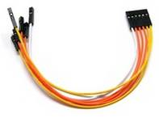
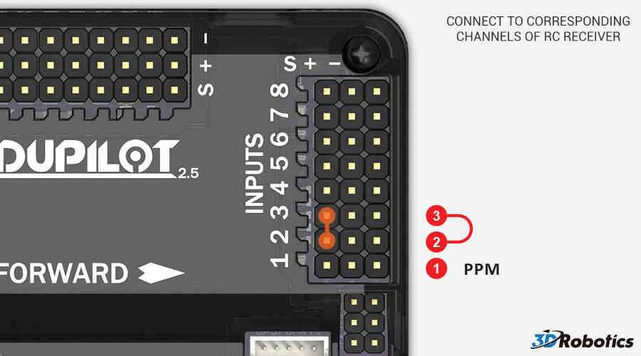

.. _common-connecting-the-radio-receiver-apm2:

=============================================
Archived:Connecting the Radio Receiver (APM2)
=============================================

.. warning::

    **ARCHIVED**
    
    The APM2.x is end of life for use with ArduPilot. 
    This article is made available for existing users.

This topic shows how to connect the RC inputs to the APM2.x controller
board.

Connecting a Receiver
=====================

Connect your RC receiver "S" (signal) pins to the "S" pins on Inputs of
APM using a (minimum 5 pin) 
`jumper cable (6-pin-to-6-pin-individual-female-15cm) <http://dronefever.com/Jumper-cable-6-pin-to-6-pin-individual-female-15cm.html>`__.
You must connect at least channels 1 ~ 5.  Channels 6 ~ 8 are optional.

Your RC receiver will require power. Normally this is done by using one
2 or 3 wire connector between the APM Inputs and one channel output on
the receiver. See :ref:`APM Power Details <common-apm25-and-26-overview_powering_the_apm2>` for
limitations and important warnings.

.. image:: ../../../images/APM_2_5_RC_IN_enc.jpg
    :target: ../_images/APM_2_5_RC_IN_enc.jpg

.. _common-connecting-the-radio-receiver-apm2_connecting_a_ppm_sum_receiver:

Connecting a PPM Sum Receiver
=============================

PPM receivers transmit all the channel information above through a
single port (some will transmit additional channels - for example the
FrSky D8RSP receiver outputs 7 PWM channels, while in CPPM mode it will
output 8).

On APM2 you can use PPM input by putting a
`jumper <https://www.sparkfun.com/products/9044>`__ on the RC inputs for
channel 2 and 3 (just the signal pins). PPM input from the receiver
should be fed into channel 1.

If you need to rearrange the channel order when using PPM and are unable
to do this from the transmitter, you can do this with the RCMAP Advanced
parameters. Read more about them :ref:`here <parameters_RCMAP_>`.

[site wiki="copter"]
.. note::

   Copter 2.8.1 and earlier versions required you use a
   transmitter/receiver combination that outputs at least 8 channels of ppm
   information. This is resolved in version 2.9 so receivers like this
   should work.
[/site]
