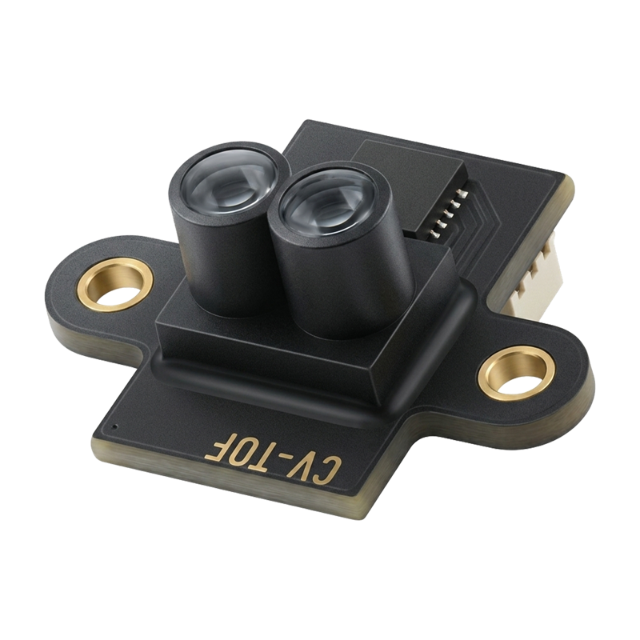
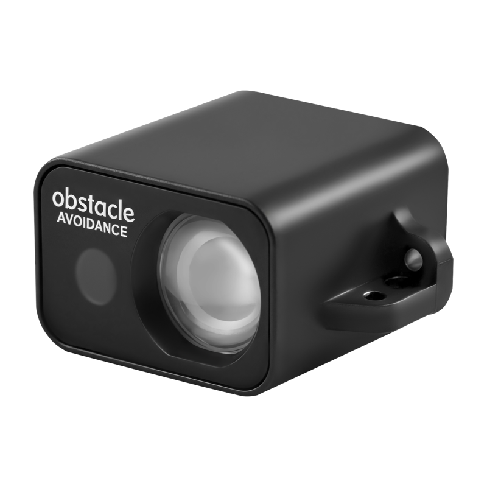
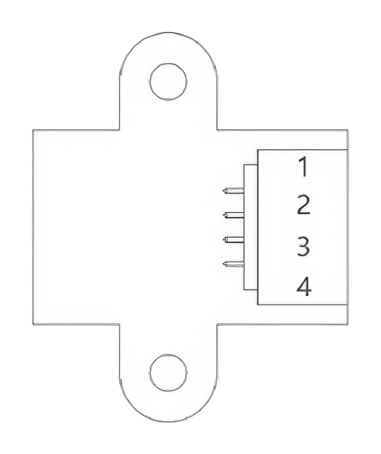
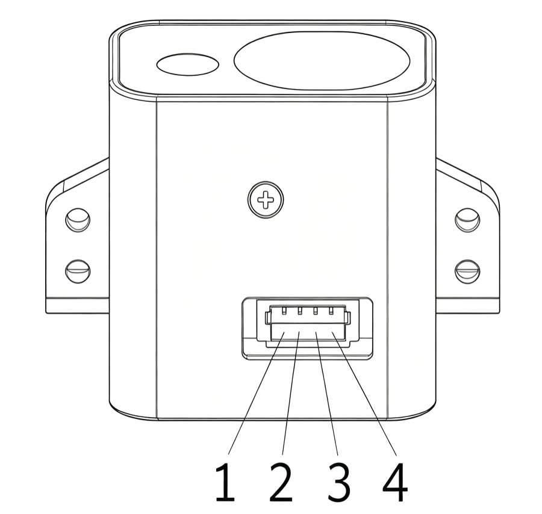

.. _common-corvon-cv08-cv50:

========================
CORVON CV08 / CV50 Lidar
========================

The `CORVON CV08 <https://www.corvon.tech/en/products/cv-080-laser-ranging-sensor>`__ and `CORVON CV50 <https://www.corvon.tech/en/products/corvon-laser-rangefinder-sensor-for-drone-altitude-hold-and-obstacle-avoidance-and-robotics-range-50-meters-high-precision-dtof-technology-sampling-rate-50hz>`__ are dToF lidar sensors with ranges of 8m and 50m respectively. Both communicate with the autopilot over UART using MAVLink.

Specifications
==============

.. list-table::
   :header-rows: 1

   * -
     - CV08
     - CV50
   * - Range
     - 2cm to 8m
     - 5cm to 50m
   * - Field of view
     - less than 3 degrees
     - less than 2 degrees
   * - Accuracy
     - +/-3cm below 1m, +/-3% at 1m and above
     - +/-3cm below 2m, +/-2% at 2m and above
   * - Update rate
     - up to 50Hz
     - up to 100Hz
   * - Supply voltage
     - 3.5V to 5.5V, 20mA maximum at 5V
     - 3.5V to 5.5V, 60mA maximum at 5V
   * - Size
     - 13.0 x 16.0 x 9.25mm
     - 28.5 x 13.6 x 21.4mm
   * - Weight
     - 0.6g
     - 6.8g

See the `CV08 datasheet <https://www.corvon.tech/spec-sheets/en/corvon-cv08-spec-sheet-en.html>`__ and `CV50 datasheet <https://www.corvon.tech/spec-sheets/en/corvon-cv50-spec-sheet-en.html>`__ for full details.

Where to Buy
============

The sensors are available from `CORVON <https://www.corvon.tech>`__.

Sensor Setup
============

- Connect the sensor to a PC using an FTDI adapter (USB to serial)
- Open the `CORVON TOF Tool <https://tof.corvon.tech>`__ in Chrome or Edge and select the adapter's serial port
- Set the protocol to "MAVLink (APM)" and the mounting orientation to match how the sensor will be mounted on the vehicle
- Save the settings to the sensor

.. note:: Use an output rate of at least 10Hz to allow margin for the autopilot's 500ms rangefinder timeout.

Connection to Autopilot
=======================

Connect the sensor to any spare serial port on the autopilot. The sensor's TX goes to the autopilot's RX and the sensor's RX to the autopilot's TX.

CV08:

- Pin 1: TX
- Pin 2: RX
- Pin 3: VCC (5V)
- Pin 4: GND

CV50:

- Pin 1: GND
- Pin 2: VCC (5V)
- Pin 3: RX
- Pin 4: TX

Parameters
==========

These settings assume a connection to Serial2. For another port, change the ``SERIAL2_`` parameters to match.

- Set :ref:`SERIAL2_BAUD<SERIAL2_BAUD>` = 115
- Set :ref:`SERIAL2_PROTOCOL<SERIAL2_PROTOCOL>` = 1 (MAVLink1)
- Set :ref:`RNGFND1_TYPE<RNGFND1_TYPE>` = 10 (MAVLink)
- Reboot the autopilot to see the rangefinder parameters
- Set :ref:`RNGFND1_MAX <RNGFND1_MAX>` = 8 for the CV08 or 50 for the CV50
- Set :ref:`RNGFND1_MIN <RNGFND1_MIN>` = 0.02 for the CV08 or 0.05 for the CV50
- Set :ref:`RNGFND1_ORIENT<RNGFND1_ORIENT>` = 25 (Downward) or 0 (Forward), matching the orientation saved with the CORVON TOF Tool. Distance messages with a different orientation are ignored
- Set bit 1 (value 2) of the ``MAVx_OPTIONS`` of the sensor's MAVLink channel (Don't forward mavlink to/from) to keep its messages off the telemetry link. See :ref:`MAVLink configuration <mavlink_configuration>` for how the channels are numbered
- Reboot the autopilot again to apply the MAVLink forwarding setting

.. note:: On 4.6 and earlier the forwarding option is bit 10 of ``SERIAL2_OPTIONS`` (value 1024) instead. Do not set that bit on 4.7 or later; it fails a pre-arm check.

Testing the sensor
==================

Distances read by the sensor can be seen in the Mission Planner's Flight Data screen's Status tab. Look for "rangefinder1".
