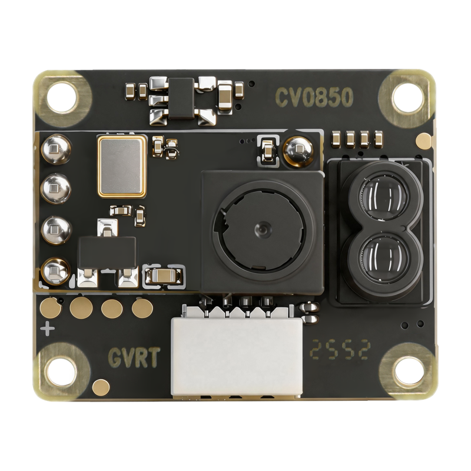
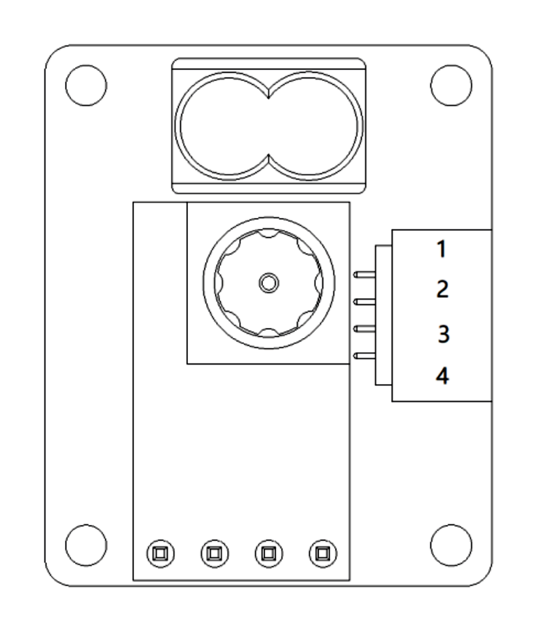
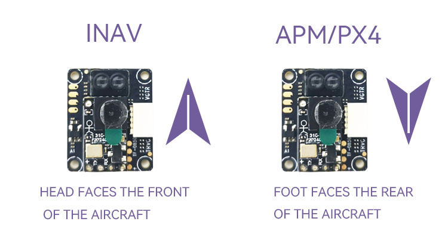

.. _common-corvon-cv0850:

====================================
CORVON CV0850 Optical Flow and Lidar
====================================

[copywiki destination="copter,plane,rover"]

The `CORVON CV0850 <https://www.corvon.tech/en/products/corvon-infrared-ranging-module-tf-0850-dtof-sensor-for-drones-robots-ranging-20mm-to-8000mm-with-2cm-accuracy-uart-i2c-1-8g-50hz-940nm-obstacle-avoidance-and-proximity-sensing>`__ combines an optical flow camera with an 8m dToF lidar. It sends optical flow and distance data to the autopilot over UART using MAVLink.

Specifications
==============

- Lidar range: 2cm to 8m, field of view less than 3 degrees, 50Hz update rate
- Lidar accuracy: +/-3cm below 1m, +/-3% at 1m and above
- Supply voltage: 3.5V to 5.5V, 40mA maximum at 5V
- Interface: UART at 115200 baud
- Size: 20.0 x 16.5 x 6.7mm
- Weight: 1.8g

See the `datasheet <https://www.corvon.tech/spec-sheets/en/corvon-cv0850-spec-sheet-en.html>`__ for full details.

Where to Buy
============

The sensor is available from `CORVON <https://www.corvon.tech>`__.

Sensor Setup
============

- Connect the sensor to a PC using an FTDI adapter (USB to serial)
- Open the `CORVON TOF Tool <https://tof.corvon.tech>`__ in Chrome or Edge and select the adapter's serial port
- Set the protocol to "MAVLink (APM)" and the mounting orientation to downward facing
- Save the settings to the sensor

Connection to Autopilot
=======================

Connect the sensor to any spare serial port on the autopilot:

- Pin 1 (TX) to the autopilot serial port's RX
- Pin 2 (RX) to the autopilot serial port's TX
- Pin 3 (VCC) to 5V
- Pin 4 (GND) to GND

Mounting Orientation
====================

Mount the sensor on the underside of the vehicle with the lenses pointing downwards, and with the end of the board carrying the two lidar lenses towards the front of the vehicle. Mounted this way :ref:`FLOW_ORIENT_YAW <copter:FLOW_ORIENT_YAW>` can be left at 0.

.. warning:: Incorrect flow orientation can cause a flyaway. Check the sensor axes using the procedure in :ref:`Optical Flow setup <common-optical-flow-sensor-setup>` before relying on optical flow in flight.

Parameters
==========

These settings assume a connection to Serial2. For another port, change the ``SERIAL2_`` parameters to match.

- Set :ref:`SERIAL2_BAUD<SERIAL2_BAUD>` = 115
- Set :ref:`SERIAL2_PROTOCOL<SERIAL2_PROTOCOL>` = 1 (MAVLink1)
- Set :ref:`FLOW_TYPE<FLOW_TYPE>` = 5 (MAVLink)
- Set :ref:`RNGFND1_TYPE<RNGFND1_TYPE>` = 10 (MAVLink)
- Reboot the autopilot to see the rangefinder parameters
- Set :ref:`RNGFND1_MAX <RNGFND1_MAX>` = 8
- Set :ref:`RNGFND1_MIN <RNGFND1_MIN>` = 0.02
- Set :ref:`RNGFND1_ORIENT<RNGFND1_ORIENT>` = 25 (Downward)
- Set bit 1 (value 2) of the ``MAVx_OPTIONS`` of the sensor's MAVLink channel (Don't forward mavlink to/from) to keep its messages off the telemetry link. See :ref:`MAVLink configuration <mavlink_configuration>` for how the channels are numbered
- Reboot the autopilot again to apply the MAVLink forwarding setting

.. note:: On 4.6 and earlier the forwarding option is bit 10 of ``SERIAL2_OPTIONS`` (value 1024) instead. Do not set that bit on 4.7 or later; it fails a pre-arm check.

In Mission Planner, open Flight Data > Status. Check ``opt_m_x``, ``opt_m_y`` and ``opt_qua`` while moving the sensor over a textured surface, and ``rangefinder1`` while changing its height above it.

Optical Flow Use and Calibration
================================

Follow :ref:`Optical Flow setup <common-optical-flow-sensor-setup>` to calibrate the sensor and configure the EKF.
