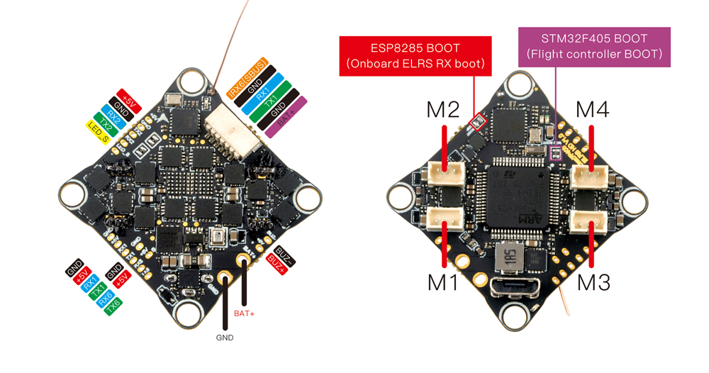
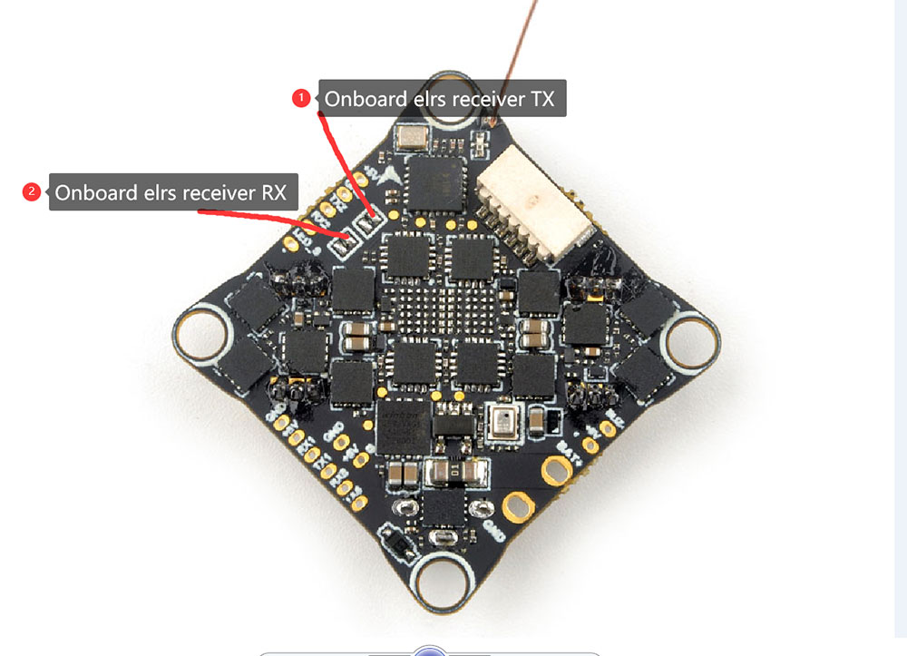

.. _common-crazyf405:
[copywiki destination="plane,copter,rover,blimp,sub"]

========================
CrazyF405HD ELRS 1-2SAIO
========================

The CrazyF405HD ELRS 1-2S AIO is an autopilot produced by `Happymodel <https://www.happymodel.cn/index.php/2023/05/26/crazyf405hd-elrs-1-2s-aio-fc-built-in-uart-elrs-receiver-and-12a-blheli_s-esc/.>`_

.. warning:: this autopilot is intended for use in quadcopters only in flight modes that do not require compass (ie non position controlled modes like STABILIZE or ACRO)

Features
========
* MCU: STM32F405RGT6, 168MHz
* Gyro: BMI270 (SPI)
* 1Mb Onboard Flash
* BEC output: 5V, 2A
* Barometer: BMP280
* 3 UARTS: (UART1, UART2 ,UART6)
* 5 PWM outputs (4 motor outputs used internally for integrated 4-in-1 ESC and 1 integrated LED)
* Integrated 4-in-1 BlueJay ESC

Pinout
======

UART Mapping
============

The UARTs are marked Rn and Tn in the above pinouts. The Rn pin is the
receive pin for UARTn. The Tn pin is the transmit pin for UARTn.

* SERIAL0 -> USB
* SERIAL1 -> UART1 (DisplayPort, DMA-enabled)
* SERIAL2 -> UART2 (RCin, connected to internal ELRS,DMA-enabled)
* SERIAL5 -> UART6 (USER, DMA-enabled)

RC Input
========

RC input is configured on the on-board ELRS on UART2 or through (UART2_RX/UART2_TX) pins. It supports all serial RC protocols.

To disable the onboard ELRS module and use an external RC on TX2/RX2, desolder the RX/TX pads of the onboard ELRS receiver as shown in the image below:

OSD Support
===========
The CrazyF405 is configured for Digital HD FPV using the HD VTX connector.

PWM Output
==========
The Carzyf405HD AIO has 4 PWM outputs internally connected to its 4-in-1 ESC. The pads for motor output M1 to M4 are also on the board. All 4 outputs support DShot, as well as all PWM types. The default configuration is for DShot using the already installed BlueJay firmware.

Battery Monitoring
==================
The board has a built-in voltage and a current sensor inputs tied to its 4 in 1 ESC current sensor. The voltage sensor can handle up to **2S**
LiPo/Li-Hv batteries.

The correct battery setting parameters are:

* :ref:`BATT_MONITOR<BATT_MONITOR>` = 4
* :ref:`BATT_VOLT_PIN<BATT_VOLT_PIN__AP_BattMonitor_Analog>` = 12
* :ref:`BATT_VOLT_MULT<BATT_VOLT_MULT__AP_BattMonitor_Analog>` = 10.9
* :ref:`BATT_CURR_PIN<BATT_CURR_PIN__AP_BattMonitor_Analog>` = 13
* :ref:`BATT_AMP_PERVLT<BATT_AMP_PERVLT__AP_BattMonitor_Analog>` = 50

These are set by default in the firmware and shouldn't need to be adjusted

Compass
=======

The BETAFPV F405 AIO does not have a builtin compass.

Firmware
========
Firmware for this board can be found `here <firmware.ardupilot.org>`_ in sub-folders labeled “CrazyF405”.

Loading Firmware
================
Initial firmware load can be done with DFU by plugging in USB with the
bootloader button pressed. Then you should load the "with_bl.hex"
firmware, using your favourite DFU loading tool.

Once the initial firmware is loaded you can update the firmware using
any ArduPilot ground station software. Updates should be done with the
\*.apj firmware files.
