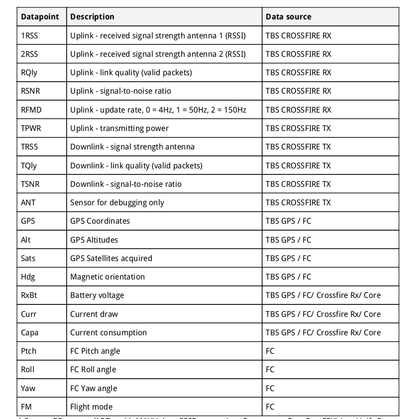
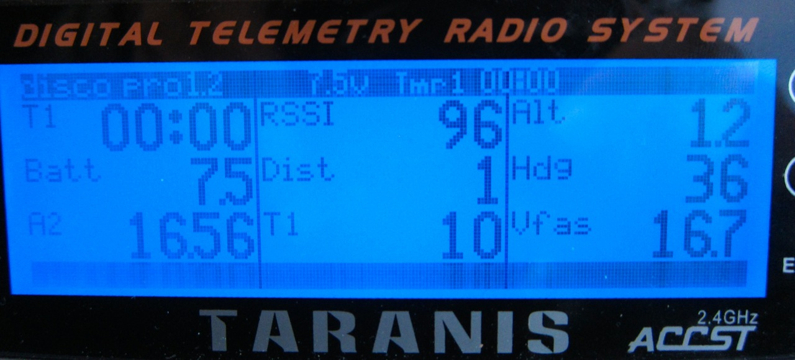
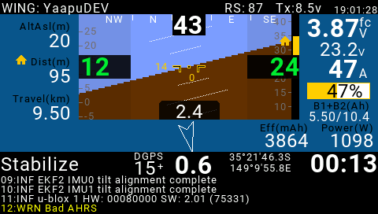
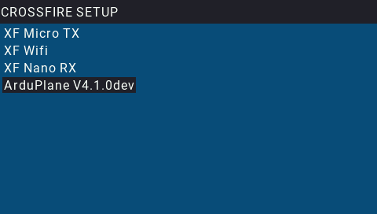
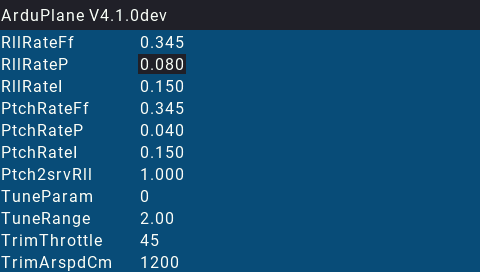

.. _common-crsf-telemetry:
[copywiki destination="plane,copter,rover,blimp,sub"]
=======================
TBS Crossfire Telemetry
=======================

.. note:: ELRS (ExpressLRS) RC systems use the CRSF protocol and are connected in a similar manner. ELRS receivers can also be used in Mavlink mode to provide both bidirectional Mavlink telemetry and RC control over a single TX-RX pair. Details `here <https://www.expresslrs.org/software/mavlink/>`_.

TBS Crossfire Receivers incorporate telemetry along with RC control information in their interface to ArduPilot. ArduPilot supports native CRSF telemetry and extensions to it that allow using the :Ref:`common-frsky-yaapu`. See :ref:`common-tbs-rc` for connection and setup information.

OpenTx will discover the native CRSF Telemetry sensors (but a limited number, use passthru option below for more displayed information using Yaapu Telemetry script), which then can be displayed on `OpenTX <https://www.open-tx.org/>`_ telemetry screens or repeated from the CRSF TX module's WIFI to MAVLink Ground Control Stations:

These values can be displayed on OpenTX transmitters in several ways:

- Using the built-in telemetry screens:

In addition, by setting :ref:`RC_OPTIONS<RC_OPTIONS>` bit 8,
additional ArduPilot telemetry items are transferred which allows use of the :ref:`common-frsky-yaapu` on OpenTX transmitters. Limitations and additional information is shown `here <https://discuss.ardupilot.org/t/passthrough-telemetry-over-crsf-crossfire>`__.

.. warning:: when using :ref:`RC_OPTIONS<RC_OPTIONS>` bit 8 for passthru, be sure no SERIAL port is setup to use ``SERIALx_PROTOCOL`` = 10 (Passthrough) to avoid a conflict and unreliable operation.

Several OpenTX scripts are normally provided for adjusting CRSF TX and RX system parameters. They are accessed by long pressing the SYS button.

ArduPilot Parameter Editor
==========================

In  addition, the ArduPilot CRSF implementation provides for ArduPilot parameter adjustment, similar in function to ArduPilot's :ref:`common-paramosd` feature.

If the autopilot has any active OSD (:ref:`OSD_TYPE<OSD_TYPE>` not equal to "0") , this feature is automatically enabled. If not, then selecting :ref:`OSD_TYPE<OSD_TYPE>` = 4 (TX only) will enable it.

Selecting the Crossfire Configuration LUA script in the transmitter will show:

And selecting the ArduPilot vehicle shown in that list will activate the :ref:`common-paramosd` with a list of all parameters which have been setup for both OSD screens. 

.. note:: Some autopilots will not display the parameter values that have text names, as text, but rather as a number, in order to save flash space. See  :ref:`common-limited_firmware` for those without CRSF TEXT capability.

Scripted CRSF Menus
====================

ArduPilot supports custom CRSF menus created via Lua scripts. These menus appear alongside the built-in ArduPilot parameter editor in the transmitter's Crossfire Configuration screen, and can be used to provide task-specific configuration interfaces.

The `crsf_helper.lua module <https://github.com/ArduPilot/ardupilot/blob/master/libraries/AP_Scripting/examples/crsf-menu.lua>`__  provides a high-level API which can be placed in LUA scripts for creating CRSF menus. Multiple independent menu scripts can run simultaneously — for example, a PID tuning menu and an OSD configuration menu can coexist without conflicts.

**Multi-menu support (4.7 and later):**

In ArduPilot 4.7, the CRSF menu Lua API was improved to support multiple concurrent menus reliably:

-  New ``crsf:peek_menu_event()`` method allows scripts to inspect pending events without consuming them, so each script can check whether an event belongs to its menu before processing it.
-  New ``crsf:pop_menu_event()`` method explicitly consumes an event after a script has determined it owns the event.
-  New ``crsf:send_response()`` method for sending generic CRSF parameter responses.
-  Thread-safe access to the menu event queues via internal semaphore protection.

Scripts using ``crsf_helper.lua`` automatically benefit from these improvements. Scripts using the low-level CRSF API directly should be updated to use the peek/pop pattern instead of the older ``crsf:get_menu_event()`` to avoid consuming events intended for other scripts.
