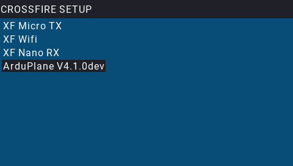

.. _common-crsf-telemetry:
[copywiki destination="plane,copter,rover,blimp"]
=======================
TBS Crossfire Telemetry
=======================

.. note:: ELRS (ExpressLRS) RC systems use the Crossfire protocol and are connected in a similar manner. However, it does not provide bi-directional telemetry like Crossfire.

TBS CRSF Receivers incorporate telemetry along with RC control information in their interface to ArduPilot. ArduPilot supports native CRSF telemetry and extensions to it that allow using the :Ref:`common-frsky-yaapu`. See :ref:`common-tbs-rc` for connection and setup information.

OpenTx will discover the native CRSF Telemetry sensors (but a limited number, use passthru option below for more displayed information using Yaapu Telemetry script), which then can be displayed on `OpenTX <https://www.open-tx.org/>`_ telemetry screens or repeated from the CRSF TX module's WIFI to MAVLink Ground Control Stations:

These values can be displayed on OpenTX transmitters in several ways:

- Using the built-in telemetry screens:

In addition, by setting :ref:`RC_OPTIONS<RC_OPTIONS>` bit 8,
additional ArduPilot telemetry items are transferred which allows use of the :ref:`common-frsky-yaapu` on OpenTX transmitters. Limitations and additional information is shown `here <https://discuss.ardupilot.org/t/passthrough-telemetry-over-crsf-crossfire>`__.

.. image:: ../../../images/x10-horus.png

.. warning:: when using :ref:`RC_OPTIONS<RC_OPTIONS>` bit 8 for passthru, be sure no SERIAL port is setup to use ``SERIALx_PROTOCOL`` = 10 (Passthrough) to avoid a conflict and unreliable operation.

Several OpenTX scripts are normally provided for adjusting CRSF TX and RX system parameters. They are accessed by long pressing the SYS button.

ArduPilot Parameter Editor
==========================

In  addition, the ArduPilot CRSF implementation provides for ArduPilot parameter adjustment, similar in function to ArduPilot's :ref:`common-paramosd` feature.

If the autopilot has any active OSD (:ref:`OSD_TYPE<OSD_TYPE>` not equal to "0") , this feature is automatically enabled. If not, then selecting :ref:`OSD_TYPE<OSD_TYPE>` = 4 (TX only) will enable it.

Selecting the Crossfire Configuration LUA script in the transmitter will show:

And selecting the ArduPilot vehicle shown in that list will activate the :ref:`common-paramosd` with a list of all parameters which have been setup for both OSD screens. 

.. note:: Some autopilots will not display the parameter values that have text names, as text, but rather as a number, in order to save flash space. See  :ref:`common-limited_firmware` for those without CRSF TEXT capability.
