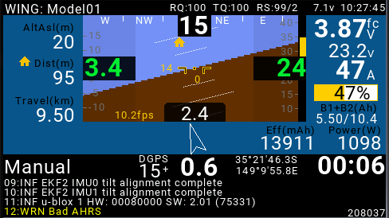

.. _common-crsf:

TBS Crossfire and CRSF protocol
===============================

.. image:: ../../../images/crsf_hardware.png
    :width: 450px

The Crossfire is a 868 MHz (SRD-band) / 915 MHz (ISM-band) bidirectional RC system. In addition to supporting commonly used protocols like PPM / SBus, it introduces
a prorietary protocol for RC / telemetry connections, heceforth referred to as "CRSF". Furthermore, it supports full bidirectional MAVLink telemetry, MAVLink oneway telemetry emulated from the native CRSF telemetry message set, as well as RC control over mavlink using the RC_CHANNELS_OVERRIDE message set, regardless of the used telemetry mode. Please refer to the `TBS Crossfire system's manual <https://www.team-blacksheep.com/tbs-crossfire-manual.pdf>`__ for specific features and setup instructions.

.. note::
   
   Due to memory limitations not all protocols are supported on all boards. Please see :ref:`common-limited-firmware` for reference on individual boards' firmware limitations.

Connecting a Crossfire receiver
-------------------------------

There are two basic options to connect the Crossfire to your autopilot:

- unidirectional (RC-uplink only)
- bidirectional (RC uplink + telemetry donwlink and / or serial communication)

For unidirectional usage, connect your receiver's signal output pin to the autopilot's RC input pin. Set the receiver's pin to one of the supported RC protocols (PPM, SBus or
CRSF). Your ardupilot autopilot will autodetect the protocol.

For bidirectional / telemetry use, connect your receiver's TX / RX pins to one of your autopilot's serial port's corresponding RX / TX pins. Currently a full-duplex UART connection is required. Now again there's multiple protocol options to choose from. Most options can not only be used exclusively, but also combined when using mutiple connections.

Bidirectional CRSF
------------------

The most straight forward option is to set your Crossfire's pins to CRSF TX / RX, and the corresponding autopilot's serial port's :ref:`SERIAL1_PROTOCOL>` to 23 = RCIn 
(SERIAL1 used as an example here). Your ardupilot flight controller will auto-detect CRSF as the input protocol, as well as provide attitude, location, battery, 
flightmode and armed state telemetry data. Set :ref:`RSSI_TYPE <RSSI_TYPE>` = 3 to use the native CRSF protocol RSSI.

When using an OpenTX RC transmitter, CRSF telemetry data can be displayd numerically or via graphical LUA-type telemetry scripts. See more detailed instructions further down this page.

Additionally, the Crossfire TX modules can use the telemetery data to emulate a set of MAVLink messages and allow unidirectional wired / wireless connection to a 
mavlink-compatible GCS.

Bidirectional mavlink
---------------------

Set your Crossfire's pins to MAVLink TX / RX and the corresponding autopilot's serial port's :ref:`SERIAL1_PROTOCOL>` to 2 = MAVLink2 and :ref:`SERIAL1_BAUD>` 
to 57 = 57.600 baud.

.. note::

   Crossfire firmware version 3.80 and newer support MAVLink2, which allows to use 12 RC channels. Older firmware versions suppot MAVLink1 only, which is limited 
   to 8 RC channels. 

To use RC control via MAVLink, set the "RC by MAVLink" option in your Crossfire receiver to "on" (default). You'll now have RC control using the RC_Channels_override
message set, as well as a full bidirectional MAVLink connection. The Crossfire TX modules allow a wired or wireless connection to a MAVLink compatible GCS for 
bidirectional communications.

.. note::

   A full bidirectional MAVLink connection at 57 kbaud uses a datarate of ~ 2,3 kbyte/s. The Crossfire will provide the required bandwidth for a full datarate connection
   at 150Hz only, and with the obvious range limitations. When using MAVLink, set the Crossfire's RF option to "dynamic" (default) or "150Hz".

Combining protocols
-------------------

It is possible to functionally separate your RC uplink from your telemetry connection. You can setup your Crossfire to use CRSF, PPM or SBus as the RC output protocol, connected to your flight controller's default RCInput pin, and use a second set of pins connected to a full UART (RX & TX) for your bidirectional MAVLink connection. This might be a favourable option especially on connections without hardware flow control or marginal bandwidth radio links, as the uplinked MAVLink RC_OVERRIDE messages for RC control might consume a considerable amount of available datarate and cause downlink telemetry to stall. Alternatively, it is possible to use MAVLink as your RC input protocol only, alongside a separate telemetry link using native CRSF protocol.

CRSF audio / video transmitters
===============================

Video transmitters supporting the CRSF protocol can be connected to one of your flight controller's free serial ports. This allows transmitter configuration via parameters and, for transmitters such as the `TBS Unify Evo <https://www.team-blacksheep.com/products/prod:tbs_unify_evo>`__ , to receive and display telemetry data using the transmitter's built-in OSD.

To use CRSF for VTx control set :ref:`SERIAL4_PROTOCOL <SERIAL4_PROTOCOL>` = 29 (SERIAL4 used as an example here). There's no further adjustments required when using CRSF as your RC protocol as well.

Displaying FrSky passthrough telemetry over CRSF using Yaapu's LUA script
=========================================================================

Support for CRSF protocol has been added to Yaapu's telemetry script recently. See :ref:`common-frsky-yaapu` for basic instructions on how to display passthrough telemetry on your OpenTX transmitter. 

Flight controller setup
-----------------------

To use passthrough telemetry over CRSF on your OpenTX transmitter, connect your crossfire receiver's RX / TX pins to your flight controller using a free serial port and set 
the respective SERIALn_PROTOCOL to 23 (= RCIn). Additionally, set the :ref:`RC_OPTIONS <RC_OPTIONS>` bit 8 (= custom CRSF telemetry) to 1.

:ref:`RC_OPTIONS <RC_OPTIONS>` = 1

Widget setup
------------

In your OpenTX transmitter with an up-to-date version of Yaapu's script running:

- enter the config menu
- long press SYS
- browse to TOOLS
- launch “Yaapu Config” and set CRSF enabled
- long press RTN to save and exit
- power cycle

How FrSky passthrough over CRSF works
-------------------------------------

CRSF native telemetry is basically supported by OpenTX, respective sensors can be discovered and displayed using widgets or telemetry pages. However, CRSF native telemetry does not support all the telemetry data that passthrough offers. 

While FrSky passthrough telemetry does not allow sending larger text strings as a single frame due to a 8 bytes per frame limit, CRSF has a limit of 64bytes per frame and allows to send full status text messages on a dedicated single frame. This adds the benefit of avoiding data corruption when the CRSF link switches to low data rate at increasing distance. It does not protect against frames being dropped on a marginal link quality though.

GPS location messages are readily supported by native CRSF telemetry, so both location and status text messages have their own CRSF frames that are sent separate from the passthrough data.

Passthrough over CRSF creates two additional custom CRSF telemetry frames, one to carry the same passthrough telemetry payload used by FrSky in order to maximize code reuse, both in ArduPilot and OpenTX, and another one to carry status text messages as a single large frame. When custom passthrough telemetry is enabled over CRSF, all rates for non essential native CRSF telemetry frames are slowed down. Message rates are adjusted dynamically to align with the crossfire's respective telemetry rate used (150Hz, 50Hz or 4Hz), slowing down the compareably high passthrough rates (attitude etc.) to respect bandwidth limitations if required.

Additionally, support for the CRSF's detailed link statistics has been added to the Yaapu widgets, using a dedicated RSSI panel to display RSSI, LQ (rx/tx) and RF mode.
