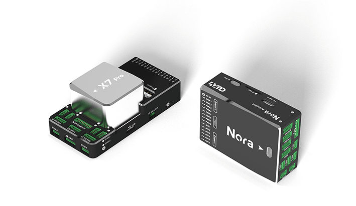
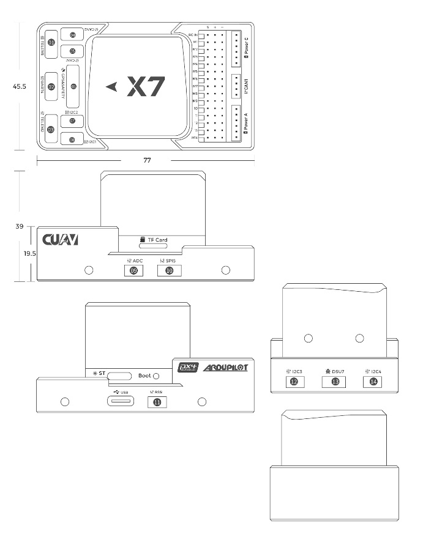
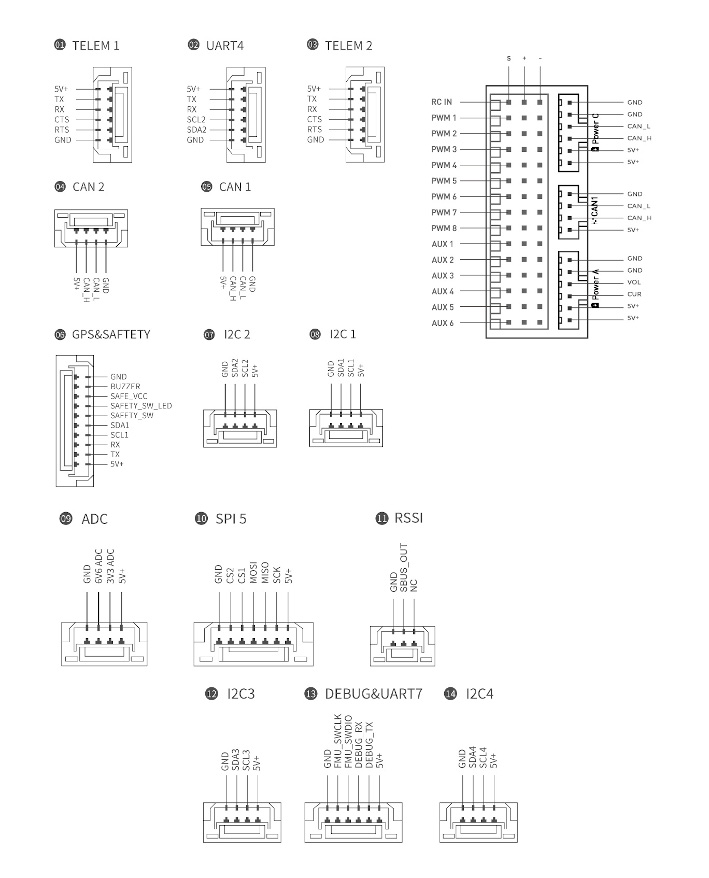

.. _common-cuav-X7-overview:

=======================
CUAV X7 Series Overview
=======================

The X7 series autopilot is independently designed by CUAV and developed by CUAV in cooperation with two international drone open source platforms Ardupilot and PX4. It is aimed primarily at the industrial or commercial drone market. In order to meet different needs, the X7 series is mainly divided into X7 Pro & Nora.

X7 Pro
======

The X7 PRO® is an advanced autopilot independently designed by CUAV®. It uses a higher-performance STM32H7 processor and integrates industrial-grade sensors and ultra-low temperature drift sensors. Compared with the previous flight controller,it has better performance and more reliability.

Features 
========

-  Internal IMU isolation
-  Modular design, can be custom carrier board
-  Supports USB_HS
-  Supports more dshot output
-  Tempratture Controled IMU
-  Dedicated uavcan smart battery port
-  Tripple redundant IMU sensors
-  High-precision industrial sensors ADIS16470 & RM3100

  
Specifications X7 and X7 Pro
============================

-  **Processor**

   -  32-bit ARM Cortex STM32H743
   -  480 Mhz/1MB RAM/2 MB Flash
   -  32 bit IOMCU co-processor

-  **Sensors X7**

   -  ICM-20689 Accelerometer/Gyroscope
   -  ICM-20649 Accelerometer/Gyroscope
   -  BMI088 Accelerometer/Gyroscope
   -  RM3100 Magnetometer
   -  MS5611 x2 Barometer

-  **Sensors X7 Pro**

The X7 Pro replaces the ICM-20689 Accelerometer/Gyroscope with the ADIS16470 Accelerometer/Gyroscope, all other sensors and spec remain the same as the X7. 

-  **Power**

   -  Operating power: 4.3~5.4V
   -  USB Input: 4.75~5.25V
   -  High-power servo rail, up to 36V
      (servo rail does not power the autopilot)
   -  Dual voltage and current monitor inputs
   -  CUAV Nora can be triple redundant if power is provided
      to both battery monitor inputs and the USB port

-  **Interfaces**

   -  14 PWM outputs （12 supports Dshot）
   -  Support multiple RC inputs (SBUs / CPPM / DSM)
   -  S.Bus servo output
   -  2 GPS ports(GPS and UART4 ports)
   -  4 I2C buses, 2 ports
   -  2 CAN bus ports
   -  2 Power ports(Power A is common adc interface, Power C is uavcan battery interface)
   -  2 ADC intput
   -  2 USB ports (Type C and gh 1.25)
   -  3 dedicated PWM/Capture inputs on FMU
   -  SBUS/DSM/RSSI connector supports all RC protocols (including SBUS, DSM, ST24, SRXL and PPM)

-  **Other**

   -  Weight: 70g
   -  Dimensions: 77mm x 45.5mm x 39mm
   -  Operating temperature: -20 ~ 80°c（Measured value）

Size & Dimensions
=================

    
    
Pinouts 
=======
  
    

Where to Buy
============

Order from `here <https://store.cuav.net/index.php>`__.

Official retailers are listed `here  <https://leixun.aliexpress.com/>`__.

Quick Start
===========

To Follow 

More Information
================

`CUAV Website <http://doc.cuav.net/flight-controller/x7/en/>`__

`Schematics <https://github.com/cuav/hardware/tree/master/X7_Autopilot>`__
