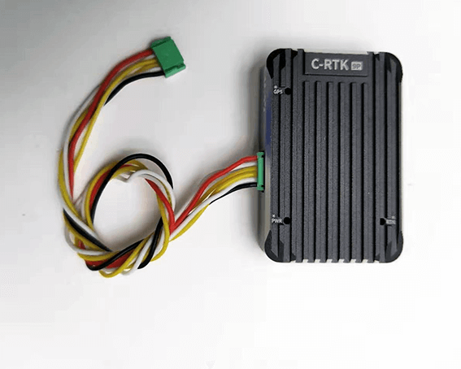

.. _common-cuav-c-rtk-9p-gps:

=================
CUAV C-RTK 9P GPS
=================

This article mainly introduces C-RTK 9P based on Ublox F9P.
The C-RTK 9P offers more accurate positional accuracy and shorter convergence times than the Ublox M8P module.
This description uses the Mission Planner for setup, but you can also use QgroundControl.

.. image:: ../../../images/c-rtk-9p/c-rtk-9p.jpg
	:target: ../images/c-rtk-9p/c-rtk-9p.jpg

.. note:: ArduPilot does not currently configure UBlox F9P GPS constellations. User must assure that the GPS is properly configured for his region and application. See :ref:`common-gps-ublox-firmware-update`

Key Features
============

- RTK Receiver: Ublox F9P 

- Compass : IST8310

-  **GNSS**

   -  GPS / QZSS,Beidou,Galileo, GLONASS
   
-  **GNSS Bands**

   -  GPS L1C/A L2C, GLONASS L1OF L2OF, GALILEO E1B/C E5b, BDS B1I B2I, QZSS L1C/A L2C
   
-  **Nav. update rate**

   -  RTK Up to 20HZ
   
-  **Position accuracy** 
 
   -  RTK 0.01 m + 1 ppm CEP
   
-  **Convergence time**

   -  RTK < 10 sec
   
-  **Acquisition**

   -  Cold starts 24 s
   -  Aided starts 2 s
   -  Reacquisition 2 s
   
-  **Sensitivity**

   -  Tracking & Nav -167 dBm
   -  Cold starts -148 dBm 
   -  Hot starts -157 dBm
   -  Reacquisition -160 dBm
   
-  **Anti-jamming**

   -  Active CW detection and removal Onboard band pass flter
   
-  **Anti-spoofng**

   -  Advanced anti-spoofng algorithms
   
-  **Interfaces**

   -  2 UART 
   -  1 USB
   -  1 I2C
   -  1 Antenna interface(MMCX)
   
-  **Protocols**

   -  NMEA
   -  UBX binary
   -  RTCM version 3.x
   -  Supply voltage
   -  –40 °C to +85 °C
-  **Size**  
   -  31.5\*48\*12MM
   -  weight:21g 

Where to buy
============

You can buy it from `CUAV store <https://www.aliexpress.com/item/4000120384761.html>`__.

Connect to Pixhawk
==================

.. image:: ../../../images/c-rtk-9p/connect-to-pixhawk.jpg
	:target: ../images/c-rtk-9p/connect-to-pixhawk.jpg
	
Connect to CUAV V5+ Or V5 nano
==============================

	
.. note::

         Please use V5+ or V5 nano special cable,10 pin connector plugged into GPS&SAFETY PORT, 6 pin connector plugged into UART 4.

Connect to Others
=================

	
.. note::
       
         If you use a different autopilot, please select the V5+ version kit, which contains a 6 pin to 6pin cable that you can connect to the flight control GPS/GPS2/UART4 interface (it can be connected to Pixhawk2.1, Pixhawk 3 pro, etc).

Port and LED
============

**LED status**:

RTK status: solid (rtk fixed), Blinking (receiving and using RTCM corrections), off
(otherwise).

GPS status:solid(no fix),Blinking(GPS FIX).

PWR status:solid(power input),off( not power  input or vcc is not healthy).

	
C-RTK 9P estimated Yaw
======================

.. youtube:: Kh_6TynYqEI
    :width: 100%

More information
================

`User guide <http://doc.cuav.net/gps/c-rtk/en/c-rtk-9p.html>`__.
