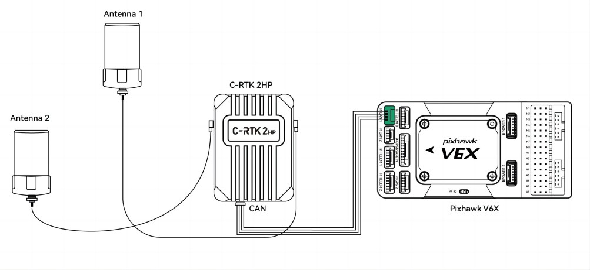

.. _common-cuav-c-rtk2-hp:

=================================
C-RTK2 HP  Heading and RTK Module
=================================

C-RTK2 HP is a heading and RTK receiver designed and manufactured by CUAV. 
The difference from F9P is that it only needs one module to realize GPS for yaw. C-RTK2 HP also supports UART and Dronecan connection methods.

Features
========

- Full constellation, multi-frequency GNSS satellite receiver
- Single module, dual antenna heading and positioning system
- RM3100 industrial grade Magnetometer (for safety redundancy)
- Safe and reliable DroneCAN protocol or standard UART serial interface
- Automatic switching between USB and UART
- ArduPilot `AP Periph Open Source Firmware <https://firmware.ardupilot.org/AP_Periph/stable/C-RTK2-HP/>`__

Key Features
=============

=======================       ======================================================================
MCU                           STM32F4
Sensors                       Compass:RM3100
Receiver                      UM982 High precision GNSS SOC
GNSS                          BDS/GPS/GLONASS/Galileo/QZSS
Frequency Bands(Master)       BDS:B1I/B2I/B3I, GPS:L1(C/A)/L2(P/C)/L5, GLONASS:L1/L2, Galileo: E1/E5a/E5b, QZSS:L1/L2/L5
Frequency Bands(Slave)        BDS:B1I/B2I/B3I, GPS:L1(C/A)/L2(P/C)/L5, GLONASS:L1/L2, Galileo: E1/E5a/E5b, QZSS:L1/L2                                 
Position accuracy(RMS)        3DGPS： **1.5m** (Horizontal, 2.5m（Vertical),
                              DGPS： **0.4m** +1PPM（Horizontal), 0.8m+1PPM（Vertical),
                              RTK: **0.8cm** +1PPM（Horizontal), 1.5cm+1PPM（Vertical）                                          
Heading accuracy (RMS)        0.1° using 1m baseline（Distance from Antenna 1 to Antenna 2）                                          
Acquisition                   Cold starts<30S, Initialization time<5s
Data update rate              UP to 20hz(default:5hz)
Differential data             RTCM3.X 
Data protocol                 Dronecan/NMEA
Connectors                    Master Antenna, Slave Antenna、CAN、UART、DSU、USB
Operating Voltage             4.7~5.2V
Operating temperature         -20~85℃
Size                          50*37*17mm
Weigh                         40g
=======================       ======================================================================

Purchase
========

`CUAV Alibaba <https://bit.ly/46fEoGq)>`__

Pinouts
=======

Hardware connection and ArduPilot Setup
=======================================
C-RTK2 HP supports connection either via serial or DroneCAN port to the autopilot.

DroneCAN
--------
The diagram below shows the C-RTK2-HP being connected via its CAN port to an autopilot's CAN port.

- setup the autopilot's CAN port parameters for DroneCAN: :ref:`common-uavcan-setup-advanced`
- :ref:`GPS1_TYPE<GPS1_TYPE>` = 9 (DroneCAN GPS)

Serial
------
The diagram below shows the C-RTK2 HP being connected via its UART2 port to an autopilot's serial port setup for GPS Protocol.

- set the autopilot's ``SERIALx_PROTOCOL`` = '5' (be sure any lower numbered port does not use this protocol unless a GPS is attached)
- :ref:`GPS1_TYPE<GPS1_TYPE>` = 25 (UnicoreMovingBaseline)

.. note:: this unit can be used with only its "Master" antenna connected, if desired, but no yaw information should be used. In this case set :ref:`GPS1_TYPE<GPS1_TYPE>` = 24 (UnicoreMaster)

Common Setup
------------
for either connection method, set:

- :ref:`EK3_SRC1_YAW <EK3_SRC1_YAW>` = 2 ("GPS") or 3 ("GPS with Compass Fallback") if a compass(es) is also in the system.

.. note:: C-RTK2 HP provides an RM3100 magnetometer for use as Compass Fallback

Be sure to setup the offset parameters for the antennas, see: :ref:`Antenna Offsets<antenna-offsets>`

CUAV docs
=========
`C-RTK2 HP <https://doc.cuav.net/gps/c-rtk-series/en/c-rtk2-hp/>`__
