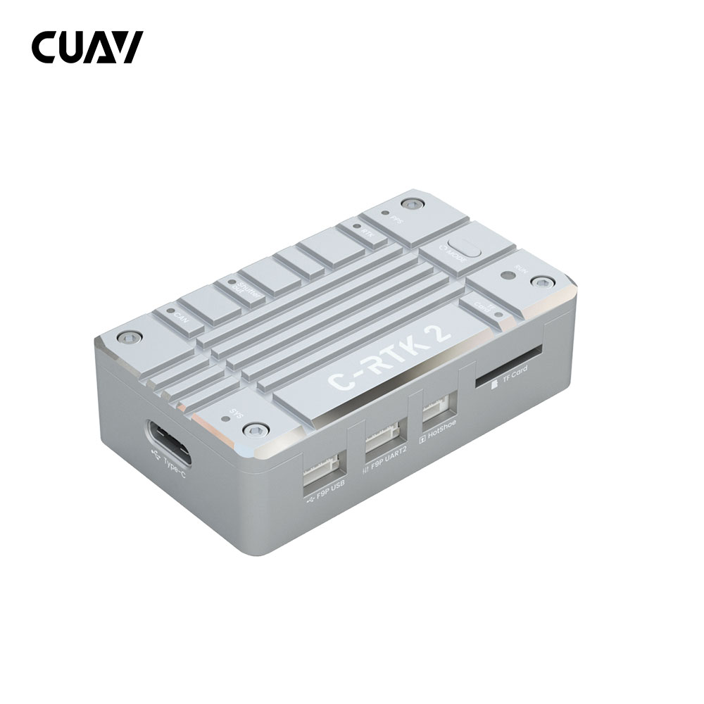
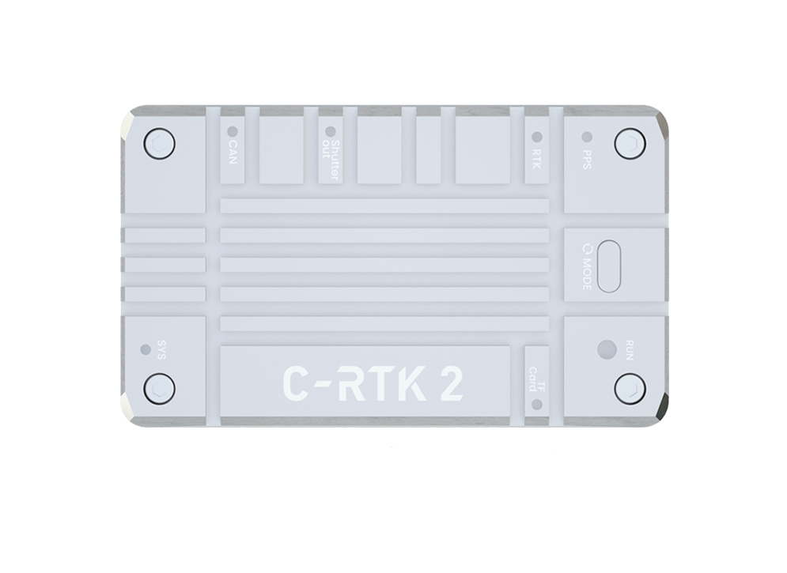
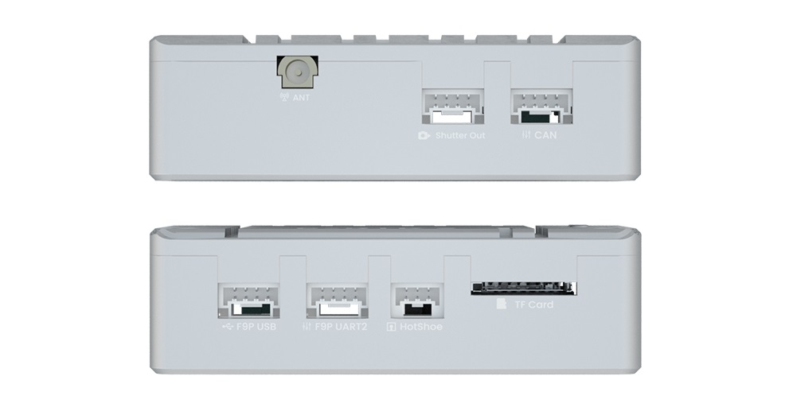
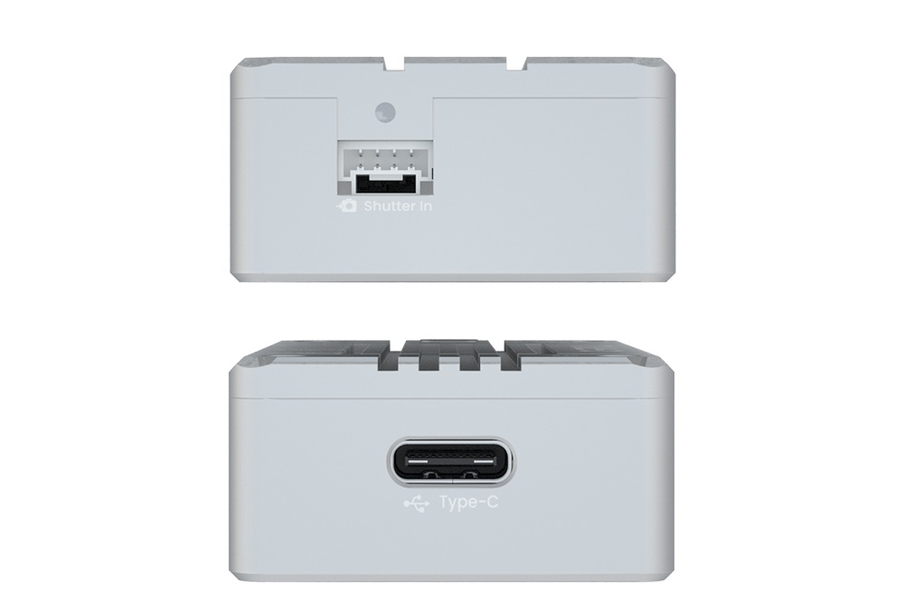
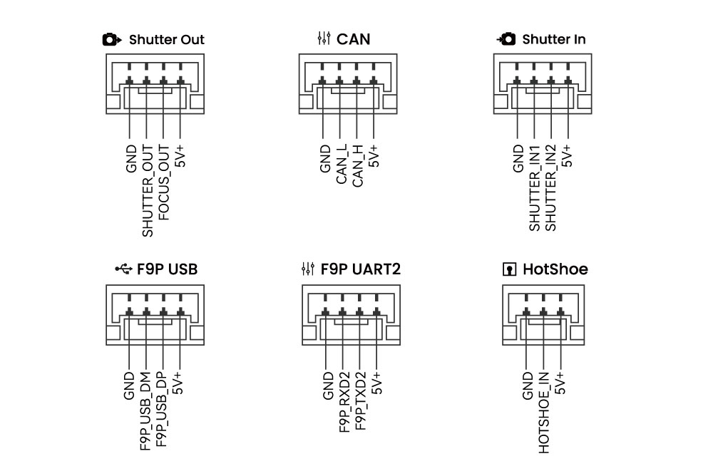
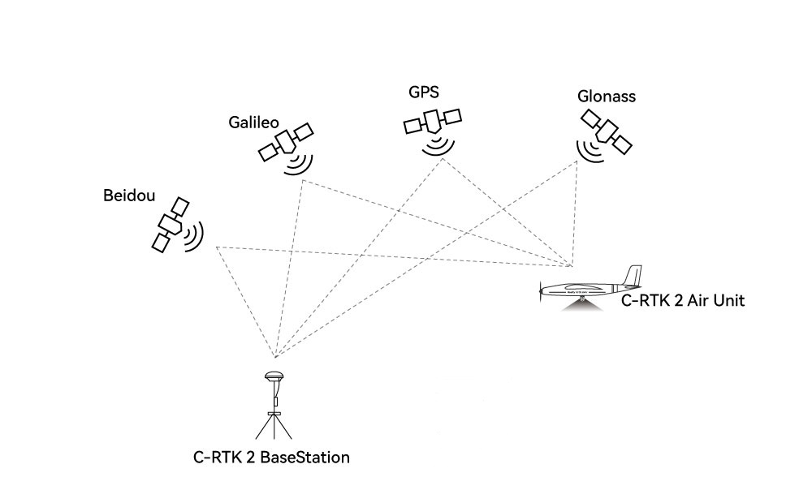
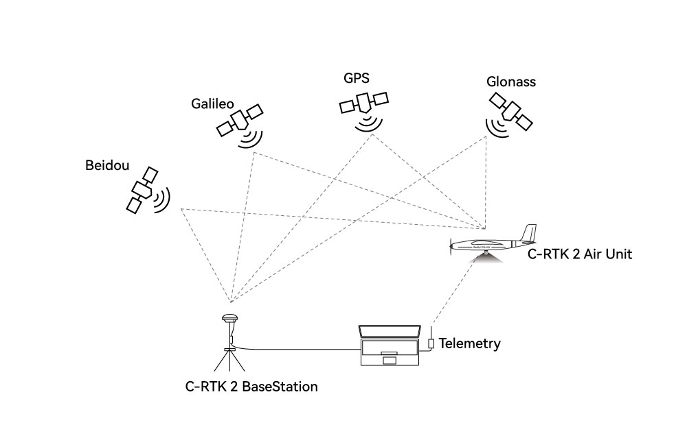

.. _common-cuav-c-rtk2:

==================
C-RTK 2 PPK Module
==================

C-RTK 2 is a high-performance PPK/RTK positioning module created by CUAV for professional applications such as drone aerial survey/mapping). Its small shape/light weight, industrial-grade IMU combination, and combination of high-precision positioning modules can easily satisfy the most demanding Copter/VTOL Plane/Traditional Helicopter applications.

Other characteristics
=====================

- High-performance H7 processor
- High precision industrial grade IMU, Magnetometer and Barometer
- Supports RTK and saves RAW raw data (PPK) at the same time
- Multi-satellite and multi-frequency receivers
- UAVCAN/Dronecan protocol
- Supports camera hotshoe and shutter trigger
- Compatible with ArduPilot/PX4 autopilot software, and using a CUAV X7 series autopilot, it is plug and play.
- HS_USB C and micro-SD disk interfaces

Key Features
=============

- ZED-F9P RTK Receiver
- 184 Receiving channels
- STM32H743VIH6(2M flash、1M RAM）Processor
- On-board sensors:
   - Accelerometer/Gyroscope: ICM20689
   - Magnetometer: RM3100
   - Barometer: ICP10111
- TF card expansion (32G(MAX))
- PPK(post processed kinematic) support
- RTK(Real - time kinematic) support
- GNSS Bands
   - GPS:L1C/A,L2C
   - GLONASS:L1OF,L2OF
   - GALILEO: E1B/C E5b
   - Beidou:B1I B2I
   - Enhanced system
   - QZSS:L1C/A,L2C,L1S
   - SBAS:L1C/A
   - 4(GPS、GLONASS、GALILEO、Beidou）concurrent GNSS
- Update rates
   - RTK Up to 20Hz
   - RAW Up to 25Hz(（Default 5Hz))
- Position accuracy（RMS)
   - RTK:0.01m+1ppm(level);0.02m+1ppm(vertical)
   - GPS:1.5m(level)
- Acquisition
   - Cold starts 24 s
   - Aided starts 2 s
   - Re-acquisition 2 s
- Sensitivity
   - Tracking & Nav –167 dBm
   - Cold starts –148 dBm
   - Hot starts –157 dBm
   - Rea-cquisition –160 dBm
- Anti-spoofng
   - Advanced anti-spoofng algorithms
- Protocols
   - NMEA
   - UBX binary
   - RTCM version 3.x
- Time pulse
   - 0.25Hz~10Hz(Configurable)
- Anti-jamming
   - Active CW detection and removal Onboard band pass flter
- Support flight control type
   -  Compatible with autopilots running ArduPilot/PX4 firmware
- Interfaces
   - 1 Hotshoe
   - 1 Shutter in
   - 1 Sutter out
   - 1 Type C(HS_USB)
   - 1 F9P USB
   - 1 F9P UART
   - 1 Antenna(mmcx)
- Supply voltage
   - 4.5~6v
- Operating temperature
   - -20~85℃
- Size
   - 56x33x16.5mm
- Weight
   -39g

Purchase
========

`CUAV Alibaba <https://cuav.en.alibaba.com/product/1600431150057-820872629/Free_shipping_Pre_sale_price_CUAV_C_RTK_2_Muti_frequency_PPK_Drone_PPK_Kit_for_Pixhawk_Fixed_Wing_VTOL.html?spm=a2700.shop_index.11406.1.194479958nMdw6)>`__

`CUAV Store <https://store.cuav.net>`__

`CUAV Aliexpress <https://pt.aliexpress.com/item/1005003754165772.html?spm=a2g0o.store_pc_home.slider_6001949835246.0>`__

LED Indicators
==============

- SYS Led
   - 100ms flashing: In bootloader
   - 1000ms flashing: Normal working condition
- TF LED(TF Card）
   - Flashing: Noraml SD card reading and writing
   - Always bright: No TF card or file system error of TF card. Try cycling the power.
- Shutter In led (on side)
   - Flashing： Camera shutter signal input
- Shutter Out led
   - Flashing： Output shutter trigger signal to camera
- CAN LED
   - Dark： No data input and output
   - Blink once every 2 seconds： Data is being sent, but no data is beingreceived
   - Blink twice within 2 seconds: Data is being received, but no data is being sent
   - Blink 3 times in 2 seconds: Sending and Receiving data.
- PPS LED
   - On: no FIX
   - Flashing: FIX
- RTK LED
   - Blinking 3 times every 2 seconds: Sending and Receiving RTK data.
   - Flash：RTK Float
   - Solid On：RTK FIX
   - Dark：NO RTK
- RUN LED
   - Red led always On： System Error
   - Yellow led always On： Application Warning
   - Yellow flashing (100ms)： GNSS(F9P) Firmware update
   - Blue Flashing: Base station mode
   - Green Flashing: Rover mode
- Mode button
   - When not connected to the computer, press and hold for 3 seconds to switch the mode

Pinouts
=======

Preparation before use
======================
Only use PPK
------------

- 1 PPK base station/Ntrip account 
- 1 C-RTK 2 1
- 1 Mapping camera 
- 1 Drone 

PPK+RTK
-------

- 1 PPK base station/Ntrip account 
- 1 C-RTK 2 
- 1 Mapping camera 
- 1 Drone 
- 1 Data link 
- 1 Computer 

.. note::
       C-RTK 2 can be used as an RTK base station and rover RTK gps, as well as a PPK rover gps,It is not recommended to be used as a PPK base station.

User Manual
===========

`C-RTK2 Quick start <https://doc.cuav.net/gps/c-rtk2/en/quick-start-c-rtk2.html>`__

Video
=====

.. youtube:: Yt7UY0NCmU8
    :width: 100%

Additional CUAV Documentation
=============================

- `C-RTK2 Quick start <https://doc.cuav.net/gps/c-rtk2/en/quick-start-c-rtk2.html>`__
- `Setting up aerial survey control points <https://doc.cuav.net/gps/c-rtk2/en/surveying-points.html>`__
- `Setting up the base station <https://doc.cuav.net/gps/c-rtk2/en/base-station.html>`__
- `Aerial survey mission planning <https://doc.cuav.net/gps/c-rtk2/en/mapping-waypoints.html>`__
- `PPK solutions and data processing <https://doc.cuav.net/gps/c-rtk2/en/ppk-solution.html>`__
- `Modeling with Aerial Three Modeling Software <https://doc.cuav.net/gps/c-rtk2/en/ppk-solution.md.html>`__

More information
================
`CUAV Docs <https://doc.cuav.net>`__