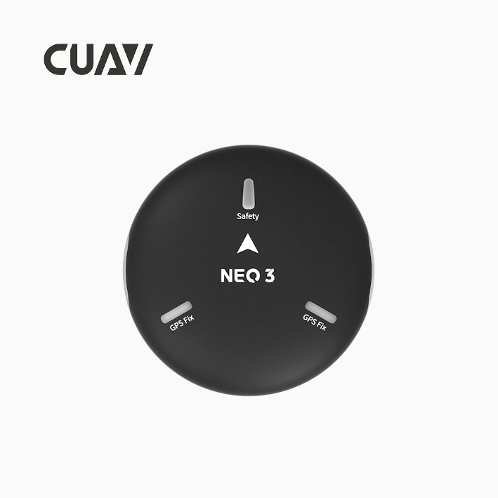
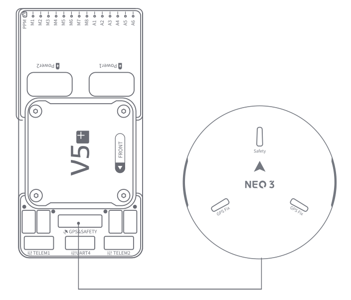
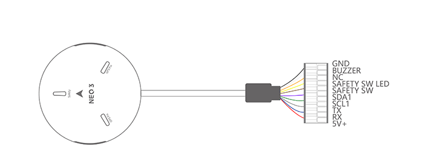

.. _common-cuav-neo-3:

==========
NEO 3  GPS
==========

Neo 3 is a UAV positioning module developed by  CUAV. It integrates industrial-grade compass, barometer, autopilot status light, buzzer, and safety switch all in one package. It has the characteristics of high safety and strong interference resistance.It integrates ublox m9n module and can receive signals from GPS, Galileo, GLONASS and Beidou at the same time.

.. note::

     NEO 3 is supported in ArduPilot 4.0 firmware (and higher).

Key Features
============

-  **Processor**
  
   -  STM32F412
   
-  **Sensors**
  
   -  Compass:IST8310
   -  Barometer:MS5611
   
-  **RTK Receiver**

   -  Ublox M9N
 
-  **GNSS Bands**

   - GPS/QZSS L1 C/A,GLONASS L10F ,BeiDou B1I,Galileo E1B/C,SBAS L1 C/A: WAAS, EGNOS, MSAS, GAGAN

-  **Number of concurrent GNSS**

   - 4 Simultaneous reception of satellite information

-  **Number of satellites(MAX)**

   - Up to 32
   
-  **Nav. update rate**

   - RTK Up to 25HZ
   
-  **Position accuracy**

   - Up to 1.5M
   
-  **Acquisition**

   - Cold starts 24 s
   - Aided starts 2 s
   - Reacquisition 2 s
   
-  **Sensitivity**

   - Tracking & Nav -167 dBm
   - Cold starts -148 dBm 
   - Reacquisition -160 dBm
   
-  **Protocol**

   - UART+I2C+IO

-  **Interface Type**
  
   - GHR-10V-S
   
-  **Input voltage**

   - 5V
   
-  **Operating temperature**

   - -10~70℃
   
-  **Size**

   - 60x60x16mm
   
-  **Weight**

   - 33g

Purchase
========

You can buy it from `CUAV store <https://store.cuav.net>`__.

Connect to CUAV v5+
===================

.. note::

    The connection to other autopilots is similar.

Pinouts
=======

More information
================

`CUAV docs <http://doc.cuav.net/gps/neo-series-gnss/en/>`__.