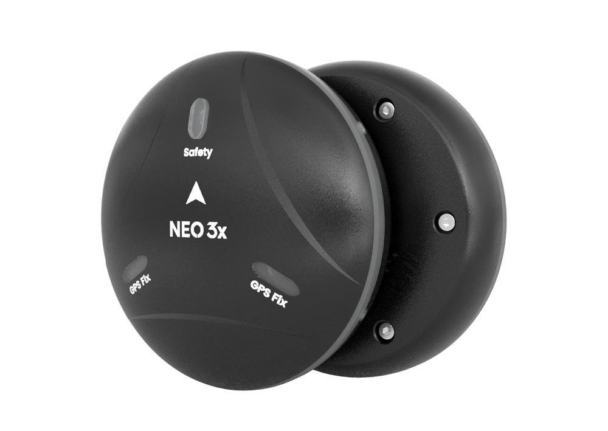
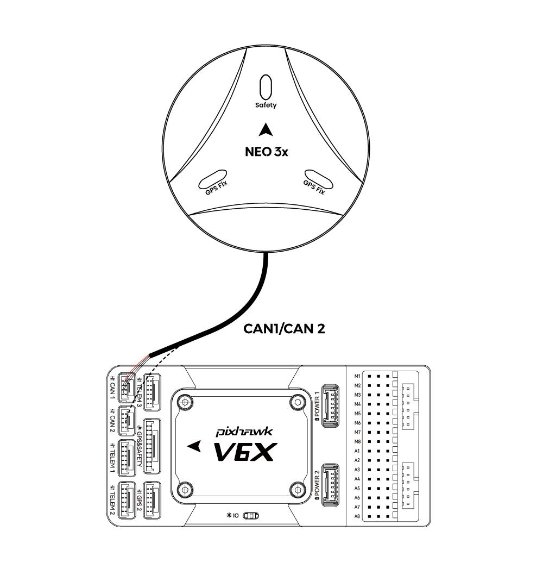

.. _common-cuav-neo-3x:

===========
NEO 3X  GPS
===========

NEO 3X is a GNSS receiver with IP66 protection level. It supports four-star system integration and has a variety of built-in waterproof and dust-proof structural designs and materials to meet dust-proof and waterproof requirements in various environments. It has built-in STM32F4 series processor, ICP2100 barometer, Ublox M9N module and RM3100 industrial grade compass, and supports DroneCan protocol.

Key Features
============

==========================    ======================================================================
MCU                           STM32F4
Sensors                       Compass:RM3100
                              Barometer:ICP-20100
Receiver                      Ublox M9N
Frequency Bands               GPS: L1C/A
                              GLONASS:L10F
                              Beidou:B1I
                              Galileo:E1B/C
Number of concurrent GNSS     4                                
Position accuracy(RMS)        1.5CEP                                          
Acquisition                   Cold start：24S
                              Hot start：2S
                              Aided start:2s             
Nav. update rate              5Hz(default)
Sensitivity                   Tracking and nav:-167dBm
                              Cold start Hot star:-148dBm
                              Reacquisition: -160dBm
Protection level              IP66
Input voltage                 4.7~5.2V
Operating temperature         -10~70℃
Size                          67*67*21.2mm
Weight                        46g(no cable）
==========================    ======================================================================

Where to buy
============

`CUAV store <https://www.alibaba.com/product-detail/Free-shipping-CUAV-NEO-3X-GPS_1601004167114.html?spm=a2747.manage.0.0.6aa271d2urCPnP>`__.

Connect to Autopilot
====================

.. note::

    Pixhawk6X shown for example. The connection to other autopilots is similar.

Setup
=====
See :ref:`common-canbus-setup-advanced` and :ref:`common-uavcan-setup-advanced` for more information.

Set the following parameters in all parameter tables of Mission planner and restart after writing

- :ref:`CAN_P1_DRIVER<CAN_P1_DRIVER>`     set to 1.
- :ref:`CAN_P2_DRIVER<CAN_P2_DRIVER>`     set to 1.
- :ref:`CAN_D1_PROTOCOL<CAN_D1_PROTOCOL>` set to 1.
- :ref:`CAN_D2_PROTOCOL<CAN_D2_PROTOCOL>` set to 1.
- :ref:`NTF_LED_TYPES<NTF_LED_TYPES>`     set to 231.
- :ref:`GPS1_TYPE<GPS1_TYPE>`               set to 9.

.. image:: ../../../images/cuav-neo-v2-pro/fc-set.png
    :target: ../_images/fc-set.png
    :width: 480px

More information
================

`CUAV docs <https://doc.cuav.net/en/>`__.