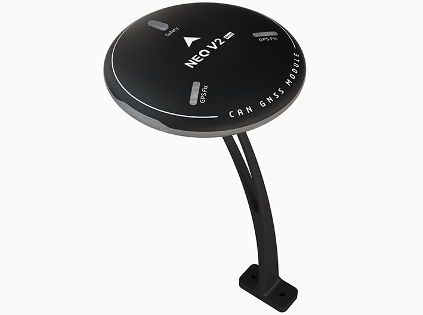
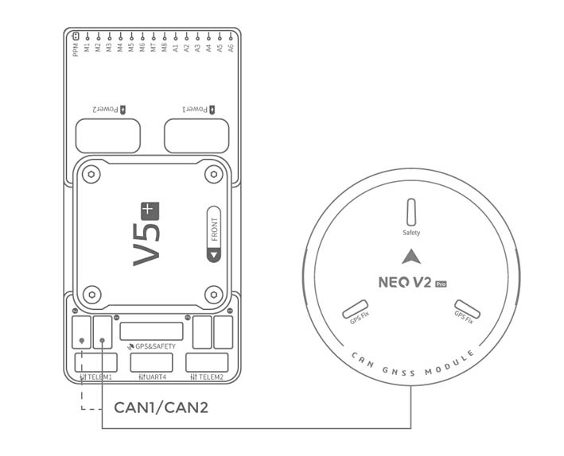
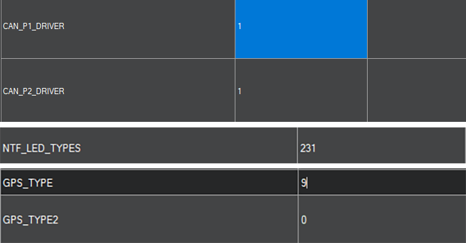
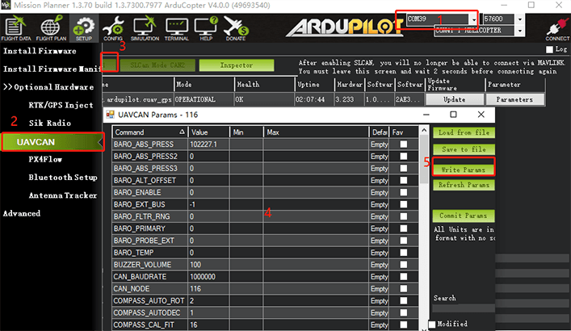
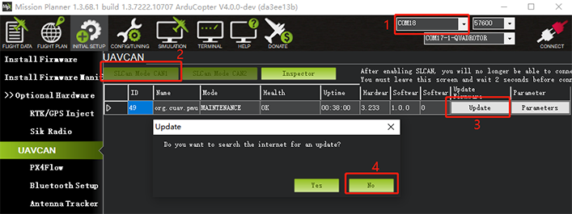
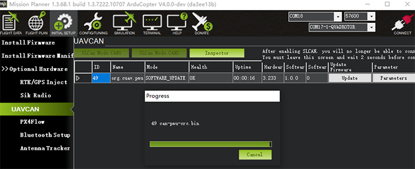
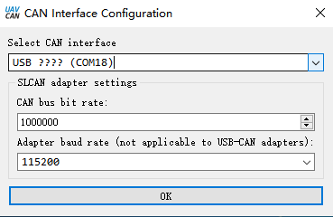
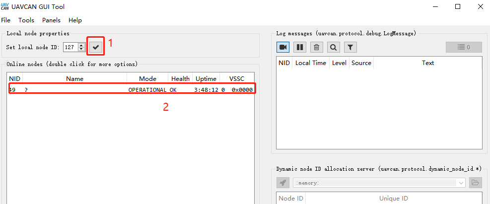
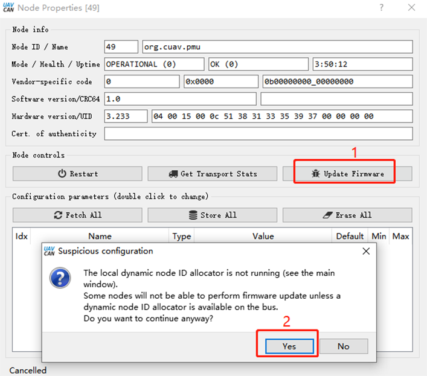
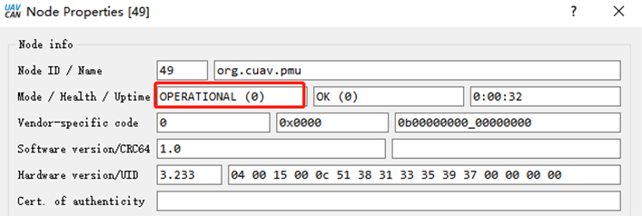

.. _common-cuav-neo-v2-pro-overview:

==============
NEO V2 Pro GPS
==============

NEO V2 pro is UAVCAN standard GPS developed by CUAV. It integrates industrial-grade compass, barometer, flight controller status light, buzzer, and safety switch all in one package. It has the characteristics of high safety and strong interference resistance.

.. note::

     NEO V2 pro is supported in ArduPilot 4.0 firmware (and higher).

Key Features
============

-  **Processor**
  
   -  STM32F412
   
-  **Sensors**
  
   -  Compass:RM3100
   -  Barometer:MS5611
   
-  **RTK Receiver**

   -  Ublox M8N
 
-  **GNSS Bands**

   - GPS/QZSS L1 C/A,GLONASS L10F ,BeiDou B1I,Galileo E1B/C,SBAS L1 C/A: WAAS, EGNOS, MSAS, GAGAN
   
-  **Nav. update rate**

   - RTK Up to 10HZ
   
-  **Position accuracy**

   - 2M
   
-  **Acquisition**

   - Cold starts 26 s
   - Aided starts 1 s
   - Reacquisition 2 s
   
-  **Sensitivity**

   - Tracking & Nav -167 dBm
   - Cold starts -148 dBm 
   - Reacquisition -160 dBm
   
-  **Protocol**

   - support

-  **Interface Type**
  
   - GHR-04V-S
   
-  **Input voltage**

   - 5V
   
-  **Operating temperature**

   - -10~70℃
   
-  **Size**

   - 60x60x16mm
   
-  **Weight**

   - 33g

Purchase
========

You can buy it from `CUAV store <https://store.cuav.net/index.php?id_product=111&rewrite=cuav-neo-v2-pro-can-gps&controller=product>`__.

Connect to CUAV v5+
===================

.. note::

    The connection to other flight controllers is similar.

Enable CAN port, UAVCAN, and Configure for NEO-V2 Pro
=====================================================

See :ref:`common-canbus-setup-advanced` and :ref:`common-uavcan-setup-advanced` for more information.

Set the following parameters in all parameter tables of Mission planner and restart after writing

- :ref:`CAN_P1_DRIVER<CAN_P1_DRIVER>`     set to 1.
- :ref:`CAN_P2_DRIVER<CAN_P2_DRIVER>`     set to 1.
- :ref:`CAN_D1_PROTOCOL<CAN_D1_PROTOCOL>` set to 1.
- :ref:`CAN_D2_PROTOCOL<CAN_D2_PROTOCOL>` set to 1.
- :ref:`NTF_LED_TYPES<NTF_LED_TYPES>`     set to 231.
- :ref:`GPS_TYPE<GPS_TYPE>`               set to 9.

NEO-V2 is now ready for operation

SLCAN Interface
===============

If you need to set up NEO V2 PRO or upgrade its firmware, you need to enable SLCAN

.. note::

    ArduPilot 4.0 or later firmware supports SLCAN.

- Please connect NEO V2 pro to the flight controller's CAN1 interface.
- Open mission planner and connect flight controller.

Modify the following parameters in the Full Parameter tab of Mission Planner.

**for CUAV V5+/nano:**

- :ref:`CAN_SLCAN_CPORT<CAN_SLCAN_CPORT>` set to 1
- :ref:`SERIAL7_PROTOCOL<SERIAL7_PROTOCOL>`  set to 22
- Reboot flight controller

.. note::

   CUAVV5 / NANO / FMUV5 flight controller running ArduPilot4.0 or later firmware will have two USB interfaces, one is flight controller's console port (SERIAL0) running MAVLINK  and one is an SLCAN interface port; if there are not two ports showing in the Mission Planner Comm Port drop-down box, please uninstall the driver and reinstall. If you continue to have problems, see :ref:`troubleshooting-composite-connections` 
   
**For Pixhawk series / FMUv2 / FMU V3 / FMU V4**

- :ref:`CAN_SLCAN_CPORT<CAN_SLCAN_CPORT>` Set to 1
- :ref:`CAN_SLCAN_TIMOUT<CAN_SLCAN_TIMOUT>` Set to 0 (no timeout, reboot to return to normal operation)
- :ref:`CAN_SLCAN_SERNUM<CAN_SLCAN_SERNUM>` Set to 0
- Please do not reboot the flight controller until your operation is complete.

.. note::

    STM32F4 does not support dual virtual USB ports, so  flight controllers using STM32F4 processor can only be used for SLCAN after the MAVlink connection on USB is closed; after writing the above settings, the USB interface becomes an SCLAN port; MAVlink connections can be made again after a reboot. Until then the USB connection can be used for SLCAN operations.

NEO-V2 Internal Configuration
=============================

ArduPilot supports setting UAVCAN device internal settings through SLCAN, such as modifying node ID; enabling / disabling barometer, etc.

	
#. Select the COMM port corresponding to SLCAN.
#. Select the UAVCAN section under Initial Setup>Optional Hardware tab.
#. Click "SLCAN NODE CAN1"  and
#. Click "Inspector"
#. Change configuration parameters for UAVCAN device

**Enable barometer**

- Baro_enabled=1, 0=disabled
- Reboot

**Modify device ID**

- Modify the CAN_NODE parameter

Upgrade Firmware
================

**Method One：**
Firmware upgrade using Mission planner

#. Select the COMM port corresponding to SLCAN.
#. Click "SLCAN NODE CAN1" on the UAVCAN section under Initial Setup>Optional Hardware tab.
#. Click "Update"
#. Select "NO" in the pop-up prompt box (Tes is to select online firmware; No selects local firmware).
#. Select firmware file.

	
- Wait for the flash process to complete.

**Method Two：**

Upgrade with UAVCAN GUI TOOL software

`UAVCAN GUI TOOL download <https://github.com/UAVCAN/gui_tool/releases>`__.

- Select the device port corresponding to SLCAN and click "ok"

	
- Click "√"; then double-click on the device information (marked in Figure 2 below).

	
- Click "update firmware", the message box will pop up "yes".

	
- The mode/heakth/uptime entry becomes "SOftware_update" 

- Waiting for firmware write to complete.

More information
================

`CUAV docs <http://doc.cuav.net/gps/neo-v2-pro/en/>`__.