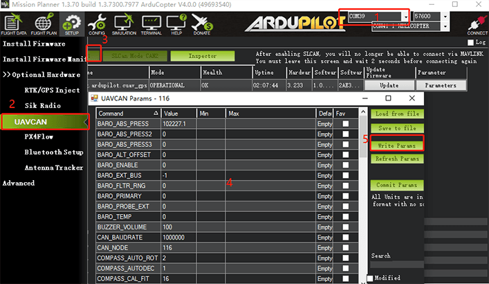
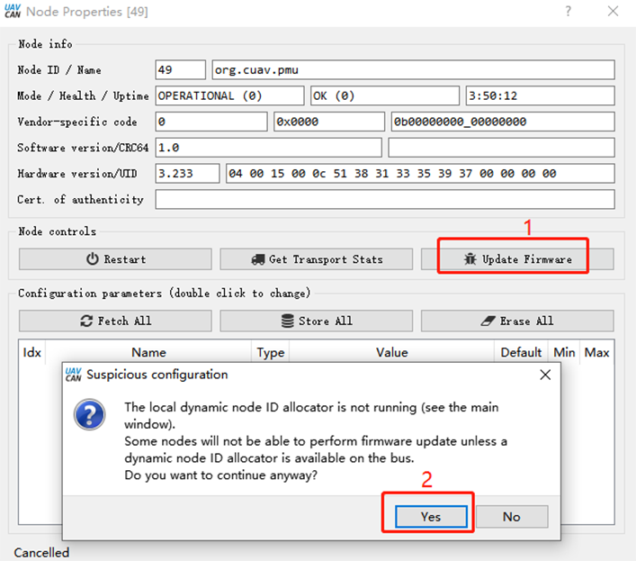
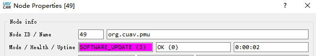

.. _common-cuav-neo-v2-pro-overview:

==============
NEO V2 Pro GPS
==============

NEO V2 pro is UAVCAN standard GPS developed by CUAV. It integrates industrial-grade compass, barometer, flight controller status light, buzzer, and safety switch in one. It has the characteristics of high safety and strong anti-interference.

.. image:: ../../../images/cuav-neo-v2-pro/neo-v2-pro.png
	:target: ../images/cuav-neo-v2-pro/neo-v2-pro.png

.. note::

     NEO V2 pro is supported in 4.0 firmware (and higher).

Key Features
============

-  **Processor**
  
   -  STM32F412
   
-  **Sensors**
  
   -  Compass:RM3100
   -  Barometer:MS5611
   
-  **RTK Receiver**

   -  Ublox M8N
 
-  **GNSS Bands**

   - GPS/QZSS L1 C/A,GLONASS L10F ,BeiDou B1I,Galileo E1B/C,SBAS L1 C/A: WAAS, EGNOS, MSAS, GAGAN
   
-  **Nav. update rate**

   - RTK Up to 10HZ
   
-  **Position accuracy**

   - 2M
   
-  **Acquisition**

   - Cold starts 26 s
   - Aided starts 1 s
   - Reacquisition 2 s
   
-  **Sensitivity**

   - Tracking & Nav -167 dBm
   - Cold starts -148 dBm 
   - Reacquisition -160 dBm
   
-  **Protocol**

   - support

-  **Interface Type**
  
   - GHR-04V-S
   
-  **Input voltage**

   - 5V
   
-  **Operating temperature**

   - -10~70℃
   
-  **Size**

   - 60*60*16MM
   
-  **Weight**

   - 33g

Purchase
========

You can buy it from `CUAV store <https://store.cuav.net/index.php?id_product=111&rewrite=cuav-neo-v2-pro-can-gps&controller=product>`__.

Connect to CUAV v5+
===================

.. image:: ../../../images/cuav-neo-v2-pro/connection-to-v5+.jpg
	:target: ../images/cuav-neo-v2-pro/connection-to-v5+.jpg

.. note::

    The connection of other PIX flight controllers is the same.
    
Enable
======

Set the following parameters in all parameter tables of Mission planner and restart after writing

- :ref:`CAN_P1_DRIVER>`  set to 1.
- :ref:`CAN_P2_DRIVER>`  set to 1.
- :ref:`NTF_LED_TYPES>`  set to 231.
- :ref:`GPS_TYPE>`  set to 9.

.. image:: ../../../images/cuav-neo-v2-pro/fc-set.png
	:target: ../images/cuav-neo-v2-pro/fc-set.png

ENable slcan
============

If you need to set up NEO V2 PRO or upgrade its firmware, you need to enable slcan

.. note::

    Ardupilot 4.0 or later firmware supports SLCAN.

- Please connect NEO V2 pro to flight control CAN1 interface.
- Open mission planner and connect flight controller.

Modify the following parameters in all parameter tables of the mission planner.

**for CUAV V5+/nano:**

- :ref:`CAN_SLCAN_CPORT>` set to 1
- :ref:`Serial7_protocol>`  set to 22
- Reboot flight control

.. note::

   CUAVV5 / NANO / FMUV5 flight control running ardupilot4.0 or later firmware will have two usb driver ports, one is flight control mavlink output port and one is slcan port; if there are no two ports, please uninstall the driver and reinstall).
   
**For Pixhawk series / FMUv2 / FMU V3 / FMU V4**

- :ref:`CAN_SLCAN_CPORT>` Set to 1
- :ref:`CAN_SLCAN_TIMEOUT>` Set to 130000
- :ref:`CAN_SLCAN_SERNUM>` Set to 0
- Please do not reboot the flight control until your operation is complete.

.. note::

    STM32F4 does not support dual virtual USB ports, so the flight control using STM32F4 processor can only be used for SLCAN after MAVlink transmission is closed; after the above settings, USB becomes SCLAN port; MAVlink transmission will resume after restart.

Debug 
=====

Ardupilot supports setting UAVCAN settings through Slcan, such as modifying node ID; enabling / disabling barometer, etc.

**Enable barometer**

- Baro_enable=1(0:disable
- Reboot

**Modify device ID**

- Modify the CAN_NODE parameter

Upgrade firmware
================

**method one：**
Firmware upgrade using Mission planner

.. image:: ../../../images/cuav-neo-v2-pro/upgrade-firmware/slcan.png
	:target: ../images/cuav-neo-v2-pro/upgrade-firmware/slcan.png

- Select the device port corresponding to slcan.
- Click "slcan mode CAN1" on the UAVCAN interface.
- Click "Update", select NO in the pop-up prompt box (yes is to select online firmware; No select local firmware).
- Select firmware file.

.. image:: ../../../images/cuav-neo-v2-pro/upgrade-firmware/slcan2.png
	:target: ../images/cuav-neo-v2-pro/upgrade-firmware/slcan2.png
	
- Wait for the writer to complete.

**method two：**

Upgrade with UAVCAN GUI TOOL software

`UAVCAN GUI TOOL download <https://github.com/UAVCAN/gui_tool/releases>`__.

- Select the device port corresponding to slcan and click "ok"

.. image:: ../../../images/cuav-neo-v2-pro/upgrade-firmware/uavcan.png
	:target: ../images/cuav-neo-v2-pro/upgrade-firmware/uavcan.png
	
- Click "√"; then double-click on the device information (marked in Figure 2 below).

	
- Click "update firmware", the message box will pop up "yes".

	
- The mode/heakth/uptime entry becomes "SOftware_update" 

- Waiting for firmware write to complete.

.. image:: ../../../images/cuav-neo-v2-pro/upgrade-firmware/uavcan5.png
	:target: ../images/cuav-neo-v2-pro/upgrade-firmware/uavcan5.png

More information
================

`CUAV docs <http://doc.cuav.net/gps/neo-v2-pro/en/>`__.