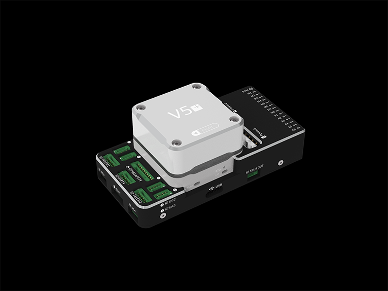
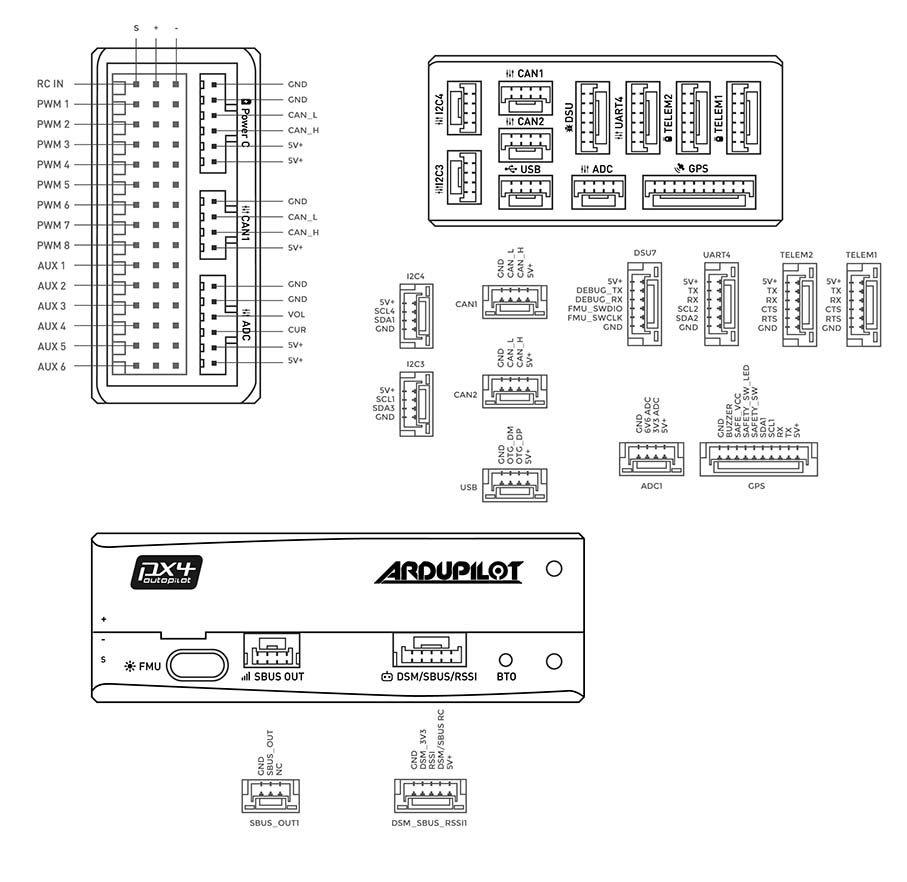

.. _common-cuav-nora-overview:

==================
CUAV Nora Overview
==================

<<<<<<< refs/remotes/ArduPilot/master
.. image:: ../../../images/cuav_autopilot/Nora/CUAV_Nora.png
    :target: ../_images/CUAV_Nora.png
    :width: 360px

=======

<<<<<<< refs/remotes/ArduPilot/master
>>>>>>> Nora page details
=======

>>>>>>> Update common-cuav-nora-overview.rst
Nora® is an advanced autopilot independently designed by CUAV®. It uses a higher-performance STM32H7 processor and integrates industrial-grade sensors and ultra-low temperature drift sensors. Compared with the previous flight controller,it has better performance and more reliability. This board can run ArduPilot firmware perfectly. Nora is ideal for academic research and commercial systems integration.

Features 
========

<<<<<<< refs/remotes/ArduPilot/master
<<<<<<< refs/remotes/ArduPilot/master
-  Internal IMU isolation
-  Connection ports on the side of autopilot
-  Supports USB_HS
-  Supports more dshot output
-  Tempratture Controled IMU
-  Dedicated uavcan smart battery port
-  Tripple redundant IMU sensors
=======
  -  Internal IMU isolation
  -  Connection ports on the side of autopilot
  -  Supports USB_HS
  -  Supports more dshot output
  -  Tempratture Controled IMU
  -  Dedicated uavcan smart battery port
  -  Tripple redundant IMU sensors
>>>>>>> Nora page details
=======
    -  Internal IMU isolation
    -  Connection ports on the side of autopilot
    -  Supports USB_HS
    -  Supports more dshot output
    -  Tempratture Controled IMU
    -  Dedicated uavcan smart battery port
    -  Tripple redundant IMU sensors
>>>>>>> Update common-cuav-nora-overview.rst
  
Specifications
==============

-  **Processor**

   -  32-bit ARM Cortex STM32H743
   -  480 Mhz/1MB RAM/2 MB Flash
   -  32 bit IOMCU co-processor

-  **Sensors**

   -  ICM-20689 Accelerometer/Gyroscope
   -  ICM-20649 Accelerometer/Gyroscope 
   -  BMI088 Accelerometer/Gyroscope
<<<<<<< refs/remotes/ArduPilot/master
   -  RM3100 Magnetometer
=======
   -  RM3100Magnetometer
>>>>>>> Nora page details
   -  MS5611 x2 Barometer

-  **Power**

   -  Operating power: 4.3~5.4V
   -  USB Input: 4.75~5.25V
   -  High-power servo rail, up to 36V
      (servo rail does not power the autopilot)
   -  Dual voltage and current monitor inputs
   -  CUAV Nora can be triple redundant if power is provided
      to both battery monitor inputs and the USB port

-  **Interfaces**

   -  14 PWM outputs （12 supports Dshot）
   -  Support multiple RC inputs (SBUs / CPPM / DSM)
   -  S.Bus servo output
   -  2 GPS ports(GPS and UART4 ports)
   -  4 I2C ports
   -  2 CAN bus ports
   -  2 Power ports(Power A is common adc interface, Power C is uavcan battery interface)
   -  2 ADC intput
   -  2 USB ports (Type C and gh 1.25)
   -  3 dedicated PWM/Capture inputs on FMU
   -  SBUS/DSM/RSSI connector supports all RC protocols (including SBUS, DSM, ST24, SRXL and PPM)

-  **Other**

<<<<<<< refs/remotes/ArduPilot/master
   -  Weight: 50g
   -  Dimensions: 46mm x 64mm x 22mm
   -  Operating temperature: -20 ~ 80°c（Measured value）

Pinouts
=======

=======
  -  Weight: 50g
  -  Dimensions: 46mm x 64mm x 22mm
  -  Operating temperature: -20 ~ 80°c（Measured value）

>>>>>>> Nora page details

Where to Buy
============

Order from `here <https://store.cuav.net/index.php>`__.
<<<<<<< refs/remotes/ArduPilot/master

=======
>>>>>>> Nora page details
Official retailers are listed `here  <https://leixun.aliexpress.com/>`__.

Quick Start
===========

To Follow 

More Information
================

`CUAV Website <http://doc.cuav.net/flight-controller/x7/en/nora.html>`__

`Schematics <https://github.com/cuav/hardware/tree/master/X7_Autopilot>`__

More Images
===========

<<<<<<< refs/remotes/ArduPilot/master
Image gallery can be found `here <https://github.com/ArduPilot/ardupilot_wiki/tree/master/images/cuav_autopilot/Nora>`__
=======
Image gallery can be found `here <https://github.com/ArduPilot/ardupilot_wiki/tree/master/images/cuav_autopilot/v5plus>`__
>>>>>>> Nora page details
