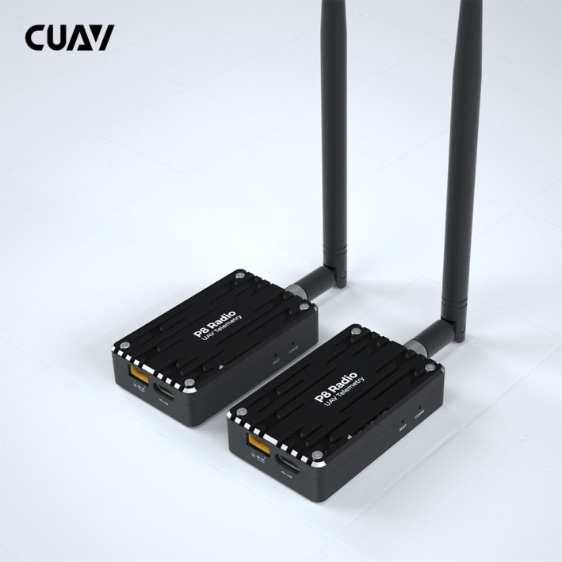
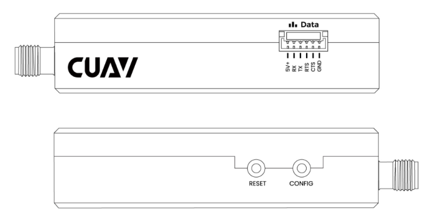
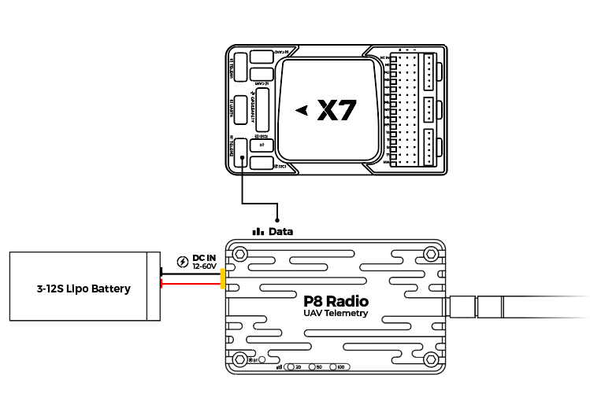

.. _common-cuav-p8:
[copywiki destination="plane,copter,rover,blimp"]
=============
CUAV P8 Radio
=============

P8 Radio is a remote data transmission module for drones; it has a remote data transmission capability of 60KM+; 

Its transmission rate is as high as 375Kbps, and it supports multiple working modes such as point-to-point, point-to-multipoint, and relay communication; for various application scenarios.

Key Features
============

- Long range >60km（depending on the antenna and use environment).
- Supports point-to-point, point-to-multipoint, and repeater modes.
- 1 Watt (+30dBm) transmit power.
- Up to 345Kbps transfer rate.
- Supports 12v~60V operating voltage.
- Unit can operate either as ground station modem or aircraft modem.
- Independent power supply for more stable operation.
  

Purchase
========

Order from `cuav store <https://store.cuav.net/shop/cuav-p8-radio-uav-telemetry/>`__. or from `here <https://www.alibaba.com/product-detail/Free-shipping-CUAV-UAV-P8-Radio_1600324379418.html?spm=a2747.manage.0.0.2dca71d2bY4B0M>`__.

Pinouts
=======

Connection with Flight Control
==============================

V5+/v5 nano/X7/X7 PRO/NORA ： Green connector is connected autopilot's telemetry UART, white connector is connected to P8 radio.

Video
=====

.. youtube:: IEeOzY04KqM
    :width: 100%

More information
================

- `CUAV docs <https://doc.cuav.net/data-transmission/p8-radio/en/>`__
- `User manual <http://manual.cuav.net/data-transmission/p8-radio/p8-user-manual-en.pdf>`__