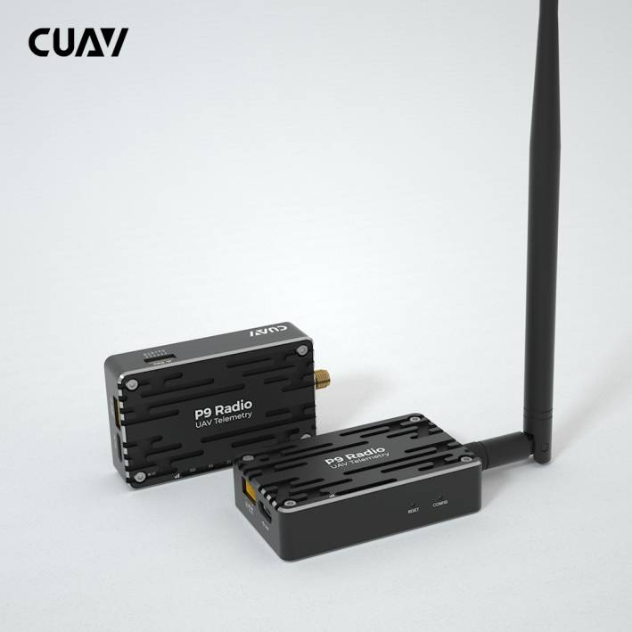
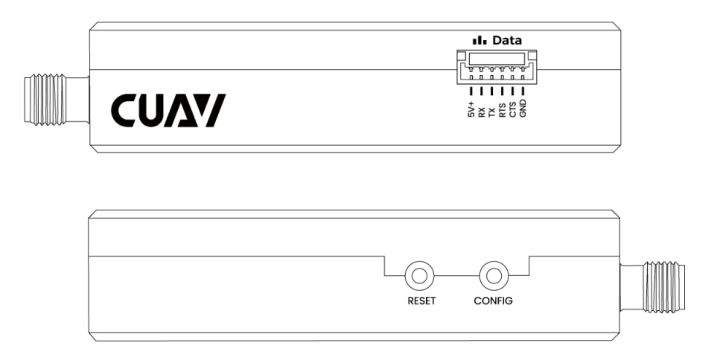
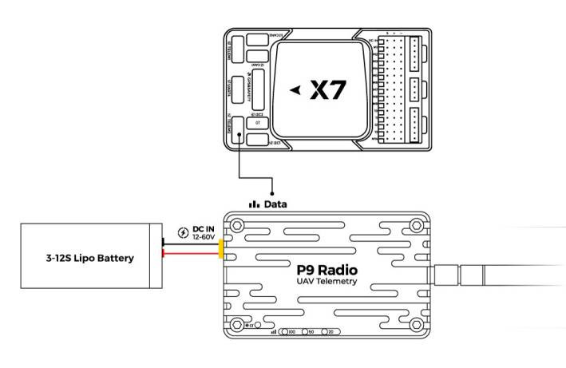

.. _common-cuav-p9:
[copywiki destination="copter,plane,rover,blimp"]
=============
CUAV P9 Radio
=============

P9 Radio is a long-range drone telemetry module developed by CUAV. It has high power, high speed and high receiving sensitivity, which is very suitable for UAV communication system.

Key Features
============

- Up to 60KM long-distance transmission.（depending on the antenna and use environment).
- 902-928 MHz Working frequency
- Support point-to-point, point-to-multipoint, relay communication and other communication methods.
- 1 Watt (+30dBm) transmit power.
- Supports 12v~60V operating voltage.
- Support high-speed frequency hopping technology, anti-interference.
  

Purchase
========

Order from `cuav store <https://store.cuav.net/shop/p9/>`__. or from `here <https://cuav.en.alibaba.com/product/1600096553670-821011610/Free_shipping_CUAV_New_design_P9_Radio_Telemetry_Ground_end_package_for_FPV_Data_Transmission_Station.html?spm=a2700.shop_index.152.3.5b1879959A5ANe>`__.

Technical Specifications
========================

    +-----------------------------+--------------------------------------------------------------------------------+
    | Working frequency           | 902-928 MHz                                                                    |
    +-----------------------------+--------------------------------------------------------------------------------+
    | Transmission technology     | Frequency Hopping                                                              |
    +-----------------------------+--------------------------------------------------------------------------------+
    | Transfer Protocol           | Transparent transmission                                                       |
    +-----------------------------+--------------------------------------------------------------------------------+
    | Forwarding error detection  | Hamming /BCH/Golay/Reed-Solomon                                                |
    +-----------------------------+--------------------------------------------------------------------------------+
    | Error detecting             | Error Detection 32 bits of CRC, ARQ                                            |
    +-----------------------------+--------------------------------------------------------------------------------+
    | Encrypt                     | Optional (see –AES option)                                                     |
    +-----------------------------+--------------------------------------------------------------------------------+
    | Range                       | Up to 60km (depending on the antenna and use environment)                      |
    +-----------------------------+--------------------------------------------------------------------------------+
    | Sensitivity                 | -110 dBm @ 115.2 kbps, better than -108 dBm @ 172.8 kbps,                      |
    |                             | better than -107 dBm @ 230.4 kbps                                              |
    +-----------------------------+--------------------------------------------------------------------------------+
    | Output power                | 100mW - 1W (20-30dBm)  （Default：1W)                                          |
    +-----------------------------+--------------------------------------------------------------------------------+
    | Serial interface            | 3.3V CMOS TTL                                                                  |
    +-----------------------------+--------------------------------------------------------------------------------+
    | Antenna gain                | 5 dbi                                                                          |
    +-----------------------------+--------------------------------------------------------------------------------+
    | Baud rate                   | Up to 230.4kbps, 57600 default                                                 |
    +-----------------------------+--------------------------------------------------------------------------------+
    | Link Rate                   | 115 - 276 kbps                                                                 |
    +-----------------------------+--------------------------------------------------------------------------------+
    | Operating Modes             | Auto Routing, Store and Forward,Self Healing, Packet Routing Modes             |
    +-----------------------------+--------------------------------------------------------------------------------+
    | Operating Voltage           | 12V-60V                                                                        |
    +-----------------------------+--------------------------------------------------------------------------------+
    | Power consumption           | Sleep <1mA, Idle <3.5mA, RX:35mA~80mA, TX:800mA~1200mA                         |
    +-----------------------------+--------------------------------------------------------------------------------+
    | Operating temperature       |  -40℃ ~ +85℃                                                                   |
    +-----------------------------+--------------------------------------------------------------------------------+
    | Humidity                    | 5% ~ 95%(Non-condensing)                                                       |
    +-----------------------------+--------------------------------------------------------------------------------+
    | Size                        | 5g(No antenna); with Antenna:31g                                               |
    +-----------------------------+--------------------------------------------------------------------------------+
    | Weight                      | 65mmx40mmx16.5mm                                                               |
    +-----------------------------+--------------------------------------------------------------------------------+

Pinouts
=======

Connection with Flight Control
==============================

V5+/v5 nano/X7/X7 PRO/NORA ： Green connector is connected autopilot's telemetry UART, white connector is connected to P8 radio.

More information
================

- `CUAV docs <https://doc.cuav.net/data-transmission/p9-radio/en/>`__