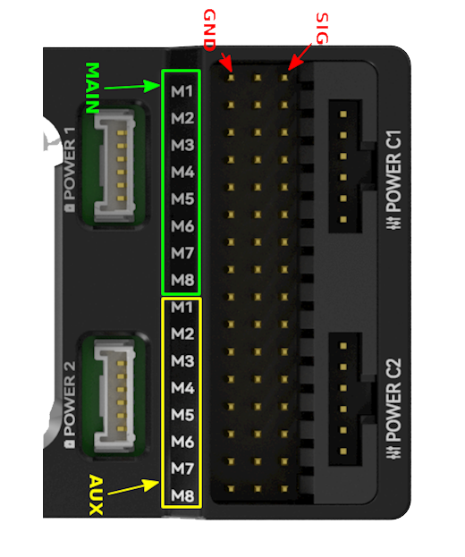

.. _common-cuav-pixhawkv6X:

================
CUAV Pixhawk v6X
================

Featuring STM32H7 cpu, vibration isolation of IMUs, redundant IMUs, double redundant barometers, IMU heating, and integrated Ethernet for high speed connections to companion computers.

Where To Buy
============

The Pixhawkv6X autopilots are sold by `CUAV <https://store.cuav.net/uav-flight-controller/>`__

Specifications
==============

-  **Processor**

   -  STM32H753IIK6
   -  STM32F103

-  **Sensors**

   -  Bosh BMI088 IMU (accel, gyro)
   -  InvenSense ICM-20649 IMU (accel, gyro)
   -  InvenSense ICM-42688-P IMU (accel, gyro)
   -  RM3100 magnetometer
   -  Dual ICP-20100 barometers

-  **Power**

   -  Dual SMBUS/I2C Power Module Inputs
   -  CAN Power Module included with autopilot

-  **Interfaces**

   -  8x UARTS, 6 Available for customer use
   -  16x PWM outputs
   -  PPM/SBUS input, DSM/SBUS input
   -  SPI6 port
   -  2x I2C ports for external compass, airspeed sensor, etc. on GPS connector
   -  USB port (with remote cabling), USB connector on module
   -  2 x CAN port
   -  Buzzer and Safety Switch
   -  microSD card
   -  Ethernet

-  **Size and Dimensions**

   - Heat disipating aluminum case

Pinouts
=======

UART Mapping
============

 - SERIAL0 -> USB 
 - SERIAL1 -> UART7 (Telem1) RTS/CTS pins
 - SERIAL2 -> UART5 (Telem2) RTS/CTS pins
 - SERIAL3 -> USART1 (GPS1)
 - SERIAL4 -> UART8 (GPS2)
 - SERIAL5 -> USART2 (Telem3) RTS/CTS pins
 - SERIAL6 -> UART4 (User)
 - SERIAL7 -> USART3 (Debug)
 - SERIAL8 -> USB Virtual(MAVLink, can be used for SLCAN with protocol change)

RC Input
========
The PPM pin, which by default is mapped to a timer input, can be used for all ArduPilot supported receiver protocols, except CRSF/ELRS and SRXL2 which require a true UART connection. However, FPort, when connected in this manner, will only provide RC without telemetry. 

To allow CRSF and embedded telemetry available in Fport, CRSF, and SRXL2 receivers, a full UART, such as SERIAL6 (UART4) would need to be used for receiver connections. Below are setups using Serial6.

- :ref:`SERIAL6_PROTOCOL<SERIAL6_PROTOCOL>` should be set to "23".

- FPort would require :ref:`SERIAL6_OPTIONS<SERIAL6_OPTIONS>` be set to "15".

- CRSF/ELRS would require :ref:`SERIAL6_OPTIONS<SERIAL6_OPTIONS>` be set to "0".

- SRXL2 would require :ref:`SERIAL6_OPTIONS<SERIAL6_OPTIONS>` be set to "4" and connects only the TX pin.

Any UART can be used for RC system connections in ArduPilot also, and is compatible with all protocols except PPM. See :ref:`common-rc-systems` for details.

PWM Output
==========

The Pixhawkv6X supports up to 16 PWM outputs. All 16 outputs
support all normal PWM output formats. All FMU outputs support DShot, except 7 and 8. These do not support serial LEDS either.

The 8 FMU PWM outputs are in 4 groups:

 - Outputs 1, 2, 3 and 4 in group1
 - Outputs 5 and 6 in group2
 - Outputs 7 and 8 in group3

FMU outputs within the same group need to use the same output rate and protocol. If
any output in a group uses DShot then all channels in that group need
to use DShot.

Battery Monitoring
==================

The autopilot defaults are setup for CAN Power Module use (normally supplied with autopilot):

- :ref:`BATT_MONITOR<BATT_MONITOR>` = 8
- :ref:`CAN_P1_DRIVER<CAN_P1_DRIVER>` = 1
- :ref:`CAN_P2_DRIVER<CAN_P2_DRIVER>` = 1
- :ref:`CAN_D1_PROTOCOL<CAN_D1_PROTOCOL>` = 1
- :ref:`CAN_D2_PROTOCOL<CAN_D2_PROTOCOL>` = 1

However, the board also has 2 dedicated power monitor ports with a 6 pin
connectors. These are intended for use with the I2C power monitors, if desired.

.. note:: do not try to use the Mission Planner SETUP->Optional Hardware->Battery Monitor tab to setup the I2C power monitors for the Pixhawk6X. The parameters needed for their operation are already setup by default:

- :ref:`BATT_MONITOR<BATT_MONITOR>` = 21
- :ref:`BATT_I2C_BUS<BATT_I2C_BUS__AP_BattMonitor_INA2xx>` = 1
- :ref:`BATT_I2C_ADDR<BATT_I2C_ADDR__AP_BattMonitor_INA2xx>` = 65

Compass
=======

The Pixhawkv6X has a built-in compass. Due to potential
interference, the autopilot is usually used with an external I2C compass as
part of a GPS/Compass combination.

GPIOs
=====

The 8 FMU outputs can be used as GPIOs (relays, buttons, RPM etc). To use them you need to set the output's ``SERVOx_FUNCTION`` to -1. See :ref:`common-gpios` page for more information.

The numbering of the GPIOs for PIN variables in ArduPilot is:

 - PWM1 50
 - PWM2 51
 - PWM3 52
 - PWM4 53
 - PWM5 54
 - PWM6 55
 - PWM7 56
 - PWM8 57

Additional GPIOs:

 - FMU_CAP1 58
 - NFC_GPIO 59

Analog inputs
=============

The Pixhawkv6X has 2 analog inputs, one 6V tolerant and one 3.3V tolerant

 - ADC Pin12 -> ADC 6.6V Sense
 - ADC Pin13 -> ADC 3.3V Sense
 - Analog 3.3V RSSI input pin = 103

Connectors
==========

Unless noted otherwise all connectors are JST GH

Loading Firmware
================

The board comes pre-installed with an ArduPilot compatible bootloader,
allowing the loading of xxxxxx.apj firmware files with any ArduPilot
compatible ground station.

Firmware for these boards can be found `here <https://firmware.ardupilot.org>`_ in  sub-folders labeled "Pixhawk6X".

Bi-Directional DShot firmware variations are available also providing BDShot capability on outputs 1-6.

[copywiki destination="plane,copter,rover,blimp"]