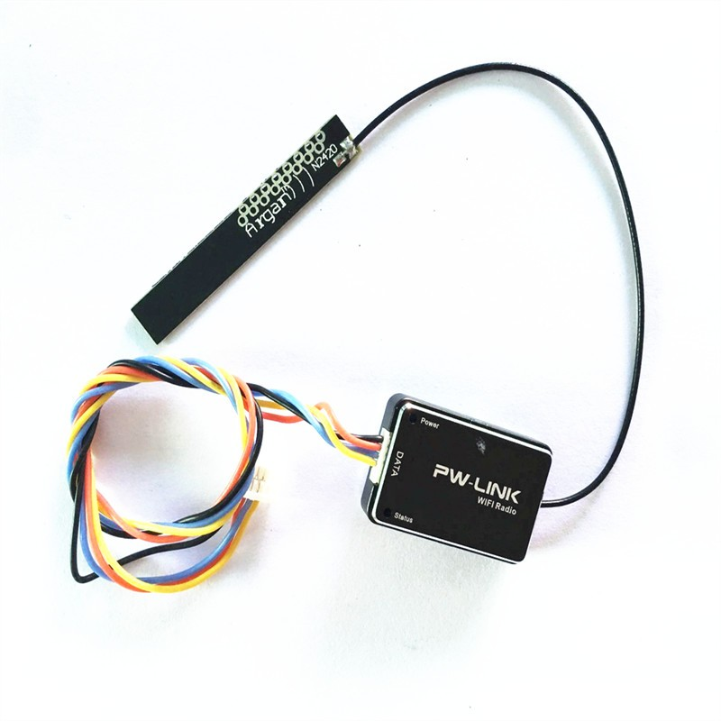
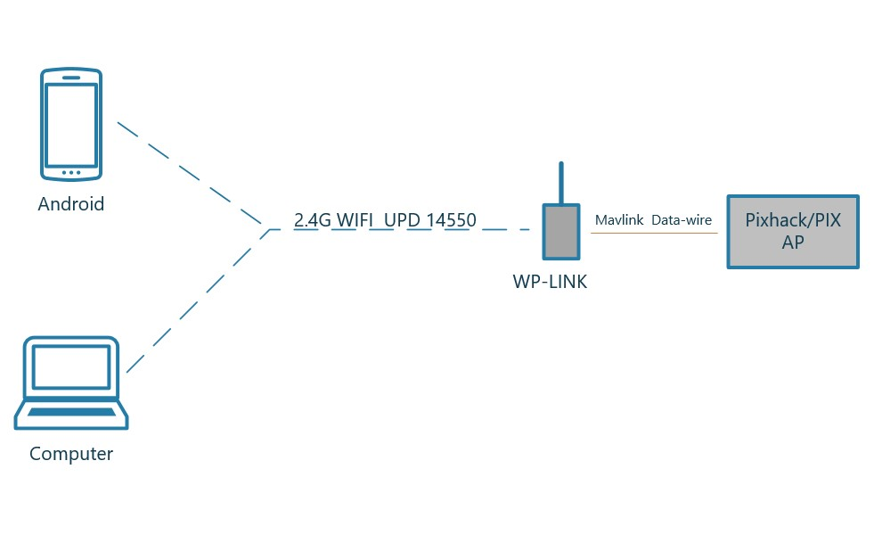

.. _common-cuav-pwlink:

============
CUAV PW-Link
============

CUAV PW-LINK is an ESP8266 based 2.4Ghz WIFI telemetry radio. It connects to any ArduPilot telemetry port using +5V,gnd,TX and RX signals. Running at the standard default parameters of 57.6 Kbaud and MAVLink2 telemetry protocol, it connects via the standard Mission Planner/ QGC UDP port 14550 over WIFI. 

With its external antenna, range of 450 meters is typical. 

Connecting to the Ground Station
================================

Open WIFI connection dialog on PC or Android Phone and select the ``CUAVWLINKxxxx`` SSID and connect using the password ``cuavwlink``. Once connected use the UDP connection with port = 14550 (which is default) to connect using Mission Planner. QGC should auto-detect and connect.
