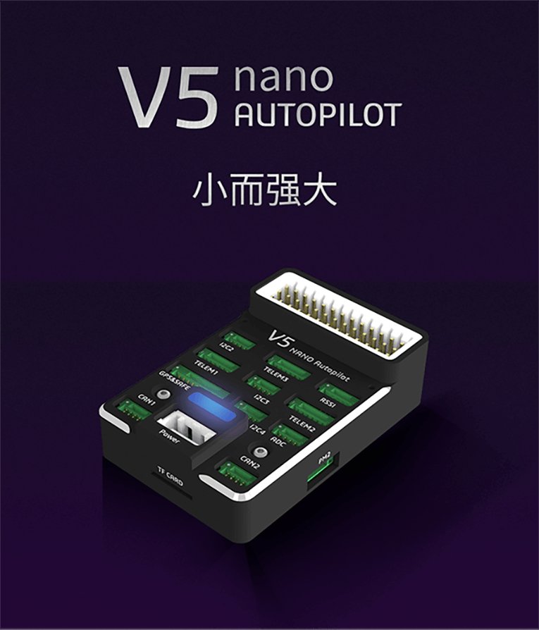
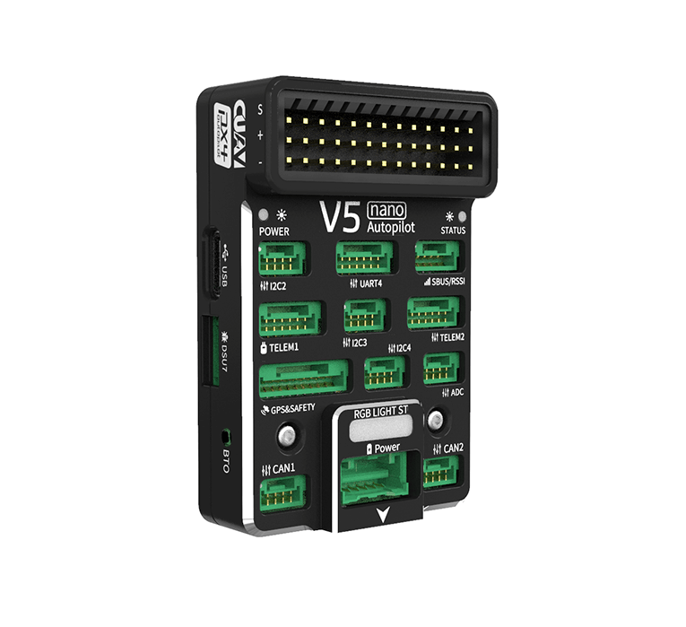
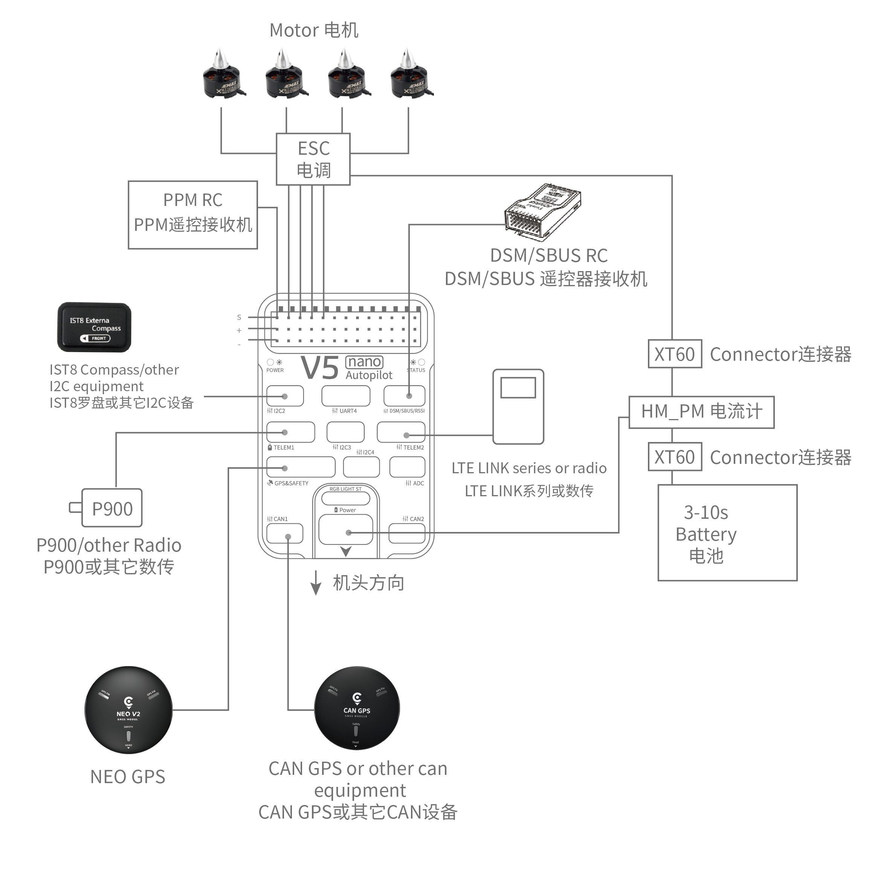
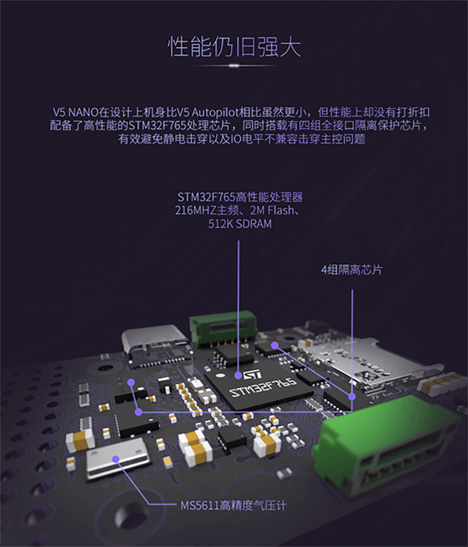

.. _common-cuav-v5nano-overview:

=====================
CUAV V5 Nano Overview
=====================

The CUAV v5 Nano is an advanced STM32F765 autopilot designed and made by CUAV.
CUAV v5 Nano is intended for engineers and hobbyists who are looking for the power of CUAV V5+ but are working with smaller drones.

Specifications
==============

-  **Processor**

   -  32-bit ARM Cortex M7 core with DPFPU
   -  216 Mhz/512 KB RAM/2 MB Flash

-  **Sensors**

   -  InvenSense ICM20689 accelerometer / gyroscope
   -  InvenSense ICM20602 : accelerometer / gyroscope
   -  Bosch BMI055 accelerometer / gyroscope
   -  MS5611 barometer
   -  IST8310 magnetometer

-  **Power**

   -  Operating power: 4.3~5.4V
   -  USB Input: 4.75~5.25V
   -  High-power servo rail, up to 36V
      (servo rail does not power the autopilot)
   -  Dual voltage and current monitor inputs
   -  CUAV v5 nano can be dual redundant if power is provided
      to Power 1 and USB inputs

-  **Interfaces**

   -  8 - 11 PWM servo outputs
   -  3 dedicated PWM/Capture inputs on FMU
   -  S.Bus servo output
   -  PPM connector supports all RC protocols (including SBUS, DSM, ST24, SRXL and PPM)
   -  SBUS/DSM/RSSI connector supports all RC protocols (including SBUS, DSM, ST24, SRXL and PPM)
      and analog / PWM RSSI input
   -  5x general purpose serial ports
   -  3x I2C ports
   -  4x SPI bus
   -  2x CAN Bus ports
   -  2x analog battery monitor ports

-  **Other**

  -  Dimensions: 60mm x 40mm x 14mm
  -  Operating temperature: -20 ~ 80°c（Measured value）

Unboxing and Review Video
=========================

..  youtube:: DM3oL41DXAc
    :width: 100%

Where to Buy
============

Order from `here <https://store.cuav.net/index.php>`__. or from `here <https://store.jdrones.com/>`__
Official retailers are listed `here  <https://leixun.aliexpress.com/>`__.

Quick Start
===========

.. image:: ../../../images/cuav_autopilot/v5-nano/v5-nano_pinouts.png
    :target: ../_images/cuav_autopilot/v5-nano/v5-nano_pinouts.png

Interfaces
    +------------------+--------------------------------------------------------------+
    | Main Interface   | Function                                                     |
    +==================+==============================================================+
    | Power 1          |Primary power module. Autopilot power, V & I monitor          |
    +------------------+--------------------------------------------------------------+
    |PM2               | 2 x ADC, ie second V & I monitor.  Does not provide power    |
    +------------------+--------------------------------------------------------------+
    | TF Card          | Insert SD card for log file and terrain data storage         |
    +------------------+--------------------------------------------------------------+
    | M1 - M8          | Main Outputs.  Servo/motor/D-Shot capable                    |
    +------------------+--------------------------------------------------------------+
    | A1 - A3          | Additional Outputs. Servo/motor capable                      |
    +------------------+--------------------------------------------------------------+
    | DSU7             | Serial 6 (uart7)                                             |
    +------------------+--------------------------------------------------------------+
    | ADC              | Analog sensor input                                          |
    +------------------+--------------------------------------------------------------+
    | I2C2/I2C3/I2C4   | External I2C (Compass / rangefinder etc)                     |
    +------------------+--------------------------------------------------------------+
    | CAN1/CAN2        | CANBUS (UAVCAN, KDECAN, ToshibaCAN)                          |
    +------------------+--------------------------------------------------------------+
    | GPS & SAFETY     | CUAV NEO v2 GPS with compass, safety switch, LED, buzzer     |
    +------------------+--------------------------------------------------------------+
    | TELEM1 / TELEM2  | Serial ports (telemetry, peripherals, companion computer)    |
    +------------------+--------------------------------------------------------------+
    | DSM/SBUS/RSSI    | RC Input (SBUS / DSM / ST24 / SRXL / PPM) or RSSI Input      |
    +------------------+--------------------------------------------------------------+

More Information
================

CUAV V5 Nano PDF `here <http://manual.cuav.net/V5-nano.pdf>`__

`Schematics <https://github.com/ArduPilot/Schematics/tree/master/CUAV>`__

More Images
===========

