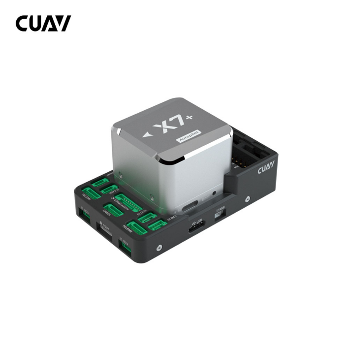
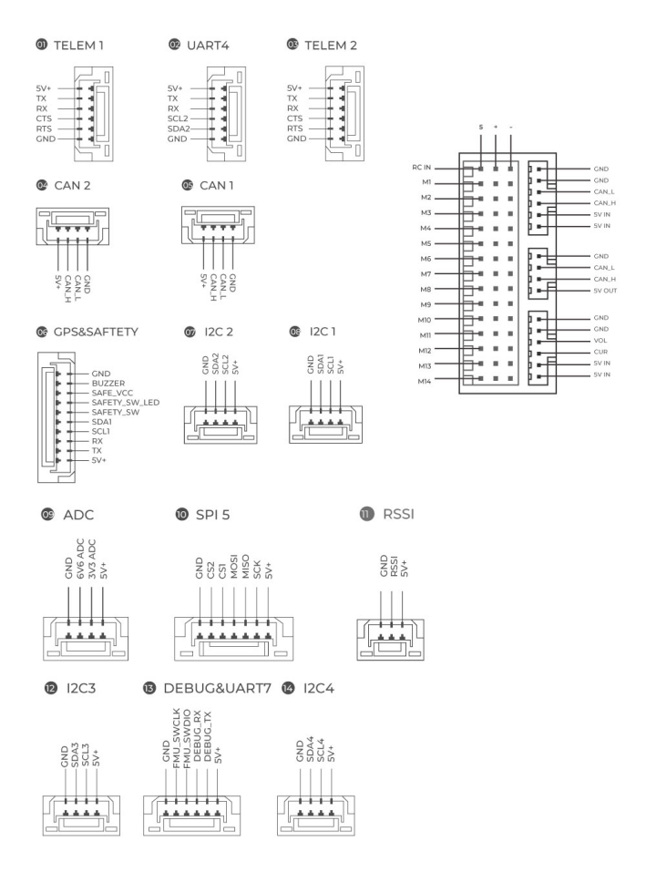

.. _common-cuav-x7-family-overview:

=======================
CUAV X7 Family Overview
=======================

**X7/X7 Pro/X7+/X7+ Pro®** is an advanced autopilot family designed in-house by CUAV®. It uses a higher-performance STM32H7 processor and integrates industrial-grade sensors. Compared with previous autopilots, it has better performance and higher reliability.

The first generation autopilots (X7/X7 Pro) have been updated with new sensors, providing the same high performance, but with more reliable source of supply, and some improvements to allow Bi-dir DShot and servo rail voltage monitoring.

The modular design allows users to customize the baseboard and is fully compatible with the CUAV V5+ carrier board. The X7+/X7+ Pro are ideal for academic research and commercial systems integration.

Where to Buy
============

Order from `here <https://store.cuav.net/index.php>`__.
Official retailers are listed `here  <https://www.cuav.net/en/resellers/>`__.

Features of CUAV X7 Series
===========================

+---------------------+------------+-----------------+------------------+------------------+
|                     |CUAV X7     |CUAV X7 Plus     | CUAV X7 Pro      | CUAV X7 Plus Pro | 
+=====================+============+=================+==================+==================+
|Processor            |                          STM32H743                                 |
+---------------------+------------+-----------------+------------------+------------------+
|Sensors              |BMI088      |ICM42688-P       |ADIS16470         |ADIS16470         |
|                     +------------+-----------------+------------------+------------------+
|                     |ICM20689    |ICM20689         |BMI088            |ICM42688-P        |
|                     +------------+-----------------+------------------+------------------+
|                     |ICM20649    |ICM20689         |ICM20649          |ICM20689          |
|                     +------------+-----------------+------------------+------------------+
|                     |                              MS5611*2 BAROs                        |
|                     +------------+-----------------+------------------+------------------+
|                     |                              RM3100  Compass                       |
+---------------------+------------+-----------------+------------------+------------------+
|PWM  outputs         |14          |14               |14                |14                | 
+---------------------+------------+-----------------+------------------+------------------+
|Bidi DShot outputs   |6(M9~M14)   |12(M1~M12 )      |6(M9~M14)         |12(M1~M12 )       |
+---------------------+------------+-----------------+------------------+------------------+
|Servo voltage monitor|NO          | YES(9.9V max)   |NO                | YES(9.9V max)    | 
+---------------------+------------+-----------------+------------------+------------------+
|Operating Voltage    |                      4.3~5.4V （USB:4.75~5.25V)                    |
+---------------------+------------+-----------------+------------------+------------------+
|Power monitor        |          2(1 analog power monitor, 1 DroneCan power monitor)       |
+---------------------+------------+-----------------+------------------+------------------+

Interfaces
==========

   -  14 PWM servo outputs（12 support DShot）
   -  Analog/ PWM RSSI input
   -  2 GPS ports(GPS and UART4 ports)
   -  4 I2C buses(Two external I2C ports)
   -  2 CAN bus ports
   -  2 Power ports(Power A is an analog PMU interface, Power C is a DroneCAN PMU interface)
   -  2 ADC inputs
   -  1 USB-C port

-  **Other**

   -  Weight: 101g（X7+ Pro：105g）
   -  Operating temperature: -20 ~ 80°c（Measured value）

Size and Pinouts
================

    
.. image:: ../../../images/cuav_autopilot/x7plus/pinouts_01.png
    :target: ../_images/cuav_autopilot/x7plus/pinouts_01.png 

Default UART Order
==================

- SERIAL0 = console = USB (MAVLink2)
- SERIAL1 = Telemetry1 (MAVlink2 default)= USART2 DMA-enabled
- SERIAL2 = Telemetry2 (MAVlink2 default)= USART6 DMA-enabled
- SERIAL3 = GPS1 = USART1
- SERIAL4 = GPS2 = UART4
- SERIAL5 = USER = UART8 (not available except on custom carrier boards) DMA-enabled
- SERIAL6 = USER = UART7
- SERIAL7 = USB2 (Default protocol is MAVLink2)

Serial protocols can be adjusted to personal preferences.

PWM Output
==========
The CUAV X7+/X7+ Pro supports up to 14 PWM outputs. All 14 outputs support all normal PWM output formats.All outputs, except 13 and 14, also support DShot. 

The 14 PWM outputs are in 4 groups:

- Outputs 1, 2, 3 and 4 in group1 (these also support Bi-dir DShot if the Bi-Dir firmware version is used)
- Outputs 5, 6, 7 and 8 in group2
- Outputs 9, 10, 11 and 12 in group3
- Outputs 13 and 14 in group4（NO DMA)

ALL outputs within the same group need to use the same output rate and protocol. If any output in a group uses DShot then all channels in that group must use DShot.

GPIOs
=====
The 14 outputs can be used as GPIOs (relays, buttons, RPM etc). To use them you need to set the output’s SERVOx_FUNCTION to -1. See :ref:`common-gpios` page for more information.

The numbering of the GPIOs for use in the PIN parametersin ArduPilot is:

pins:

- PWM1(M1) 50
- PWM2(M2) 51
- PWM3(M3) 52
- PWM4(M4) 53
- PWM5(M5) 54
- PWM6(M6) 55
- PWM7(M7) 56
- PWM8(M8) 57
- PWM9(M9) 58
- PWM10(M10) 59
- PWM11(M11) 60
- PWM12(M12) 61
- PWM13(M13) 62
- PWM14(M14) 63

Analog inputs
=============
The CUAV X7+/X7+ Pro has 2 analog inputs, one 6V tolerant and one 3.3V tolerant

- ADC Pin18 -> ADC 6.6V Sense
- ADC Pin4 -> ADC 3.3V Sense
- Analog 3.3V RSSI input pin = 6

Battery Monitor
===============

The autopilot includes a DroneCAN power module and battery monitor, :ref:`common-can-pmu`. Connect to the Power C port and its already pre-configured for use.
If you are using an analog battery monitor instead, connect to the Power A connector and set the following parameters (if used as second monitor use the BATT2 parameters instead):

- :ref:`BATT_MONITOR<BATT_MONITOR>` = 4
- :ref:`BATT_CURR_PIN<BATT_CURR_PIN>` = 17
- :ref:`BATT_VOLT_PIN<BATT_VOLT_PIN>` = 16
- Set the :ref:`BATT_AMP_PERVLT<BATT_AMP_PERVLT>` and :ref:`BATT_VOLT_MULT<BATT_VOLT_MULT>` as required for the analog PMU used.

RC Input
========
The RCIN pin, which by default is mapped to a timer input, can be used for all ArduPilot supported receiver protocols, except CRSF/ELRS and SRXL2 which require a true UART connection. However, FPort, when connected in this manner, will only provide RC without telemetry. 

To allow CRSF and embedded telemetry available in Fport, CRSF, and SRXL2 receivers, a full UART, such as SERIAL6 (UART7) would need to be used for receiver connections. Below are setups using Serial6.

- :ref:`SERIAL6_PROTOCOL<SERIAL6_PROTOCOL>` should be set to "23".

- FPort would require :ref:`SERIAL6_OPTIONS<SERIAL6_OPTIONS>` be set to "15".

- CRSF would require :ref:`SERIAL6_OPTIONS<SERIAL6_OPTIONS>` be set to "0".

- SRXL2 would require :ref:`SERIAL6_OPTIONS<SERIAL6_OPTIONS>` be set to "4" and connects only the TX pin.

Any UART can be used for RC system connections in ArduPilot also, and is compatible with all protocols except PPM. See :ref:`common-rc-systems` for details.

The power rail associated with this connector position is powered via USB or PMU.

Typical Wiring Diagram
======================

Loading Firmware
================

The board comes pre-installed with an ArduPilot compatible bootloader, allowing the loading of xxxxxx.apj firmware files with any ArduPilot compatible ground station.

Firmware for these boards can be found here in sub-folders labeled starting with “CUAV-X7”. For the Bi-directional DSHot capable firmware (Outputs 1-4), the sub-folder is labeled starting with "CUAV-X7-bdshot"

Flight video
============

.. youtube:: jiAjyL_ruec
    :width: 100%
    
More Information
================

- `CUAV docs <http://doc.cuav.net/flight-controller/x7/en/x7.html>`__
- `x7 schematic <https://github.com/cuav/hardware/tree/master/X7_Autopilot>`__
[copywiki destination="plane,copter,rover,blimp"]
