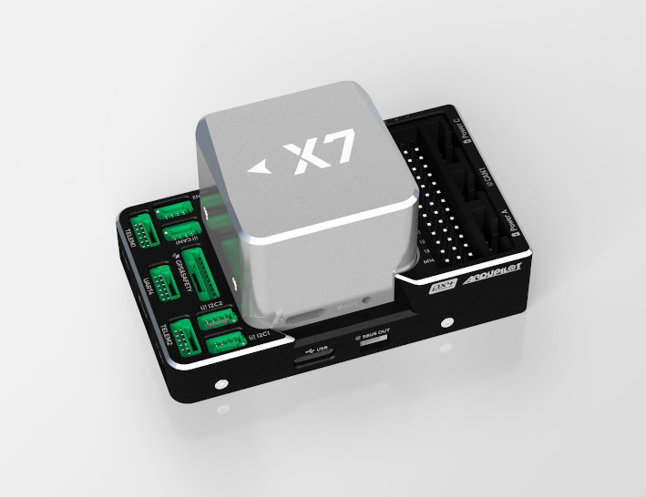
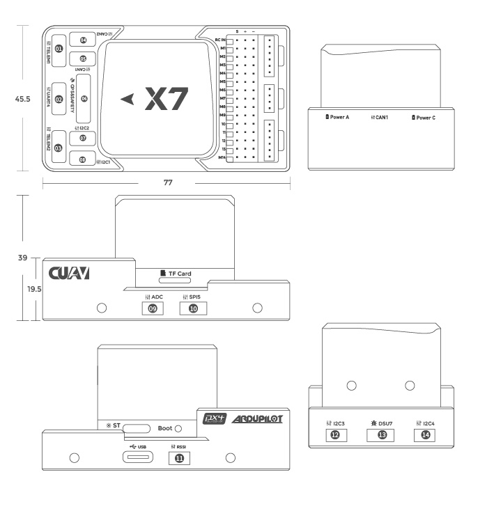
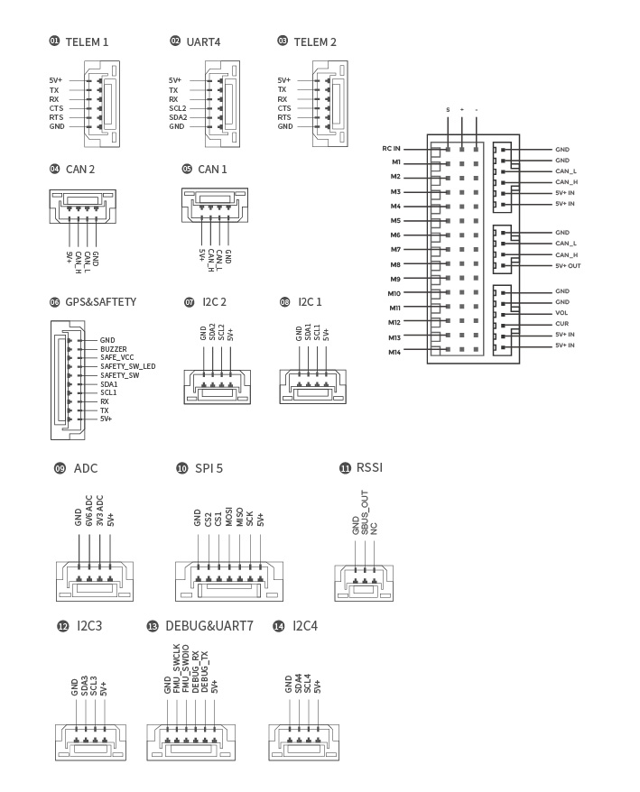

.. _common-cuav-x7-overview:

================
CUAV X7 Overview
================

**X7®** is an advanced autopilot independently designed by CUAV®. It uses a higher-performance STM32H7 processor and integrates industrial-grade sensors and ultra-low temperature drift sensors. Compared with previous flight controllers,it has better performance and more reliability.
The modular design allows the users to customize their own carrier board and is fully compatible with CUAV V5 + carrier board. X7 is ideal for academic research and commercial systems integration.

  Other characteristics:

- Internal shock absorption
- Supports High Speed USB (480mb/s), can download logs faster
- Supports more DShot outputs
- Supports IMU heating, making the sensor more consistent
- Dedicated UAVCAN battery port
- 3 sets of IMU sensors

Specifications
==============

-  **Processor**

   -  32-bit STM32H743 main processor
   -  480Mhz / 1MB RAM / 2MB Flash

-  **Sensors**

   -  **X7** : InvenSense ICM20689 accelerometer / gyroscope
   -  **X7 Pro** replaces the above IMU with a high G , high precision InvenSense ADIS16470 accelerometer / gyroscope
   -  InvenSense ICM20649 accelerometer / gyroscope
   -  Bosch BMI088 accelerometer / gyroscope
   -  2 MS5611 barometers
   -  RM3100 Industrial grade magnetometer

-  **Power**

   -  Operating Voltage: 4.3~5.4V
   -  USB Input: 4.75~5.25V
   -  High-voltage capable servo rail, up to 36V
      (servo rail does not power the autopilot)
   -  Dual voltage and current monitor inputs
   -  X7 can have triple redundant powering, if power is provided
      to both battery monitor inputs and the USB port

-  **Interfaces**

   -  14 PWM servo outputs（12 support DShot）
   -  Analog/ PWM RSSI input
   -  2 GPS ports(GPS and UART4 ports)
   -  4 I2C buses(Two external I2C ports)
   -  2 CAN bus ports
   -  2 Power ports(Power A is an ADC interface, Power C is a UAVCAN battery interface)
   -  2 ADC inputs
   -  1 High Speed (480mb/s)USB port

-  **Other**

   -  Weight: 101g
   -  Operating temperature: -20 ~ 80°c（Measured value）

Default UART Order
==================

- SERIAL0 = console = USB
- SERIAL1 = Telemetry1 = USART1
- SERIAL2 = Telemetry2 = USART6
- SERIAL3 = GPS1 = USART1
- SERIAL4 = GPS2 = UART4
- SERIAL5 = USER = UART8 
- SERIAL6 = USER = UART7 (DEBUG TX/RX)

Serial protocols can be adjusted to personal preferences.

DShot Capability
================

All motor/servo outputs are DShot and PWM capable. However, mixing DShot and normal PWM operation for outputs is restricted into groups, ie. enabling DShot for an output in a group requires that ALL outputs in that group be configured and used as DShot, rather than PWM outputs. The output groups that must be the same (PWM rate or DShot, when configured as a normal servo/motor output) are: 1-4, 5-8,and 9-12. Outputs 13 and 14 are not DShot capable.

Battery Monitor
===============

The autopilot includes a UAVCAN power module and battery monitor, :ref:`common-can-pmu` . Connect to one of the CAN ports and its already pre-configured for use.

Where to Buy
============

Order from `here <https://store.cuav.net/index.php>`__.
Official retailers are listed `here  <https://leixun.aliexpress.com/>`__.

Size and Pinouts
================

    

Flight video
============

.. youtube:: KxN8nMHSi-0
    :width: 100%
    
More Information
================

- `CUAV docs <http://doc.cuav.net/flight-controller/x7/en/x7.html>`__
- `x7 schematic <https://github.com/cuav/hardware/tree/master/X7_Autopilot>`__