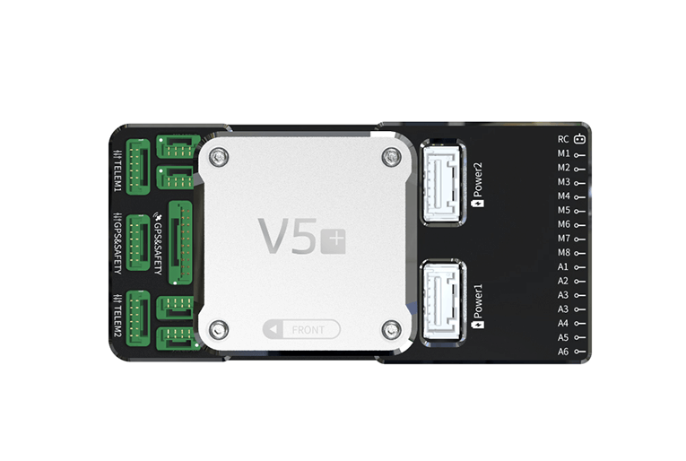

.. _common-cuav-x7-overview:

================
CUAV X7 Overview
================

.. image:: ../../../images/cuav_autopilot/x7/x7.jpg
    :target: ../_images/x7.jpg
    :width: 360px

**X7**&reg; is an advanced autopilot independently designed by CUAV&reg;. It uses a higher-performance STM32H7 processor and integrates industrial-grade sensors and ultra-low temperature drift sensors. Compared with the previous flight controller,it has better performance and more reliability.
The modular design allows the users to customize their own carrier board; fully compatible with cuav V5 + carrier board.

Specifications
==============

-  **Processor**

   -  32-bit ARM Cortex M7 core with DPFPU
   -  216 Mhz/512 KB RAM/2 MB Flash
   -  32 bit IOMCU co-processor

-  **Sensors**

   -  InvenSense ICM20689 accelerometer / gyroscope
   -  InvenSense ICM20602 : accelerometer / gyroscope
   -  Bosch BMI055 accelerometer / gyroscope
   -  MS5611 barometer
   -  IST8310 magnetometer

-  **Power**

   -  Operating power: 4.3~5.4V
   -  USB Input: 4.75~5.25V
   -  High-power servo rail, up to 36V
      (servo rail does not power the autopilot)
   -  Dual voltage and current monitor inputs
   -  CUAV v5 Plus can be triple redundant if power is provided
      to both battery monitor inputs and the USB port

-  **Interfaces**

   -  8 - 14 PWM servo outputs (6 IOMCU, 8 FMU)
   -  3 dedicated PWM/Capture inputs on FMU
   -  S.Bus servo output
   -  PPM connector supports all RC protocols (including SBUS, DSM, ST24, SRXL and PPM)
   -  SBUS/DSM/RSSI connector supports all RC protocols (including SBUS, DSM, ST24, SRXL and PPM)
   -  Analog / PWM RSSI input
   -  5x general purpose serial ports
   -  4x I2C ports
   -  4x SPI bus
   -  2x CAN Bus ports
   -  2x analog battery monitor ports

-  **Other**

  -  Weight: 90g
  -  Dimensions: 85.5mm x 42mm x 33mm
  -  Operating temperature: -20 ~ 80°c（Measured value）

Where to Buy
============

Order from `here <https://store.cuav.net/index.php>`__.
Official retailers are listed `here  <https://leixun.aliexpress.com/>`__.

Quick Start
===========

Interfaces
    +------------------+--------------------------------------------------------------+
    | Main Interface   | Function                                                     |
    +==================+==============================================================+
    | Power 1          |Primary power module. Autopilot power, V & I monitor          |
    +------------------+--------------------------------------------------------------+
    | Power 2          | Secondary power module. I2C Smart Battery capable            |
    +------------------+--------------------------------------------------------------+
    | ADC              | 2 x ADC, ie second V & I monitor.  Does not provide power    |
    +------------------+--------------------------------------------------------------+
    | TF Card          | Insert SD card for log file and terrain data storage         |
    +------------------+--------------------------------------------------------------+
    | M1 - M6          | Main Outputs.  Servo/motor capable                           |
    +------------------+--------------------------------------------------------------+
    | A1 - A8          | Additional Outputs. Servo/motor/D-Shot capable               |
    +------------------+--------------------------------------------------------------+
    | DSU7             | Serial 6 (uart7)                                             |
    +------------------+--------------------------------------------------------------+
    | I2C1/I2C2        | External I2C (Compass / rangefinder etc)                     |
    +------------------+--------------------------------------------------------------+
    | USB C            | USB for setup / firmware upload                              |
    +------------------+--------------------------------------------------------------+
    | SBUS Out         | SBUS output for peripherals: gimbal / camera etc             |
    +------------------+--------------------------------------------------------------+
    | CAN1/CAN2        | CANBUS (UAVCAN, KDECAN, ToshibaCAN)                          |
    +------------------+--------------------------------------------------------------+
    | GPS & SAFETY     | CUAV NEO v2 GPS with compass, safety switch, LED, buzzer     |
    +------------------+--------------------------------------------------------------+
    | TELEM1 / TELEM2  | Serial ports (telemetry, peripherals, companion computer)    |
    +------------------+--------------------------------------------------------------+
    | DSM/SBUS/RSSI    | RC Input (SBUS / DSM / ST24 / SRXL / PPM) or RSSI Input      |
    +------------------+--------------------------------------------------------------+

More Information
================

CUAV V5 Plus PDF Manual `here <http://manual.cuav.net/V5-Plus.pdf>`__

`Schematics <https://github.com/ArduPilot/Schematics/tree/master/CUAV>`__

More Images
===========

Image gallery can be found `here <https://github.com/ArduPilot/ardupilot_wiki/tree/master/images/cuav_autopilot/v5plus>`__
