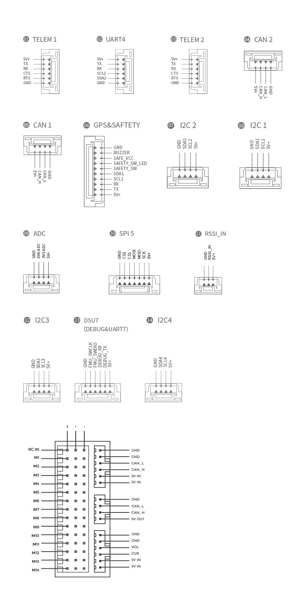

.. _common-cuav-x7-pro-overview:

================
CUAV X7 Pro Overview
================

The X7 Pro is a high Ji autopilot developed and manufactured by cuav. It uses adis16470 ultra-high precision IMU and industrial compass, and is an ideal choice for industrial UAVs.

Other characteristics
=====================

- Internal shock absorption
- Modular design, can be DIY carrier board
- Support USB_HS, download logs faster
- Support more dshot output
- Support IMU heating, make the sensor work better
- Dedicated uavcan battery port
- 3 sets of IMU sensors
- High-precision industrial sensor(ADIS16470+RM3100)

Specifications
==============

-  **Processor**

   -  32-bit STM32H743 main processor
   -  480Mhz / 1MB RAM / 2MB Flash

-  **Sensors**

   -  InvenSense ADIS16470 accelerometer / gyroscope
   -  InvenSense ICM20649  accelerometer / gyroscope
   -  Bosch BMI088 accelerometer / gyroscope
   -  2 MS5611 barometer
   -  RM3100 Industrial grade magnetometer

-  **Power**

   -  Operating power: 4.3~5.4V
   -  USB Input: 4.75~5.25V
   -  High-power servo rail, up to 36V
      (servo rail does not power the autopilot)
   -  Dual voltage and current monitor inputs
   -  X7 can be triple redundant if power is provided
      to both battery monitor inputs and the USB port

-  **Interfaces**

   -  14 PWM servo outputs （12 supports Dshot）
   -  12 supports Dshot
   -  Analogue / PWM RSSI input
   -  2 GPS ports(GPS and UART4 ports)
   -  4 i2c buses(Two i2c dedicated ports)
   -  2 CAN bus ports
   -  2 Power ports(Power A is common adc interface, Power C is uavcan battery interface)
   -  2  ADC intput
   -  1 USB ports

-  **Other**

  -  Weight: 103g
  -  Operating temperature: -20 ~ 80°c（Measured value）

Where to Buy
============

Order from `here <https://store.cuav.net/index.php>`__.
Official retailers are listed `here  <https://leixun.aliexpress.com/>`__.

Size and Pinouts
================

.. image:: ../../../images/cuav_autopilot/x7/x7-pro-size.jpg
    :target: ../_images/cuav_autopilot/x7/x7-pro-size.jpg
    

    
More Information
================

* [CUAV docs](http://doc.cuav.net/flight-controller/x7/en/x7-pro.html)

* [x7 schematic](https://github.com/cuav/hardware/tree/master/X7_Autopilot)