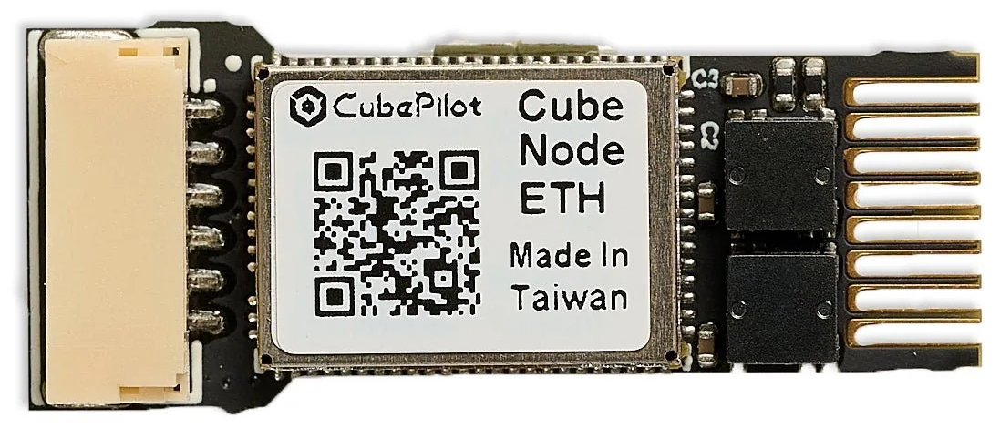
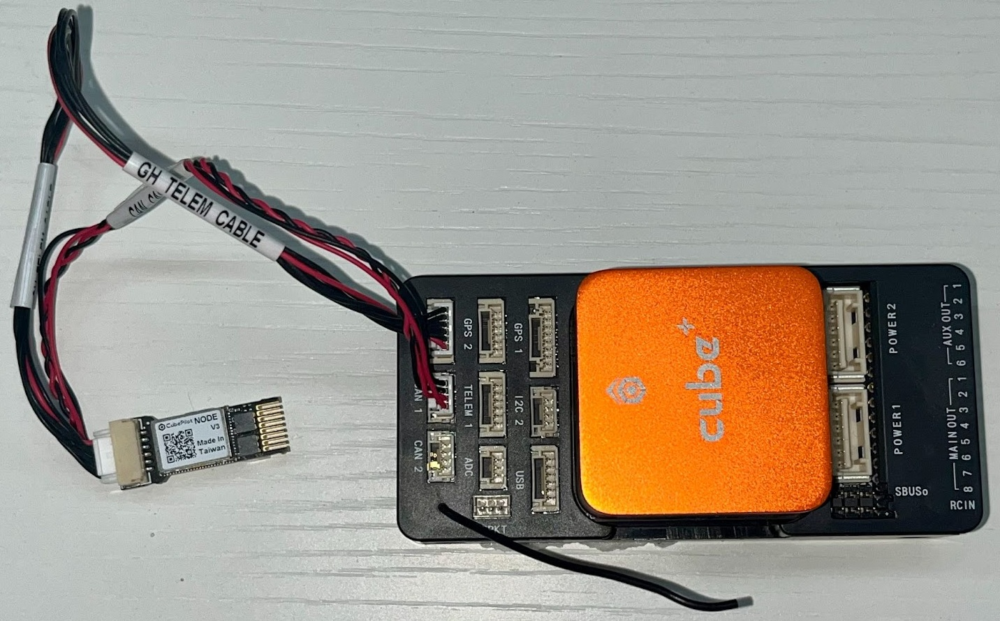
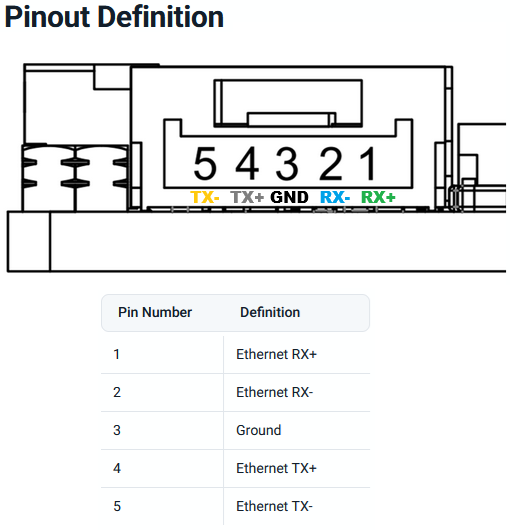
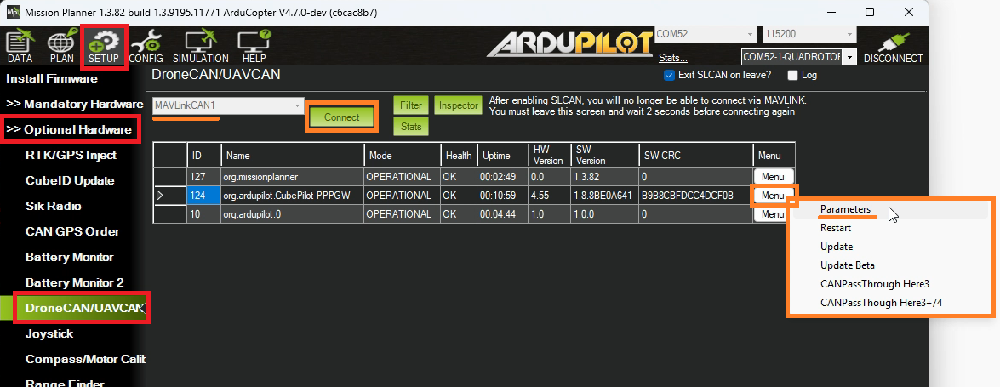

.. _common-cubepilot-cubenodeeth:

======================
CubePilot CubeNode ETH
======================

The `CubePilot CubeNode ETH <https://docs.cubepilot.org/user-guides/cubenode/cubenode-eth>`__ ethernet adapter allows STM32 H7 autopilots without built-in ethernet support to connect to ethernet peripherals.  This is often used in combination with a `CubeLAN 8 Port Switch <https://docs.cubepilot.org/user-guides/switch/cubelan-8-port-switch>`__

Some images courtesy of `CubePilot <https://www.cubepilot.org>`__

Where To Buy
============

The `CubeNode ETH can be purchased from CubePilot resellers <https://www.cubepilot.org/#/reseller/list>`__

Optionally the `CubeLAN 8 Port Switch <https://docs.cubepilot.org/user-guides/switch/cubelan-8-port-switch>`__ may be useful to connect multiple devices via Ethernet

Connecting to the Autopilot
===========================

Connect one of the autopilot's serial ports to the CubeNodeETH's UART port. For optimum performance the autopilot's serial port should support flow control which normally means using Serial1 or Serial2.  In the image above Serial2 is used.

Connect one of the autopilot's CAN ports to the CubeNodeETH's CAN port.  This connection is only used to configure the device and so it maybe removed after the configuration is completed.  In the image above the autopilot's CAN1 is used.

While difficult to see in the image above, the CubeNodeETH has a 5-pin ethernet connector with the same pin layout as the `CubeLAN 8 Port Switch <https://docs.cubepilot.org/user-guides/switch/cubelan-8-port-switch>`__

The general rule when connecting ethernet devices is:

- When connecting a device to a switch the pins should be connected straight through (e.g. RX+ to RX+, RX- to RX-, TX+ to TX+, TX- to TX-)
- When connecting a device to a device the pins should be crossed (e.g. RX+ to TX+, RX- to TX-, TX+ to RX+, TX- to RX-)

Install ArduPilot with PPP Support
==================================

`PPP <https://en.wikipedia.org/wiki/Point-to-Point_Protocol_over_Ethernet>`__ allows an autopilot to communicate over Ethernet using a serial port but with the exception of the CubePilot CubeOrangePlus, PPP is not included by default in the ArduPilot firmware.

- Use the `Custom Firmware Build Server <https://custom.ardupilot.org/>`__ to build a firmware that includes PPP support

.. image:: ../../../images/build-server-ppp.jpg
    :target: ../_images/build-server-ppp.jpg

- Alternatively :ref:`build the code yourself <building-the-code>` and enable PPP by adding ``--enable-PPP`` to the waf configuration step
- :ref:`Install the firmware on the autopilot <common-loading-firmware-onto-pixhawk>`

Autopilot Configuration
=======================

See the ``PPP configuration`` and ``ArduPilot Port Configuration`` sections of :ref:`common-network` but in short set these parameters:

- :ref:`CAN_P1_DRIVER <CAN_P1_DRIVER>` = 1 (First driver)
- :ref:`CAN_D1_DRIVER <CAN_D1_PROTOCOL>` = 1 (DroneCAN)
- :ref:`NET_ENABLE <NET_ENABLE>` = 1
- :ref:`SERIAL2_PROTOCOL <SERIAL2_PROTOCOL>` = 48 (PPP)
- :ref:`SERIAL2_BAUD <SERIAL2_BAUD>` = 12500000 (12.5MBaud)

To allow the autopilot to eventually communicate with other ethernet devices, the :ref:`NET_P1_TYPE <NET_P1_TYPE>`, :ref:`NET_P1_PROTOCOL <NET_P1_PROTOCOL>`, etc parameters will need to be set.
More details on the settings required can be found in the "Ethernet Conectivity" sections of the ArduPilot wiki page for the device.  For example :ref:`Siyi camera setups can be found on this page <common-siyi-zr10-gimbal>`

CubeNodeETH Setup
=================

The CubeNodeETH's parameters can be set using Mission Planner's DroneCAN screen or the :ref:`DroneCAN GUI tool <common-uavcan-gui>`.  The following instructions assume Mission Planner is used:

- Connect to the AutoPilot with Mission Planner 
- Open the Setup, Optional Hardware, DroneCAN/UAVCAN screen
- From the top-left drop-down select MAVLinkCAN1 (or MAVLinkCAN2 if the autopilot's CAN2 is used)
- Press "Connect" and the table should be populated with the available DroneCAN devices including "org.ardupilot.CubePilot-PPPGW"
- Press the "Menu" button on the right side and select "Parameters"
- Set the following parameters and press the "Write" button

  - :ref:`NET_DHCP <NET_DHCP>` = 0 (to disable dynamic IP assignment)
  - :ref:`NET_IPADDR0 <NET_IPADDR0>` = 192 (default)
  - :ref:`NET_IPADDR1 <NET_IPADDR1>` = 168 (default)
  - :ref:`NET_IPADDR2 <NET_IPADDR2>` = 144
  - :ref:`NET_IPADDR3 <NET_IPADDR3>` = 14
  - :ref:`NET_GWADDR0 <NET_GWADDR0>` = 192 (default)
  - :ref:`NET_GWADDR1 <NET_GWADDR1>` = 168 (default)
  - :ref:`NET_GWADDR2 <NET_GWADDR2>` = 144
  - :ref:`NET_GWADDR3 <NET_GWADDR3>` = 1

- Reboot the system or from the DroneCAN screen select "Menu", "Restart"
- On the next autopilot reboot, messages like those shown below should appear.  Note that the autopilot's IP address's final octet is one higher (e.g. "15") than the CubeNodeETH's IP address (e.g. "14")

.. image:: ../../../images/botblox-dronenet-mp-messages.png
    :target: ../_images/botblox-dronenet-mp-messages.png

The IP addresses chosen above are somewhat arbitrary but work well for many systems.  In general all ethernet devices on the drone should be in the same subnet meaning the first three octets of the IP address (e.g. 192.168.144.x) should match while the last octet should be unique to each device.

Firmware Updates
================

The CubeNodeETH firmware can be updated by following the instructions below

- Download the `stable <https://firmware.ardupilot.org/AP_Periph/stable/CubeNode-ETH/>`__, `beta <https://firmware.ardupilot.org/AP_Periph/beta/CubeNode-ETH/>`__ or `latest <https://firmware.ardupilot.org/AP_Periph/latest/CubeNode-ETH/>`__ AP_Periph.bin file from firmware.ardupilot.org
- Download, install and run the `DroneCAN GUI Tool <https://dronecan.github.io/GUI_Tool/Overview>`__.  For Windows users download and run `the .msi file found here <https://firmware.ardupilot.org/Tools/CAN_GUI>`__
- Connect the autopilot to your PC using a USB cable
- Run the DroneCAN GUI Tool:

  - Select the autopilot's COM port
  - Optionally set the "Bus Number" to the CAN port that the CubeNodeETH is connected To
  - Press "OK"

    .. image:: ../../../images/cubepilot-cubenodeeth-firmwareupdate1.png
        :target: ../_images/cubepilot-cubenodeeth-firmwareupdate1.png

  - Uncheck the check box to the right of "Local node ID" to set the DroneCAN GUI Tool's DroneCAN node ID
  - Double click on line containing "org.ardupilot.CubePilot-PPPGW" or "org.ardupilot.CubeNode-ETH" to open the "Node Properties" window

    .. image:: ../../../images/cubepilot-cubenodeeth-firmwareupdate2.png
        :target: ../_images/cubepilot-cubenodeeth-firmwareupdate2.png
        :width: 450px

  - Push the "Update Firmware" button and select the AP_Periph.bin file downloaded above, press Open

    .. image:: ../../../images/cubepilot-cubenodeeth-firmwareupdate3.png
        :target: ../_images/cubepilot-cubenodeeth-firmwareupdate3.png
        :width: 450px

  - After the update has completed you should see the firmware version change (see the green underline above) 

Reboot the autopilot and CubeNodeETH.  There should be no need to backup and restore any parameters as part of the upgrade process
