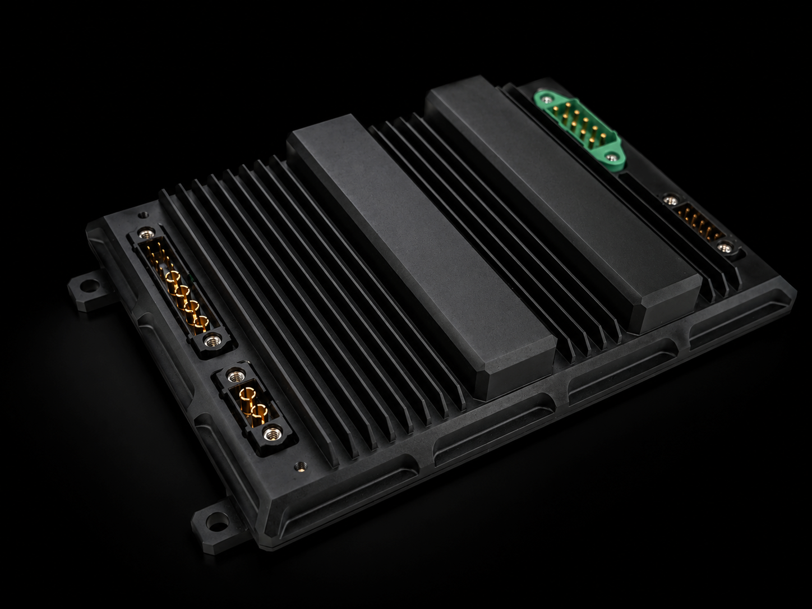
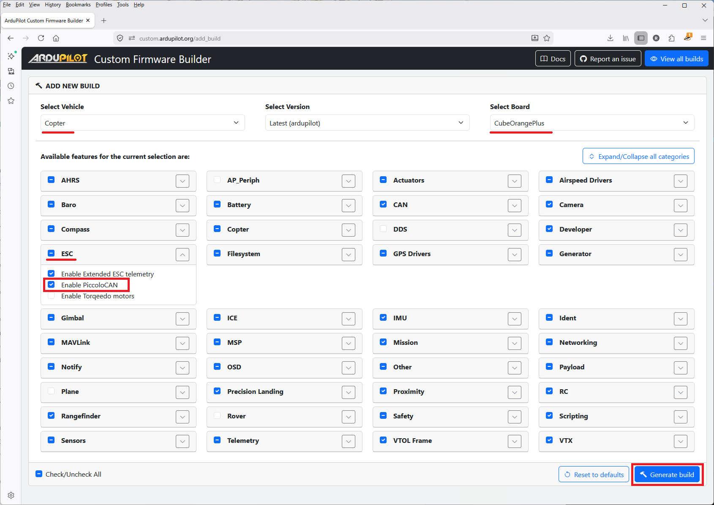
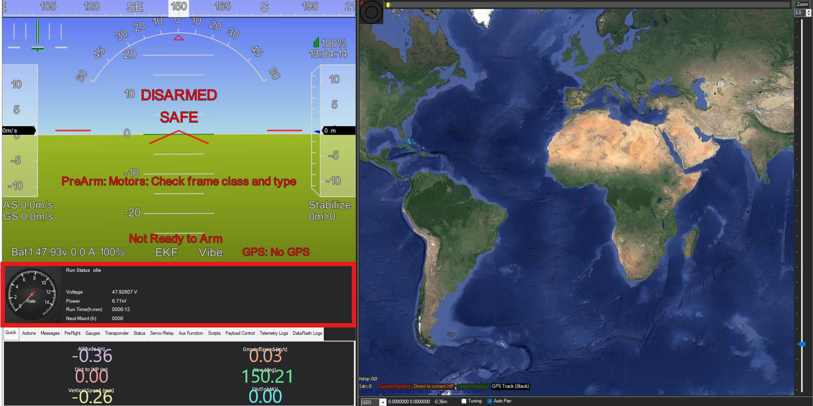

.. _common-currawong-cortex-generator:

===========================
Currawong Cortex Generators
===========================

    
The Cortex Hybrid Power Systems (CHPS-MQ and CHPS-MX) provide up to 1500W of electrical power for UAVs in a compact Power Management Unit (PMU).

Power can come from the generator, the battery, or both simultaneously. CHPS provides remote engine start and restart and the battery automatically supplements generator power whenever output falls short of demand.

During flight battery charging is managed automatically, alongside the supply of three other independent voltage rails, all powered by the generator.

Where to Buy
------------

Contact `Currawong Engineering <https://www.currawongeng.com/contact/>`__ for purchasing details.

PiccoloCAN Setup
----------------
The CHPS generator supports the PiccoloCAN protocol. Originally developed for the Piccolo autopilot, the protocol is now natively supported by ArduPilot.

Support for PiccoloCAN is available by default in ArduPilot 4.7 (and lower).  If using ArduPilot 4.8 (and higher) please use the custom build server to create a firmware with the 'AP_PICCOLOCAN_ENABLED' build option enabled which can be done using the `Custom Build Server <https://custom.ardupilot.org/add_build>`__.

More instructions on using the :ref:`Custom Build Server can be found here <common-custom-firmware>`.

.. note:: For users with autopilots having less than 2MB of flash, Cortex Generator support needs to be manually enabled in the custom build server.

ArduPilot Configuration
-----------------------
After loading custom firmware with both PiccoloCAN and Cortex Generator enabled, the following parameters must be set:

- Set :ref:`CAN_P1_DRIVER <CAN_P1_DRIVER>` = 1 (First driver) to specify that the CHPS is connected to the CANx port.
- Set :ref:`CAN_D1_PROTOCOL <CAN_D1_PROTOCOL>` = 4 (PiccoloCAN) to specify the protocol used.
- Set :ref:`GEN_TYPE <GEN_TYPE>` = 5 to specify the Cortex Generator.
- Set :ref:`BATT_MONITOR <BATT_MONITOR>` = 17 to connect the Cortex's battery readings to the Ardupilot Battery monitoring capabilities.

Available Information
---------------------
- Upon successful connection and configuration, Mission Planner will display a generator cluster that provides information such as battery voltage and current, the CHPS status bits, engine runtime and engine speed. 
- For example those using Mission Planner will see:

- Additionally, users can map the generator cranking command to RC channels using the following:
- Set ``RCx_OPTION = 85`` to map a three position switch to the generator function.
- These commands are interpreted as standby, preflight and crank for low, mid and high positions respectively.
