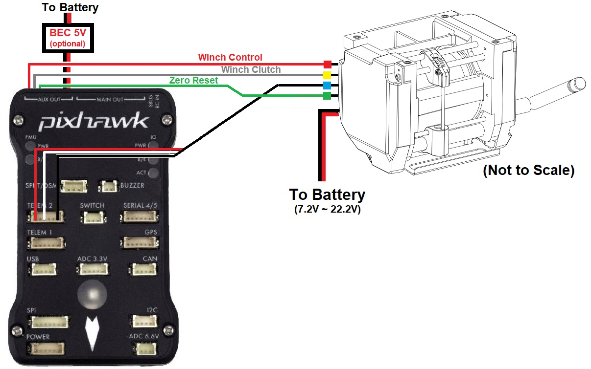

.. _common-daiwa-winch:

[copywiki destination="copter"]
===========
Daiwa Winch
===========

.. image:: ../../../images/daiwa-winch.png
    :target: ../_images/daiwa-winch.png

The Daiwa winch is a high quality winch specially designed for drone delivery.  The winch includes a "thread end detector switch" that protects against pulling the line in too tightly and thus straining the device or breaking the thread.  The gripper includes a spring mechanism that automatically releases the package when it touches the ground.

- Weight: 630g
- Size: W:110mm H:82mm D:72mm
- Maximum Payload: 8kg
- Maximum Power: 55W
- Input Voltage: 7.2V ~ 22.2V
- Interface: 4xPWM or UART
- Designed and manufactured in Japan

.. note::

    The driver for this winch will be released with Copter-4.1.0.  For earlier versions the winch can be controlled using the autopilot's servo outputs which allows the winch to be operated from the pilot's transmitter and/or from DO_SET_SERVO mission commands

Where To Buy
------------

- These winches are manufactured by Okaya (`japanese site <https://www.okaya.co.jp/>`__, `english site <https://www.okaya.co.jp/en/index.html>`__) and can be purchased `here <https://www.ipros.jp/product/detail/2000434011/>`__ (Japanese language only).

Connection and Configuration
----------------------------

Connect the winch to the autopilot as shown below

- Connect the 3-pin Winch Control wire (red cable tie) to AUX OUT 1 (aka Servo9)
- Connect the 3-pin Winch Clutch wire (yellow cable tie) to AUX OUT 2 (aka Servo10)
- Connect the 3-pin Winch Telemetry wire (blue cable tie) to the Autopilot's Telem2 (or any other telemetry port)
- The Zero Reset (green cable tie) used to calibrate the winch should be left disconnected
- A 7.2V to 22.2V power supply is required to power the motors
- A 5V BEC can optionally be connected to the autopilot's servo rail to provide power to the winch electronics.  This is not required if the Telemetry wire is connected

Set the following parameters

- :ref:`WINCH_TYPE <WINCH_TYPE>` = 2 (Daiwa)
- :ref:`SERVO9_FUNCTION <SERVO9_FUNCTION>` = 88 (Winch)
- :ref:`SERVO9_MIN <SERVO9_MIN>` = 1000
- :ref:`SERVO9_TRIM <SERVO9_TRIM>` = 1500
- :ref:`SERVO9_MAX <SERVO9_MAX>` = 2000
- :ref:`SERVO10_FUNCTION <SERVO10_FUNCTION>` = 133 (Winch Clutch)
- :ref:`SERVO10_MIN <SERVO10_MIN>` = 1000
- :ref:`SERVO10_TRIM <SERVO10_TRIM>` = 1500
- :ref:`SERVO10_MAX <SERVO10_MAX>` = 2000
- :ref:`SERIAL2_PROTOCOL <SERIAL2_PROTOCOL>` = 31 (Winch).  Note this assumes the Winch's telemetry is connected to Serial2/Telem2
- :ref:`SERIAL2_BAUD <SERIAL2_BAUD>` = 115
- :ref:`RC6_OPTION <RC6_OPTION>` = 45 (Winch Control) to allow controlling the winch speed from the transmitter's channel 6 knob
- :ref:`RC6_DZ <RC6_DZ>` = 30.  This deadzone is used to detect whether the pilot has moved the winch control knob to retake control from autonomous operation
- :ref:`RC6_TRIM <RC6_TRIM>` = The mid value between :ref:`RC6_MIN <RC6_MIN>` and :ref:`RC6_MAX <RC6_MAX>` which is normally close to 1500
- :ref:`RC8_OPTION <RC8_OPTION>` = 44 (Winch Enable) to allow relaxing the winch by pulling the transmitter's channel 8 switch low

Controlling during Missions
---------------------------

The Winch can be controlled during Autonomous missions using the DO_WINCH mission command.

Video
-----

..  youtube:: p4x97iomWZ0
    :width: 100%
