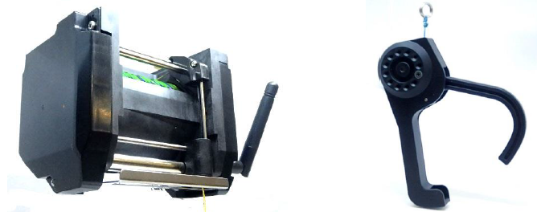

.. _common-daiwa-winch:

===========
Daiwa Winch
===========

The `Daiwa winch <http://www.ele.okaya.co.jp/index_en.html>`__ is a high quality winch specially designed for drone delivery.  The winch includes a "thread end detector switch" that protects against pulling the line in too tightly and thus straining the device or breaking the thread.  The gripper includes a spring mechanism that automatically releases the package when it touches the ground.

- Weight: 630g
- Size: W:110mm H:82mm D:72mm
- Maximum Payload: 8kg
- Maximum Power: 55W
- Input Voltage: 7.2V ~ 22.2V
- Interface: 4xPWM or UART
- Designed and manufactured in Japan

.. note::

    The driver for this winch will be released with Copter-4.1.0.  For earlier versions the winch can be controlled using the autopilot's servo outputs which allows the winch to be operated from the pilot's transmitter and/or from DO_SET_SERVO mission commands

Where To Buy
============

- These winches are manufactured by Okaya (`japanese site <https://www.okaya.co.jp/>`__, `english site <https://www.okaya.co.jp/en/index.html>`__) and can be purchased `here (English) <http://www.ele.okaya.co.jp/index_en.html>`__ or `here (Japanese) <https://www.ipros.jp/product/detail/2000434011/>`__.

Connection and Configuration
============================

Connect the winch to the autopilot as shown below

.. image:: ../../../images/daiwa-winch-pixhawk.png
    :target: ../_images/daiwa-winch-pixhawk.png
    :width: 400px

- Connect the 3-pin Winch Control wire (red cable tie) to AUX OUT 1 (aka Servo9)
- Connect the 3-pin Winch Clutch wire (yellow cable tie) to AUX OUT 2 (aka Servo10)
- Connect the 3-pin Winch Zero Reset wire (blue cable tie) to AUX OUT 3 (aka Servo11)
- Connect the 3-pin Winch Telemetry wire (blue cable tie) to the Autopilot's Telem2 (or any other telemetry port)
- The Zero Reset (green cable tie) used to calibrate the winch should be left disconnected
- A 7.2V to 22.2V power supply is required to power the motors
- A 5V BEC can optionally be connected to the autopilot's servo rail to provide power to the winch electronics.  This is not required if the Telemetry wire is connected

Set the following parameters

- :ref:`WINCH_TYPE <WINCH_TYPE>` = 2 (Daiwa)
- :ref:`SERVO9_FUNCTION <SERVO9_FUNCTION>` = 88 (Winch)
- :ref:`SERVO9_MIN <SERVO9_MIN>` = 1000
- :ref:`SERVO9_TRIM <SERVO9_TRIM>` = 1500
- :ref:`SERVO9_MAX <SERVO9_MAX>` = 2000
- :ref:`SERVO10_FUNCTION <SERVO10_FUNCTION>` = 133 (Winch Clutch)
- :ref:`SERVO10_MIN <SERVO10_MIN>` = 1000
- :ref:`SERVO10_TRIM <SERVO10_TRIM>` = 1500
- :ref:`SERVO10_MAX <SERVO10_MAX>` = 2000
- :ref:`SERVO11_FUNCTION <SERVO11_FUNCTION>` = 0 (Disabled)
- :ref:`SERVO11_MIN <SERVO11_MIN>` = 1000
- :ref:`SERVO11_TRIM <SERVO11_TRIM>` = 1500
- :ref:`SERVO11_MAX <SERVO11_MAX>` = 2000
- :ref:`SERIAL2_PROTOCOL <SERIAL2_PROTOCOL>` = 31 (Winch).  Note this assumes the Winch's telemetry is connected to SERIAL2 which is usually TELEM2 on most boards. Note that this does not necessarily correspond to UART2 on some boards.
- :ref:`SERIAL2_BAUD <SERIAL2_BAUD>` = 38 (38400 baud) or 115 (115200 baud), depending on version of winch.
- :ref:`RC6_OPTION <RC6_OPTION>` = 45 (Winch Control) to allow controlling the winch speed from the transmitter's channel 6 knob
- :ref:`RC6_DZ <RC6_DZ>` = 30.  This deadzone is used to detect whether the pilot has moved the winch control knob to retake control from autonomous operation
- :ref:`RC6_TRIM <RC6_TRIM>` = The mid value between :ref:`RC6_MIN <RC6_MIN>` and :ref:`RC6_MAX <RC6_MAX>` which is normally close to 1500
- :ref:`RC8_OPTION <RC8_OPTION>` = 44 (Winch Enable) to allow relaxing the winch by pulling the transmitter's channel 8 switch low

Winch Options
=============

The :ref:`WINCH_OPTIONS<WINCH_OPTIONS>` parameter provides a bit mask of possible configuration options for the winch when the following bits are set in the parameter:

===     ======
Bit     Option
===     ======
0       Spin freely on startup allows the line to be pulled out after startup. This is the current default but is actually quite annoying because we need to remember to disengage the clutch before takeoff or the package will likely be left on the ground.
1       Verbose output sends text to the GCS when any important state of the winch changes (healthy, moving up or down, clutch position, line length). This is in addition to the normal Telemetry winch messages (see below)
2       Retry if stuck (Daiwa only)
===     ======

All options are set active by default.

Winch Telemetry
===============

The status of the winch can be viewed in real-time using Mission Planner or QGC's MAVLink Inspector window.  If using Mission Planner push the "MAVLink Inspector" button found under Setup, Advanced.

The winch's current draw, length of line, current speed (in m/s) temperature and voltage can all be seen.

Zero Reset Line Length
======================

The winch constantly estimates how much line has been deployed and will stop retracting line once this estimated line length has reached zero in order to protect the line from being broken.  This estimate is prone to drift however meaning that you may find it impossible to completely retract the line or (less likely) it may retract too far and break the line.  To avoid these issues the line length estimate should be periodically reset to zero using the following procedure:

- Power on the autopilot and winch
- Connect with Mission Planner, open the Setup, Advanced screen and push the "MAVLink Inspector" button and check the current line length.
- Retract the line (perhaps using the RC6 tuning knob) to within 20cm or so of the ideal minimum length
- Open Mission Planner's Data, Servo/Relay tab, find the row for output 11
- Push the "High" button to simultaneously retract the line and reset the line length to zero
- Push the "Low" button to retracting the line

Control during Missions
=======================

The Winch can be controlled during Autonomous missions using the DO_WINCH mission command.  See the bottom of the :ref:`Copter Mission Command List <copter:mission-command-list>` for more details

Winch-test Lua Script
=====================

In cases where the vehicle will be well outside of RC range and no joystick is being used, the `winch-test lua script <https://raw.githubusercontent.com/ArduPilot/ardupilot/master/libraries/AP_Scripting/examples/winch-test.lua>`__ may be useful in order to allow manually raise or lower the line using Mission Planner's Aux Function page.

Video
-----

..  youtube:: p4x97iomWZ0
    :width: 100%
