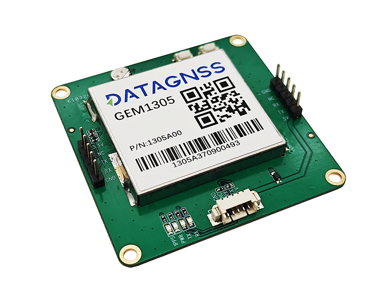
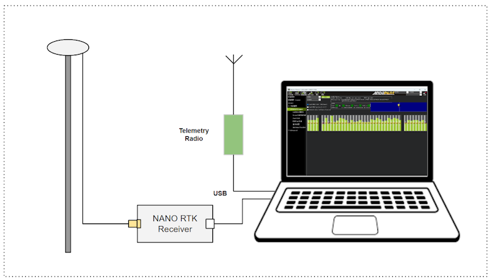
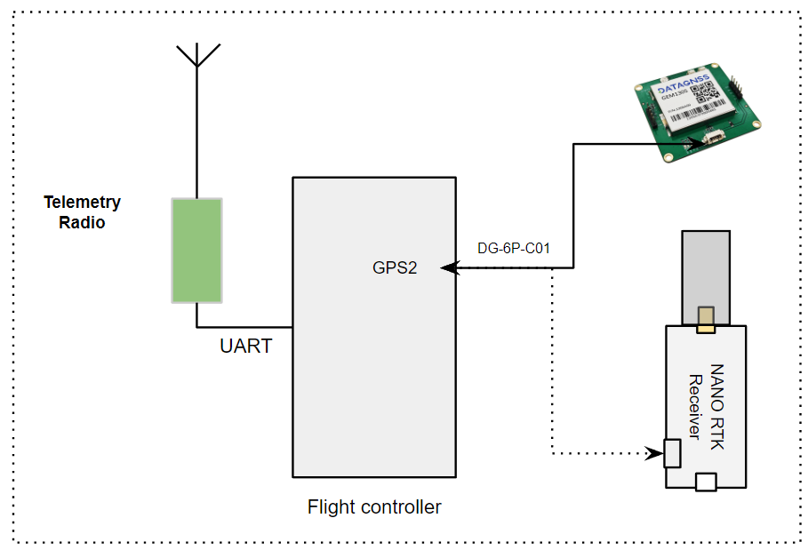

.. _common-datagnss-gem1305-rtk:

==================================
GEM1305 RTK receiver with antenna
==================================

GEM1305 is a RTK receiver with antenna designed and manufactured by DATAGNSS. 

GEM1305 is based on the new generation Allystar dual-core GNSS SoC. It supports RTK functionality with a maximum data update rate of 5Hz. 

Where to Buy
============

- `DATAGNSS website <https://www.datagnss.com/>`_

Features
========

- Full constellation, multi-frequency GNSS satellite receiver
- Support RTK
- Standard UART serial interface
- Lightweight only 50g

GNSS Features
=============

=======================       ======================================================================
Receiver                      Allystar CYNOSURE IV GNSS SOC
GNSS                          BDS/GPS/GLONASS/Galileo/QZSS
BAND                          GPS/QZSS L1,L5, BDS B1,B2,GLONASS L1, GALILEO E1/E5a                                 
Position accuracy(RMS)        3D: **1.5m** (Horizontal, 2.5m(Vertical),
                              RTK: **1.5cm** +1PPM(Horizontal), 3.0cm+1PPM(Vertical)                                   
Acquisition                   Cold starts<30S, RTK coverage time<10s
Data update rate              5Hz
Baud rate                     230400bps default
Differential data             RTCM3.X 
Data protocol                 NMEA-0184 V3.0,4.x
Operating Voltage             4.7~5.2V
Operating temperature         -20~85℃
Size                          55*55*12mm
Weigh                         50g
=======================       ======================================================================

Pin definition
==============

The board is connected to the autopilot via UART interface.

The 1.25mm pitch 6P connector :

   -  1: GND
   -  2: NC
   -  3: PPS
   -  4: Rx
   -  5: Tx
   -  6: 5V

Please note that the board only includes RTK.

Configuration
=============

RTK technology can greatly improve the accuracy of positioning. 

RTK technology requires a base and a rover, with the base placed on the ground end, which is referred to as the rover end on the drone. 

The data from the base needs to be transmitted to the drone end via telemetry radio and inputted into the RTK receiver on the rover end.

Base station setup

We suggest using the NANO RTK Receiver as the configuration for the base station(ground base station), which is more convenient and user-friendly.

.. image:: ../../../images/gem1305/nano-rtk-rcv-helix.png
	:target: ../images/gem1305/nano-rtk-rcv-helix.png

.. image:: ../../../images/gem1305/nano-rtk-rcv-patchAnt.png
	:target: ../images/gem1305/nano-rtk-rcv-patchAnt.png

Setup the NANO RTK Receiver as a base station, and it is recommended to use Satrack software.

`Download Satrack <https://wiki.datagnss.com/images/e/ee/Satrack.zip>`

1. Open Satrack, then choose the com port, baud rate then connect the nano-rtk-rcv.

.. image:: ../../../images/gem1305/satrack-connect-device.png
	:target: ../images/gem1305/satrack-connect-device.png

2. Enable RTCMv3 output

.. image:: ../../../images/gem1305/satrack-rtcm-output.png
	:target: ../images/gem1305/satrack-rtcm-output.png

3. Disable NMEA data output

.. image:: ../../../images/gem1305/satrack-disable-nmea.png
	:target: ../images/gem1305/satrack-disable-nmea.png

4. Config the base station fixed coordinates

There are two methods to set the coordinates of the base station:
A. According to the diagram below, directly "Get Now" and then proceed with the setup.

Press "Get now", then "send" to apply the fixed coordinates.

.. image:: ../../../images/gem1305/satrack-cfg-fixedecef.png
	:target: ../images/gem1305/satrack-cfg-fixedecef.png

B. According to the CFG-SURVEY method, automatically calculate the average before proceeding with the setup.

.. image:: ../../../images/gem1305/satrack-cfg-survey.png
	:target: ../images/gem1305/satrack-cfg-survey.png

5. After above configuration, open Mission Planner

.. image:: ../../../images/gem1305/mp-connect-base.png
	:target: ../images/gem1305/mp-connect-base.png

6. Finish other configuration in Mission Planner

Rover station (Aircraft) setup

For drones, NANO RTK Receiver or GEM1305 can be chosen as the Rover for RTK.

Whether you choose NANO RTK Receiver or GEM1305, you need to confirm in the Satrack software that all RTCM data outputs are disabled and all NMEA outputs are enabled.

Note: NANO RTK Receiver and GEM1305 do not support safety switch, so BRD_SAFETY_DEFLT needs to be set to 0 or a separate safety switch should be connected to the flight controller.

After completing the above settings, you can write parameters to the flight controller.

Package List
============
- GEM1305
- DG-6P-C01,GH-1.25mm-6P cable
