.. _common-datagnss-gem1305-rtk:

==================================
GEM1305 RTK receiver with antenna
==================================

This page mainly includes some instructions for using the GEM1305 and NANO RTK Receiver products with Ardupilot.

GEM1305 is a RTK receiver with antenna designed and manufactured by DATAGNSS. 

GEM1305 is based on the new generation Allystar dual-core GNSS SoC. It supports RTK functionality with a maximum data update rate of 5Hz. 

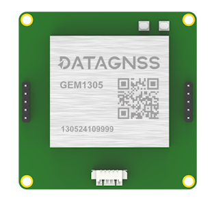

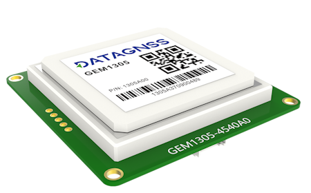

GEM1305/NANO RTK Receiver doesn't support Moving Base mode.

Where to Buy
============

- `DATAGNSS website <https://www.datagnss.com/>`_

Key Features
============

- Full constellation, multi-frequency GNSS satellite receiver
- Support RTK
- Standard UART serial interface
- Lightweight only 50g or 26g(NANO RTK receiver)
- High performance antenna

Frequencies
===========
   -  GPS/QZSS: L1 C/A, L5C
   -  GLONASS: L1OF
   -  BEIDOU: B1I, B2a
   -  GALILEO: E1, E5a

GNSS
====
   - Allystar CYNOSURE IV GNSS SOC
   - Dual core
   - 3D accuracy: **1.5m** CEP
   - RTK accuracy: **2cm** +1PPM(H), 3cm+1PPM(V)

Interface
=========
   - UART, 230400bps
   - SMA for antenna
   - Output rate 5Hz
   - Main power supply,4.7~5.2V

Protocol
========
   - NMEA output
   - RTCM v3 input/output

Environment
===========
   - Operating temp. -20~85℃

Dimession and weight
====================
   - 55*55*12mm
   - 50g (GEM1305) 26g (NANO with Helix)

Pin definition
==============

The board is connected to the autopilot via UART interface.

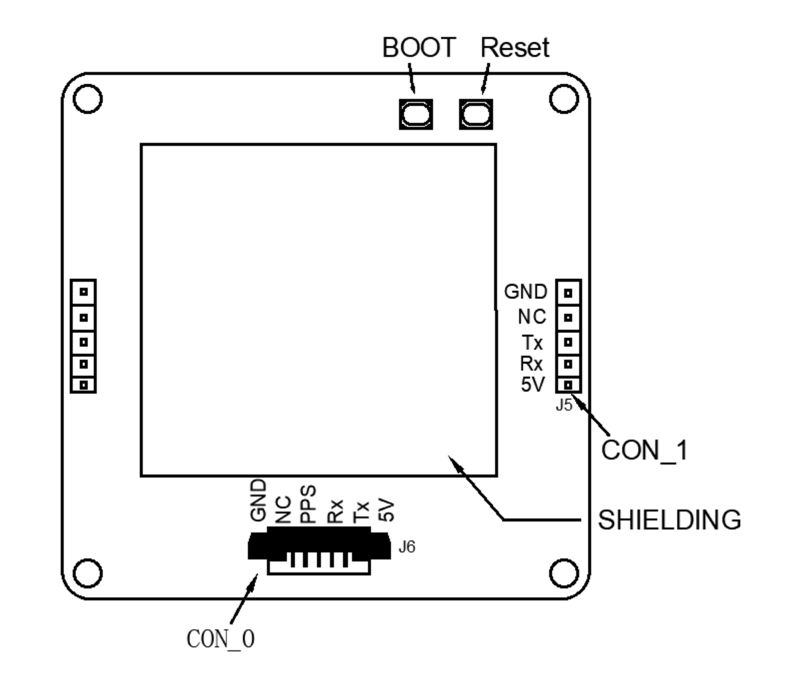

The 1.25mm pitch 6P connector (from Left PIN1 to PIN6) :

   -  1: GND
   -  2: NC
   -  3: PPS
   -  4: Rx
   -  5: Tx
   -  6: 5V

Please note that the board only includes RTK and doesn't inlcude compass.

ArduPilot Setup
===============

Assuming GEM1305 is connected to the autopilot's SERIAL4 port, it should work with :

- :ref:`SERIAL4_PROTOCOL <SERIAL4_PROTOCOL>` = 5

Configuration
=============

RTK technology can greatly improve the accuracy of positioning. 

RTK technology requires a base and a rover, with the base placed on the ground, which is referred to as the rover on the drone. 

The data from the base needs to be transmitted to the drone via telemetry radio and inputted into the RTK receiver on the rover.

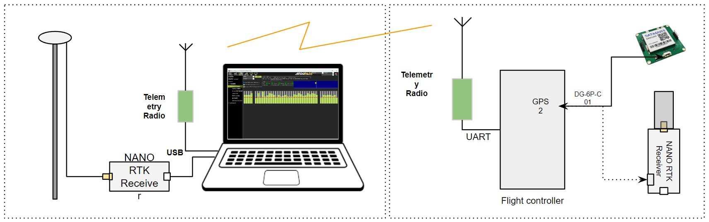

Base station setup
==================

We suggest using the NANO RTK Receiver as the configuration for the base station(ground base station), which is more convenient and user-friendly.

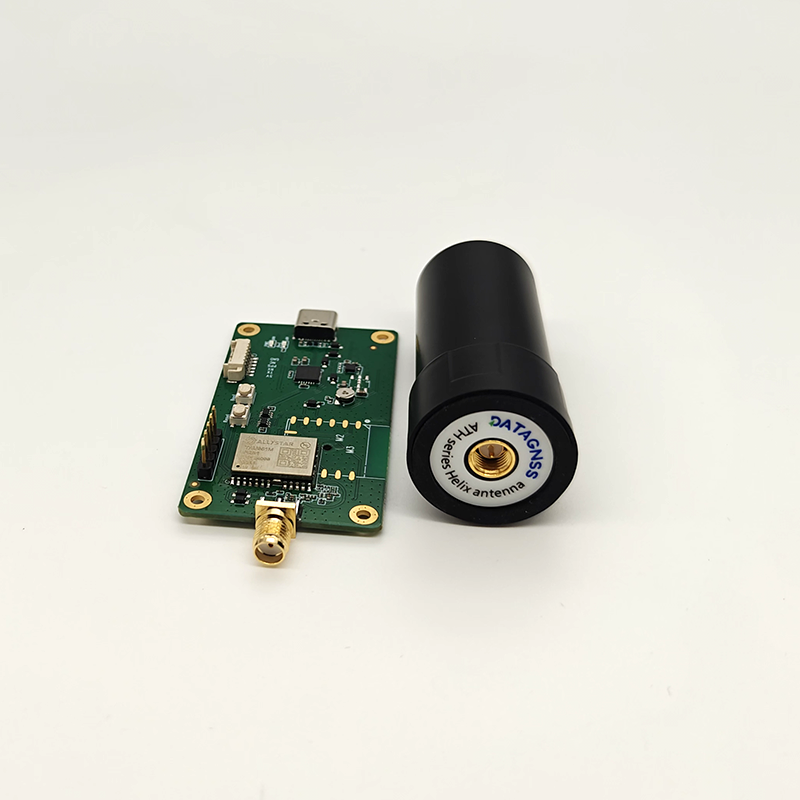

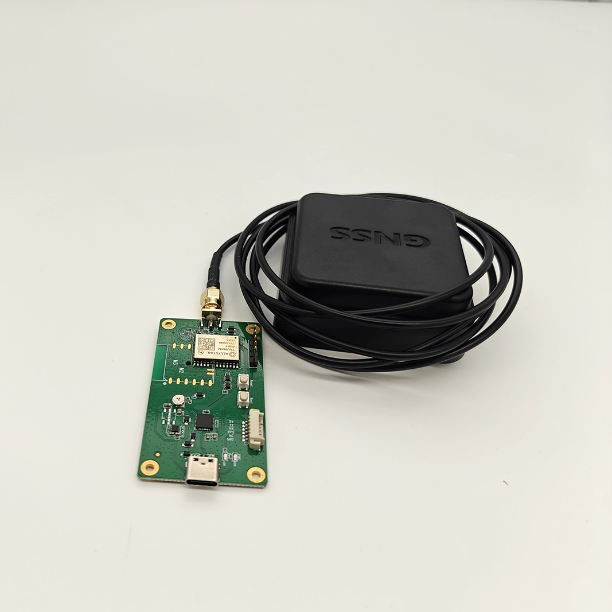

Connect the NANO RTK Receiver to your Laptop via USB.

Setup the NANO RTK Receiver as a base station, and it is recommended to use Satrack software.

- `Download Satrack <https://wiki.datagnss.com/images/e/ee/Satrack.zip>`_

1. Open Satrack, then choose the com port, baud rate then connect the nano-rtk-rcv.

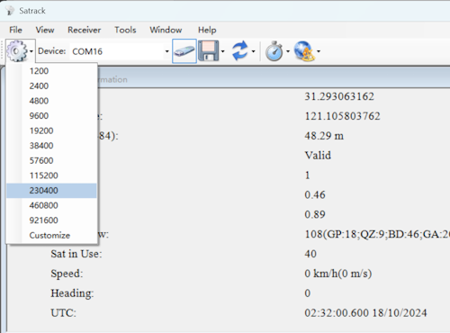

2. Enable RTCMv3 output

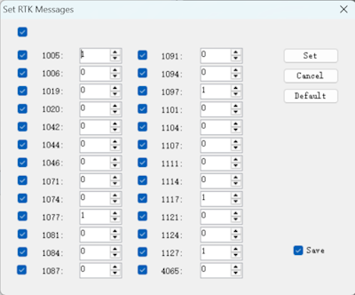

3. Disable NMEA data output

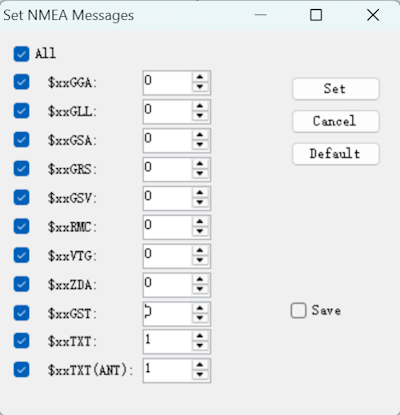

4. Config the base station fixed coordinates

There are two methods to set the coordinates of the base station:
A. According to the diagram below, Input the known coordinates.

Press "Get now", and modify the coordinates to the known values, then "send" to apply the fixed coordinates.

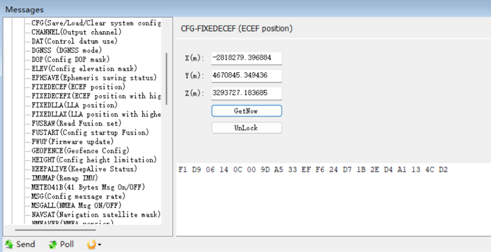
 

B. According to the CFG-SURVEY method, config miniDuration and AccLimit, then automatically calculate the average before proceeding with the setup.

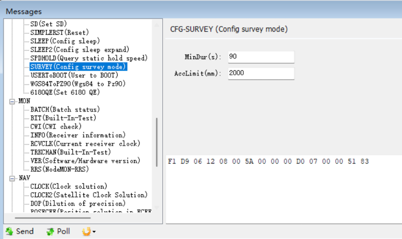

After completing the above operation, you can save the current configuration with CFG-SAVE. 

5. After above configuration, open Mission Planner

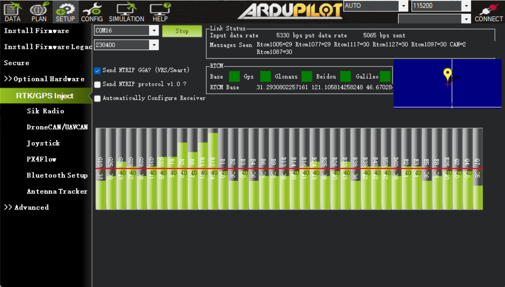
 
6. Finish other configuration in Mission Planner

Rover station (Aircraft) setup
==============================

For drones, NANO RTK Receiver or GEM1305 can be chosen as the Rover for RTK.

   - Please note that NANO RTK Receiver supports Ardupilot starting from **V3.0**.

Whether you choose NANO RTK Receiver or GEM1305, you need to confirm in the Satrack software that all RTCM data outputs are disabled and all NMEA outputs are enabled.

Note: NANO RTK Receiver and GEM1305 do not support safety switch, so BRD_SAFETY_DEFLT needs to be set to 0 or a separate safety switch should be connected to the flight controller.

After completing the above settings, you can write parameters to the flight controller.

Package List
============

- GEM1305 RTK Receiver
- DG-6P-C01,GH-1.25mm-6P cable

Resource
========
   - `GEM1305 2D drawing file <https://wiki.datagnss.com/index.php/GEM1305>`__
   - `NANO RTK Receiver 2D drawing file <https://wiki.datagnss.com/images/3/31/EVK-DG-1206_V.2.0.pdf>`__
   - `DATAGNSS WiKi <https://wiki.datagnss.com>`__

More information
================

   - `NANO RTK Receiver <https://www.datagnss.com/collections/evk/products/tau951m-1312-tiny-evk>`__
   - `HELIX Antenna for RTK <https://www.datagnss.com/collections/rtk-antenna/products/smart-helix-antenna>`__
   - `RTK Antenna AGR6302G <https://www.datagnss.com/collections/rtk-antenna/products/antenna-agr6302g>`__
   - `AT400 RTK Antenna <https://www.datagnss.com/collections/rtk-antenna/products/at400-multi-band-antenna-for-rtk>`__
