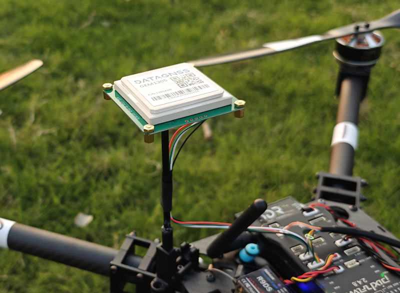

.. _common-datagnss-gem1305-rtk:

==================================
GEM1305 RTK receiver with antenna
==================================
GEM1305 is a RTK receiver with antenna designed and manufactured by `DATAGNSS <https://www.datagnss.com/>`__. 

GEM1305 is based on the new generation Allystar dual-core GNSS SoC. It supports RTK functionality with a maximum data update rate of 5Hz. 

.. note:: GEM1305/NANO RTK Receiver doesn't support Moving Base mode.

GEM1305 also has a version with a casing.

Where to Buy
============
- `DATAGNSS website <https://www.datagnss.com/>`_

Key Features
============
- Full constellation, multi-frequency GNSS satellite receiver
- Support RTK
- Standard UART serial interface
- Lightweight only 50g or 26g(NANO RTK receiver)
- High performance antenna

Frequencies
===========
   -  GPS/QZSS: L1 C/A, L5C
   -  GLONASS: L1OF
   -  BEIDOU: B1I, B2a
   -  GALILEO: E1, E5a

GNSS
====
   - Allystar CYNOSURE IV GNSS SOC
   - Dual core
   - 3D accuracy: **1.5m** CEP
   - RTK accuracy: **2cm** +1PPM(H), 3cm+1PPM(V)

Interface
=========
   - UART, 230400bps default
   - SMA connector for antenna
   - Output rate 5Hz default
   - Main power supply,4.7~5.2V

Protocol
========
   - NMEA-0183 output
   - RTCMv3 input/output

Environment
===========
   - Operating temp. -20~85℃

Dimession and weight
====================
   - 55*55*12mm
   - 50g (GEM1305) 26g (NANO with Helix)

Pin definition
==============
The board is connected to the autopilot via UART interface.

.. image:: ../../../images/gem1305/GEM1305-connector.png
    :target: ../_images/gem1305/GEM1305-connector.png

The 1.25mm pitch 6P connector (from Left PIN1 to PIN6) :

   -  1: GND
   -  2: NC
   -  3: PPS
   -  4: Rx
   -  5: Tx
   -  6: 5V

Please note that the board only includes RTK and doesn't include compass.

ArduPilot Setup
===============
For example, if GEM1305 is connected to the autopilot's SERIAL4 port, set:

- :ref:`SERIAL4_PROTOCOL <SERIAL4_PROTOCOL>` = 5
- :ref:`GPS_TYPE <GPS_TYPE>` = 5

.. note:: if you use 4.5 or earlier firmware, it should be GPS_TYPE = 5.

Configuration
=============
RTK technology can greatly improve the accuracy of positioning.

RTK technology requires a base and a rover, with the base placed on the ground, which is referred to as the rover on the drone.The data from the base needs to be transmitted to the drone via telemetry radio and inputted into the RTK receiver on the rover.

.. image:: ../../../images/gem1305/setup-rtk-00.png
    :target: ../_images/gem1305/setup-rtk-00.png

Base station setup
==================
We suggest using the NANO RTK Receiver as the configuration for the base station(ground base station), which is more convenient and user-friendly.

Please refer to the following link for the full base station setup guide:
- `Base station setup <https://wiki.datagnss.com/index.php/Faq-how-to-setup-base-or-rover>`__

Rover station (Aircraft) setup
==============================
For vehicles, NANO RTK Receiver or GEM1305 can be chosen as the Rover for RTK.

Whether you choose NANO RTK Receiver or GEM1305, you need to confirm in the Satrack software that all RTCM data outputs are disabled and all NMEA outputs are enabled.

In Rover mode, the output rate must be set to 5Hz.

Please refer to the following link for the full rover station setup guide:
- `Rover station setup <https://wiki.datagnss.com/index.php/Faq-how-to-setup-base-or-rover>`__

Package List
============
- GEM1305 RTK Receiver
- DG-6P-C01,GH-1.25mm-6P cable

Resource
========
   - `GEM1305 2D drawing file <https://wiki.datagnss.com/index.php/GEM1305>`__
   - `NANO RTK Receiver 2D drawing file <https://wiki.datagnss.com/images/3/31/EVK-DG-1206_V.2.0.pdf>`__
   - `DATAGNSS WiKi <https://wiki.datagnss.com>`__

More information
================

   - `NANO RTK Receiver <https://www.datagnss.com/collections/evk/products/tau951m-1312-tiny-evk>`__
   - `HELIX Antenna for RTK <https://www.datagnss.com/collections/rtk-antenna/products/smart-helix-antenna>`__
   - `RTK Antenna AGR6302G <https://www.datagnss.com/collections/rtk-antenna/products/antenna-agr6302g>`__
   - `AT400 RTK Antenna <https://www.datagnss.com/collections/rtk-antenna/products/at400-multi-band-antenna-for-rtk>`__
