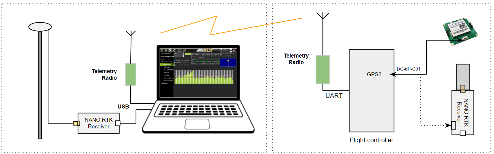

.. _common-datagnss-nano-h10p:

=======================
NANO H10P RTK receiver
=======================
NANO H10P RTK receiver is a high-precision RTK receiver designed and manufactured by DATAGNSS. 

It supports RTK functionality with a maximum data update rate of 10Hz. 
It includes compass IST8310.

NANO H10P RTK Receiver support base and rover mode.

Where to Buy
============

- `DATAGNSS website <https://www.datagnss.com/>`_

Key Features
============

- GPS/QZSS/BDS/GLONASS/GALILEO/IRNSS
- Multi-bands, support L1+L5/L1+L2
- Support RTK,output rate 10Hz
- Standard UART serial interface
- Lightweight only 15g
- Build-in High performance antenna

GNSS
====
   - 3D accuracy: **1.5m** CEP
   - RTK accuracy: **2cm** +1PPM(H), 3cm+1PPM(V)

Interface
=========
   - UART0 and UART1, 230400bps default
   - Output rate 5Hz default
   - Main power supply,4.7~5.2V

Protocol
========
   - NMEA-0183 output
   - RTCMv3 input/output

Environment
===========
   - Operating temp. -20~85℃

Dimession and weight
====================
   - ⌀48*35mm
   - 15g

Pin definition
==============
The board is connected to the autopilot via UART interface.

The 1.25mm pitch 8P connector (from Left PIN1 to PIN8) :

   -  1: 5V
   -  2: RxD0
   -  3: TxD0
   -  4: SCL
   -  5: SDA
   -  6: RxD1
   -  7: TxD1
   -  6: GND

ArduPilot Setup
===============
For example, NANO Helix RTK Receiver is connected to the autopilot's SERIAL4 port, it should work with :

- :ref:`SERIAL4_PROTOCOL <SERIAL4_PROTOCOL>` = 5
- :ref:`GPS1_TYPE <GPS1_TYPE>` = 5

.. note:: If you are using firmware version 4.5 or earlier, set GPS_TYPE = 5. In some cases, you may encounter a "GPS unhealthy" warning. In such situations, try lowering the GPS check threshold in the PreArm settings.

Configuration
=============
RTK technology requires a base and a rover, with the base placed on the ground, which is referred to as the rover on the drone. 

The data from the base needs to be transmitted to the drone via telemetry radio and inputted into the RTK receiver on the rover.

NANO RTK Receiver family for UAV:

.. image:: ../../../images/datagnss-nano/NANO-total-for-UAV-800x.png
	:target: ../_images/datagnss-nano/NANO-total-for-UAV-800x.png

Base station setup
==================
Please refer to the following link for the full base station setup guide:
- `Base station setup <https://wiki.datagnss.com/index.php/Faq-how-to-setup-base-or-rover>`__

Rover station (Aircraft) setup
==============================
Please refer to the following link for the full rover setup guide:
- `Rover station setup <https://wiki.datagnss.com/index.php/Faq-how-to-setup-base-or-rover>`__

Resource
========
   - `DATAGNSS WiKi <https://docs.datagnss.com>`__

More information
================

   - `NANO H10P RTK Receiver <https://docs.datagnss.com/gnss/rtk_receiver/NANO-H10P/>`__
   - `HELIX Antenna for RTK <https://www.datagnss.com/collections/rtk-antenna/products/smart-helix-antenna>`__
   - `RTK Antenna AGR6302G <https://www.datagnss.com/collections/rtk-antenna/products/antenna-agr6302g>`__
   - `AT400 RTK Antenna <https://www.datagnss.com/collections/rtk-antenna/products/at400-multi-band-antenna-for-rtk>`__
