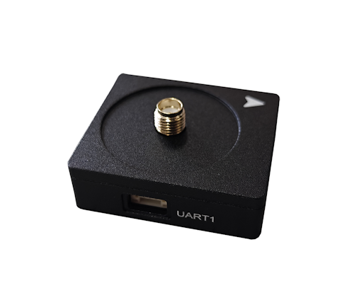
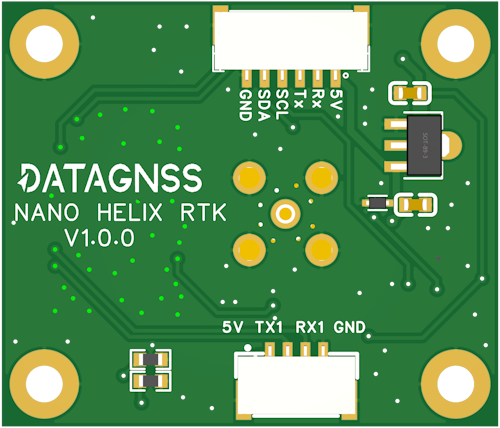
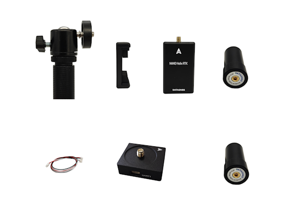

.. _common-datagnss-nano-rcv-rtk:

=======================
NANO Helix RTK receiver
=======================
NANO Helix RTK receiver is a high-precision RTK receiver designed and manufactured by DATAGNSS. 

It's based on the new generation Allystar dual-core GNSS SoC. It supports RTK functionality with a maximum data update rate of 5Hz. 
It includes two models, one is v1.0.0 without compass, and another is Rev.A with compass.

.. note:: NANO Helix RTK Receiver doesn't support Moving Base mode.

Where to Buy
============

- `DATAGNSS website <https://www.datagnss.com/>`_

Key Features
============

- GPS/QZSS/BDS/GLONASS/GALILEO/IRNSS
- Multi-bands, support L1+L5/L1+L2
- Support RTK,output rate 5Hz
- Standard UART serial interface
- Lightweight only 26g
- High performance antenna

GNSS
====
   - Allystar CYNOSURE IV GNSS SOC
   - Dual core
   - 3D accuracy: **1.5m** CEP
   - RTK accuracy: **2cm** +1PPM(H), 3cm+1PPM(V)

Interface
=========
   - UART, 230400bps default
   - SMA connector for antenna
   - Output rate 5Hz default
   - Main power supply,4.7~5.2V

Protocol
========
   - NMEA-0183 output
   - RTCMv3 input/output

Environment
===========
   - Operating temp. -20~85℃

Dimession and weight
====================
   - 65*30mm
   - 26g

Pin definition
==============
The board is connected to the autopilot via UART interface.

The 1.25mm pitch 6P connector (from Left PIN1 to PIN6) :

   -  1: GND
   -  2: NC
   -  3: NC
   -  4: Rx
   -  5: Tx
   -  6: 5V

Please note that only Rev.A includes RTK and compass.
If the model support compass, pin2 and pin3 output compass I2C interface.

ArduPilot Setup
===============
For example, NANO Helix RTK Receiver is connected to the autopilot's SERIAL4 port, it should work with :

- :ref:`SERIAL4_PROTOCOL <SERIAL4_PROTOCOL>` = 5

Configuration
=============
RTK technology requires a base and a rover, with the base placed on the ground, which is referred to as the rover on the drone. 

The data from the base needs to be transmitted to the drone via telemetry radio and inputted into the RTK receiver on the rover.

.. image:: ../../../images/gem1305/setup-rtk-00.png
	:target: ../_images/gem1305/setup-rtk-00.png

NANO RTK Receiver family for UAV:

Base station setup
==================

.. image:: ../../../images/datagnss-nano/NANO-GCS-01-600x.png
	:target: ../_images/datagnss-nano/NANO-GCS-01-600x.png

Connect the NANO RTK Receiver to your Laptop via USB.

Setup the NANO RTK Receiver as a base station, and it is recommended to use Satrack software.

- `Download Satrack <https://wiki.datagnss.com/images/e/ee/Satrack.zip>`_

1. Open Satrack, then choose the com port, baud rate then connect the nano-rtk-rcv.

   .. image:: ../../../images/gem1305/satrack-connect-device.png
      :target: ../_images/gem1305/satrack-connect-device.png

2. Enable RTCMv3 output

   .. image:: ../../../images/gem1305/satrack-rtcm-output.png
      :target: ../_images/gem1305/satrack-rtcm-output.png

3. Disable NMEA data output

   .. image:: ../../../images/gem1305/satrack-disable-nmea.png
      :target: ../_images/gem1305/satrack-disable-nmea.png

4. Config output rate to 1Hz

   In base station mode, the RTCM data output rate must be set to 1Hz.

   .. image:: ../../../images/gem1305/satrack-outputrate-1hz.png
      :target: ../_images/gem1305/satrack-outputrate-1hz.png
   
5. Config the base station fixed coordinates

   There are two methods to set the coordinates of the base station:

   5.1 According to the diagram below, Input the known coordinates.

   Press ``Get now``, and modify the coordinates to the known values, then ``Send`` to apply the fixed coordinates.

   .. image:: ../../../images/gem1305/satrack-cfg-fixedecef.png
       :target: ../_images/gem1305/satrack-cfg-fixedecef.png

   5.2 or, using the ``CFG-SURVEY`` meassage, config ``miniDuration`` and ``AccLimit``, then automatically calculate the average before proceeding with the setup.

   .. image:: ../../../images/gem1305/satrack-cfg-survey.png
       :target: ../_images/gem1305/satrack-cfg-survey.png

   After completing the above operation, you can save the current configuration with ``CFG-SAVE`` message. 

6. After completing the above configuration, open Mission Planner and finish the configuration on this page:

.. image:: ../../../images/gem1305/mp-connect-base.png
    :target: ../_images/gem1305/mp-connect-base.png

Rover station (Aircraft) setup
==============================

.. image:: ../../../images/datagnss-nano/NANO-RCV-02-Total-800x.png
	:target: ../_images/datagnss-nano/NANO-RCV-02-Total-800x.png

You need to confirm in the Satrack software that all RTCM data outputs are disabled and all NMEA outputs are enabled.

In Rover mode, the output rate must be set to 5Hz.

.. note:: NANO Helix RTK Receiver do not support safety switch, so BRD_SAFETY_DEFLT needs to be set to 0 or a separate safety switch should be connected to the flight controller.

After completing the above settings, you can write parameters to the flight controller.

Resource
========
   - `DATAGNSS WiKi <https://wiki.datagnss.com>`__

More information
================

   - `NANO Helix RTK Receiver <https://www.datagnss.com/collections/evk/products/nano-helix-rtk-receiver>`__
   - `HELIX Antenna for RTK <https://www.datagnss.com/collections/rtk-antenna/products/smart-helix-antenna>`__
   - `RTK Antenna AGR6302G <https://www.datagnss.com/collections/rtk-antenna/products/antenna-agr6302g>`__
   - `AT400 RTK Antenna <https://www.datagnss.com/collections/rtk-antenna/products/at400-multi-band-antenna-for-rtk>`__
