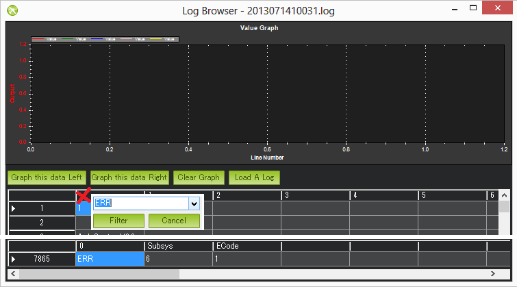

.. _common-diagnosing-problems-using-logs:

==============================
Diagnosing problems using Logs
==============================

This page aims to show you how to diagnose the top 5 most common
problems affecting Copter in particular but to some extent Plane and
Rover as well.

[copywiki destination="copter,plane,rover,planner"]

Log Types (Dataflash vs tlogs)
==============================

There are two ways to record your flight data. With some exceptions, the
two methods record very similar data but in different ways:

-  :ref:`Dataflash logs <common-downloading-and-analyzing-data-logs-in-mission-planner>`
   use the Pixhawk (or APM2.x) onboard dataflash memory, which you can
   download after the flight. On Plane and Rover dataflash logs are
   created soon after start-up. On Copter they are created after you
   first arm the copter.
-  :ref:`Telemetry logs <planner:common-mission-planner-telemetry-logs>`
   (also known as "tlogs") are recorded by the *Mission Planner* (or
   other ground station) when you connect ArduPilot to your computer via
   a :ref:`telemetry link <common-telemetry-landingpage>`.

If you are not yet familiar with the basics of these log files, first
review the introductory pages to understand where these logs are stored
and how you can download and view the information held within them.

.. _common-diagnosing-problems-using-logs_mechanical_failures:

Mechanical Failures
===================

Common mechanical failures include a motor or ESC failure (`including ESC sync failures <https://www.youtube.com/watch?v=hBUBbeyLe0Q>`__), the
propeller slipping or coming off, etc.  These appear in the log as a
sudden divergence in the desired roll and pitch vs the vehicles actual
roll and pitch.  This discrepancy is most clearly visible in the
**dataflash logs** by graphing the ATT message's Roll-In vs Roll and
Pitch-In vs Pitch and to a lesser extent in the NavYaw vs Yaw.

.. image:: ../../../images/DiagnosingWithLogs_RollInVsRoll.png
    :target: ../_images/DiagnosingWithLogs_RollInVsRoll.png

In the example above the vehicle's actual roll ("Roll") closely follows
the desired roll ("Roll-In") for the first part of the log but then
suddenly diverges.  The flight controller wanted the roll to remain
level (0 roll) but it was unable to likely meaning a mechanical
failure.  This is very different from a software failure in which the
flight controller freaked out and for some strange reason suddenly
wanted the copter up-side-down because in such cases the desired roll
would be also be crazy and actual roll would follow.

Extra notes:

-  tlogs are generally more difficult to use in this case because
   although we have nav_roll and nav_pitch which hold the desired roll
   and pitch, they are only updated when in RTL, Loiter or Auto flight
   modes.
-  in AC3.1 (and higher) Roll-In and Pitch-In only hold the desired roll
   and pitch while in stabilize mode.  When in an autopilot mode you
   must look at the NTUN messages's DRol and DPit columns

.. _common-diagnosing-problems-using-logs_vibrations:

Vibrations
==========

High vibrations cause the Copter's accelerometer based altitude and
horizontal position estimates to drift far off from reality which leads
to problems with alt hold (normally rocketing into the sky) or Loiter
(drifting).

Vibrations are best viewed by graphing the dataflash's **IMU** message's
**AccX**, **AccY** and **AccZ** values.  The AccX and AccY values
(primarily used for horizontal position control) should be between -3
and +3 m/s/s and the AccZ should be between -15 and -5 m/s/s.  The
accelerometer values will change momentarily as the copter moves up and
down which is why it is better to pull the data from a portion of the
flight where the copter was mostly stationary but even with a copter
that is moving you can still see the vibration levels by comparing the
difference between the top and bottom of the "grass".  an occasional
blade of grass going over the lines is ok but if it's sustained then
it's likely a real vibration problem.

The below graph shows acceptable vibration levels.

.. image:: ../../../images/DiagnosingWithLogs_Vibes.png
    :target: ../_images/DiagnosingWithLogs_Vibes.png

Tlog's RAW_IMU **xacc**, **yacc** and **zacc** can also be used but
their update is much slower (generally less than 10hz) than the
dataflash log (50hz) so it becomes more difficult to see whether the
changes in accelerometer values are due to the copter moving or are just
vibrations.

If using tlogs the scale is in milli-Gs so the acceptable range for
**xacc** and **yacc** is -300 ~ +300, and for zacc is -500 ~ -1500. 
Note that in the image below the values appear out of that range which
perhaps indicates a vibration problem although this user did not
complain of AltHold or Loiter problems so it is more likely that these
variations were because the copter was not in a stable hover and the
update rate was low.

For more advanced vibration analysis, see :ref:`Batch Sampling <common-imu-batchsampling>`.

.. _common-diagnosing-problems-using-logs_compass_interference:

Compass interference
====================

Interference from the power distribution board, motors, battery, ESC and
other electrical devices near the APM or Pixhawk boards can throw off the compass
heading which can lead to circling (aka "toilet bowling") or even the
copter flying off in completely the wrong direction.  Graphing the
tlog's mag_field (found under "CUSTOM") and throttle (found under
VFR_HUD) values are the easiest way to quickly see the amount of interference.

In the graph's below shows an acceptable amount of magnetic
interference.  You can see the mag_field fluctuates when the throttle
is raised but only moves around by about 10% ~ 20%.  Below 30%
inteference is acceptable.  Between 30% ~ 60% is in the grey zone where
it might be ok (some users are ok, some are not) and really bad magnetic
interference will show up as jumps of over 60% when the throttle is
raised.

.. image:: ../../../images/DiagnosingWithLogs_MagFieldVsThr.png
    :target: ../_images/DiagnosingWithLogs_MagFieldVsThr.png

Extra Notes:

-  The length of the mag_field can be anywhere from 120 ~ 550 depending
   upon where in the world the vehicle is but it is normally around 330.
-  The magnetic interference as a percentage of the total mag field is
   also displayed at the end of the compassmot set-up procedure.
-  Dataflash log's COMPASS message hold the compass's raw x, y and z
   axis values (called MagX, MagY, MagZ) which are equivalent to the
   tlog's RAW_IMU xmag, ymag and zmag fields.  It's possible to
   calculate the mag-field length by first loading the dataflash log
   file into excel, filtering by the COMPASS message and then
   calculating the mag-field using the formula mag_field = sqrt(MagX^2,
   MagY^2, MagZ^2).  Note that the COMPASS message is not enabled by
   default in the dataflash logs because it runs at 50hz and does affect
   CPU performance a bit.
-  Another general thing to check re the compass is the offsets which
   should bet between -150 ~ 150.  These are found in the tlog's
   SENSOR_OFFSET group as **mag_ofs_x**, **mag_ofs_y**,
   **mag_ofs_z** and in the dataflash's COMPASS message as **OfsX**,
   **OfsY**, **OfsZ**.  They can also be seen in the parameters as
   **COMPASS_OFS_X**, **COMPASS_OFS_Y**, **COMPASS_OFS_Z**.
-  The image above it shows a short spike at the beginning of the graph
   but this can be ignored because it's before the throttle is raised so
   it's probably just as the user plugged in some other electrical
   device.

.. _common-diagnosing-problems-using-logs_gps_glitches:

GPS glitches
============

When in autopilot modes (Loiter, RTL, AUTO) position errors from the GPS
can cause Copter to think that it's suddenly in the wrong position and
lead to aggressive flying to correct the perceived error.  These
"glitches" show up in both the tlogs and dataflash logs as an decrease
in the number of satellites visible and an increase in the
`hdop <https://en.wikipedia.org/wiki/Dilution_of_precision_%28GPS%29>`__.

If using tlogs graph the the you can do this by graphing the
GPS_RAW_IT group's "eph" and "satellites_visible" values.  An hdop
value of 1.5 (displayed as 150) or lower is very good.  Over 2.0 (i.e.
200) indicates a bad position value.  The number of satellites falling
below 9 is also bad.  A significant change in these two values often
accompanies a GPS position change.

.. image:: ../../../images/DisagnosingWithLogs_GPShdopAndNumSats.png
    :target: ../_images/DisagnosingWithLogs_GPShdopAndNumSats.png

In the Dataflash logs's GPS message you will find the "HDop" and "NSats"
columns.  Note the hdop values are in the correct units in the dataflash
(i.e. not 100x too big like in the tlogs).

AC 3.1 includes :ref:`GPS Glitch detection <copter:gps-failsafe-glitch-protection>` which
attempts to ignore glitches by sanity checking the positions.

Power Problems (BrownOuts, etc)
===============================

The introduction of the 3DR Power Module has made it much easier for
people to provide a reliable power supply to their Pixhawk-series.  This has
led to a massive reduction in the number of brown-outs reported but they
do still occur.  They can normally be recognised by the logs suddenly
ending while the copter is still in the air (i.e. barometer or inertial
navigation altitude is still well above zero).

Try graphing the:

-  Dataflash log's CTUN message's Baro Alt
-  Dataflash log's GPS message's RelAlt (the combined accelerometer +
   barometer altitude estimate)
-  Tlog's VFR_HUD alt (the combined accelerometer + barometer altitude
   estimate)
-  Tlog's GLOBAL_POSITION relative_alt

Changes in the board voltage can also be a sign of a power problem. 
Variations of 0.10 to 0.15 volts are normal.  Beyond that could be a
sign that other devices sharing the power source with the APM are
causing ripples in the power supply that could lead to a brown-out or
other weird behaviour.  The board voltage can be graphed using:

-  Dataflash CURRENT message's VCC
-  Tlog HWSTATUS's Vcc

In the image directly below shows the board voltage sinking by 0.15V
when the throttle is raised.  This is generally not a good thing but
because it's only 0.15V it's probably OK. The 2nd graph below (a
dataflash graph from a different user's log) shows a more random
variation in voltage but also up to 0.15V which is typical.

.. image:: ../../../images/DiagnosingWithLogs_BoardVccVsThr.png
    :target: ../_images/DiagnosingWithLogs_BoardVccVsThr.png

.. image:: ../../../images/DiagnosingWithLogs_DataFlashBoardVcc.png
    :target: ../_images/DiagnosingWithLogs_DataFlashBoardVcc.png

Unexpected ERRORS including Failsafes
=====================================

When unexpected behaviour from the flight controller occurs (especially
when the user complains that the copter no longer responded to their
input) it is often caused by one of the failsafes being triggered. 
There are 5 failsafes that can be activated: Throttle Failsafe, GPS
Failsafe, GCS Failsafe (ground station failsafe), Battery Failsafe and
the Fence.

The easiest way to find these is to look in the dataflash logs and
filter the 1st column by "ERR".

The Subsys (aka Sub-system) gives the area that generated the error and
the ECode (aka Error Code) tells you what the error was specifically. 
The very limited number of subsystems and error codes can be found at
the bottom of the Copter `defines.h file <https://github.com/ArduPilot/ardupilot/blob/master/ArduCopter/defines.h#L339>`__.

Sub Systems / Error Codes

1: Main (never used)

2: Radio

ECode 1: "Late Frame" which means the APM's onboard ppm encoder did not
provide an update for at least 2 seconds

ECode 0: error resolved which means the ppm encoder started providing
data again

3: Compass

ECode 1: the compass failed to initialise (likely a hardware issue)

ECode 2: failure while trying to read a single value from the compass
(probably a hardware issue)

ECode 0: above errors resolved

4: Optical flow

Ecode 1: failed to initialise (likely a hardware issue)

5: Throttle failsafe

ECode 1: throttle dropped below FS_THR_VALUE meaning likely loss of
contact between RX/TX

ECode 0: above error resolve meaning RX/TX contact likely restored

6: Battery failsafe

ECode 1: battery voltage dropped below LOW_VOLT or total battery
capacity used exceeded BATT_CAPACITY

7: GPS failsafe

ECode 1: GPS lock lost for at least 5 seconds

ECode 0: GPS lock restored

8: GCS (Ground station) failsafe

ECode 1: updates from ground station joystick lost for at least 5
seconds

ECode 0: updates from ground station restored

9: Fence

ECode 1: altitude fence breached

ECode 2: circular fence breached

ECode 3: both altitude and circular fences breached

ECode 0: vehicle is back within the fences

10: Flight Mode

ECode 0 ~ 10: the vehicle was unable to enter the desired flight mode

(0=Stabilize, 1=Acro, 2=AltHold, 3=Auto, 4=Guided, 5=Loiter, 6=RTL,
7=Circle, 8=Position, 9=Land, 10=OF_Loiter)

11: GPS

ECode 2: GPS Glitch

ECode 0: GPS Glitch cleared

12: Crash Check

ECode 1: Crash detected

13: Flip

ECode 2: Flip abandoned (because of 2 second timeout)

14: AutoTune

ECode 2: Bad Gains (failed to determine proper gains)

15: Parachute

ECode 2: Too low to deploy parachute

16: EKF/InertialNav Check

ECode 2: Bad Variance

ECode 0: Bad Variance cleared

17: EKF/InertialNav Failsafe

ECode 2: EKF Failsafe triggered

18: Baro glitch

ECode 2: Baro glitch

ECode 0: Baro glitch cleared
