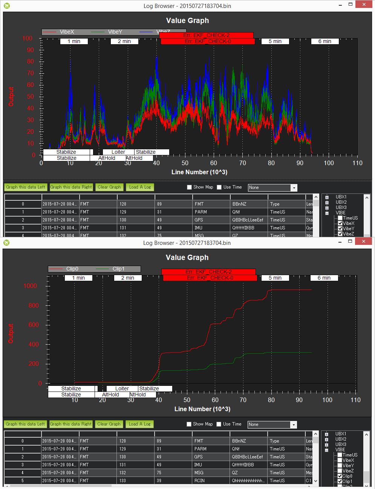

.. _common-diagnosing-problems-using-logs:

==============================
Diagnosing problems using Logs
==============================

This page show how to diagnose the six most common problems affecting Copter in particular but to some extent Plane and Rover as well.

[copywiki destination="copter,plane,rover,dev,planner"]

Log Types (Dataflash vs tlogs)
==============================

There are two ways to record your flight data. With some exceptions, the
two methods record very similar data but in different ways:

-  :ref:`Dataflash logs <common-downloading-and-analyzing-data-logs-in-mission-planner>` are recorded on the autopilot (often to the SD card) so they must be downloaded from the autopilot after a flight
-  :ref:`Telemetry logs <planner:common-mission-planner-telemetry-logs>` (also known as "tlogs") are recorded by the ground station (i.e. Mission Planner) on the local PC when the autopilot is connected via a :ref:`telemetry link <common-telemetry-landingpage>`

If you are not yet familiar with the basics of these log files, first review the introductory pages to understand where these logs are stored and how you can download and view the information held within them.

.. _common-diagnosing-problems-using-logs_mechanical_failures:

Mechanical Failures
===================

Common mechanical failures include a motor or ESC failure (`including ESC sync failures <https://www.youtube.com/watch?v=hBUBbeyLe0Q>`__), the propeller breaking or coming off, etc.  These appear in the log as a sudden divergence in the desired roll and pitch vs the vehicle's actual roll and pitch.  This divergence is visible by graphing the ATT message's DesRoll vs Roll, DesPitch vs Pitch and to a lesser extent DesYaw vs Yaw.

In the example above the vehicle's actual roll ("Roll") closely follows the desired roll ("DesRoll") for the first part of the log but then suddenly diverges.  The autopilot wanted the roll to remain level ("Roll" = 0) but it was unable to likely meaning there was a mechanical failure.  This is very different from a software failure in which the autopilot freaked out and for some strange reason suddenly wanted the copter up-side-down because in such cases the DesRoll would be also be crazy and actual Roll would follow.

Tlogs contain the same data.  Compare NAV_CONTROLLER_OUTPUT's nav_roll (desired roll) and nav_pitch (desired pitch) to ATTITUDE.roll (actual roll) and pitch (actual pitch).

.. _common-diagnosing-problems-using-logs_vibrations:

Vibrations
==========

High vibrations can cause the Copter's accelerometer based altitude and horizontal position estimates to drift far off from reality which leads to problems with altitude hold (the vehicle may rocket into the sky) or position control in modes like Loiter, PosHold, Auto, etc.

As covered on the :ref:`Measuring Vibration <common-measuring-vibration>` page, vibrations are best viewed by graphing the **VIBE** message's **VibeX**, **VibeY** and **VibeZ** values.  Vibration levels below 30m/s/s are normally acceptable. Levels above 30m/s/s may have problems and levels above 60m/s/s nearly always have problems with position or altitude hold.

The below graph shows acceptable vibration levels which are consistently below 30m/s/s

.. image:: ../../../images/mp_vibe_dataflash_msg.png
    :target: ../_images/mp_vibe_dataflash_msg.png

The graph below is from a vehicle that had position estimation problems due to high vibrations

Tlog's VIBRATION **vibration_x**, **vibration_y** and **vibration_z** can also be used and show the same information as is stored to the dataflash log

.. image:: ../../../images/DiagnosingWithLogs_VibesTlog.png
    :target: ../_images/DiagnosingWithLogs_VibesTlog.png

.. _common-diagnosing-problems-using-logs_compass_interference:

Compass interference
====================

Interference from the power distribution board, motors, battery, ESCs and other electrical devices near the autopilot can throw off the compass heading which can lead to circling (aka "toilet bowling") or even the copter flying off in completely the wrong direction.  Graphing the tlog's mag_field (found under "CUSTOM") and throttle (found under VFR_HUD) is the easiest way to quickly see the amount of interference.

The graph below shows an acceptable amount of magnetic interference with mag_field fluctuations of only 10% to 20% when the throttle is raised.  Below 30% interference is acceptable.  Between 30% ~ 60% is in the grey zone where it might be OK (some users are OK, some are not) and really bad magnetic interference will show up as jumps of over 60% when the throttle is raised.

.. image:: ../../../images/DiagnosingWithLogs_MagFieldVsThr.png
    :target: ../_images/DiagnosingWithLogs_MagFieldVsThr.png

Extra Notes:

-  The length of the mag_field can be anywhere from 120 ~ 550 depending upon where in the world the vehicle is but it is normally around 330
-  The magnetic interference as a percentage of the total mag field is also displayed at the end of the compassmot set-up procedure.  Search for "CompassMot" on the :ref:`Advanced Compass Setup page <common-compass-setup-advanced>` page to learn more about compassmot
-  Dataflash log's COMPASS message hold the compass's raw x, y and z axis values (called MagX, MagY, MagZ) which are equivalent to the tlog's RAW_IMU xmag, ymag and zmag fields.  It is possible to calculate the mag-field length by first loading the dataflash log file into excel, filtering by the COMPASS message and then calculating the mag-field using the formula mag_field = sqrt(MagX^2, MagY^2, MagZ^2).  Note that the COMPASS message is not enabled by default in the dataflash logs because it runs at 50hz and does affect CPU performance a bit.
-  The image above it shows a short spike at the beginning of the graph but this can be ignored because it is before the throttle is raised so it is probably just as the user plugged in some other electrical device

.. _common-diagnosing-problems-using-logs_gps_glitches:

GPS glitches
============

When in autonomous modes (Loiter, RTL, Auto, etc) position errors from the GPS can cause the vehicle to think that it is suddenly in the wrong place and lead to aggressive flying to correct the perceived error.  These "glitches" show up in both the tlogs and dataflash logs as a decrease in the number of satellites visible and an increase in the `hdop <https://en.wikipedia.org/wiki/Dilution_of_precision_%28GPS%29>`__.

Graph the Dataflash log's GPS message's "HDop" and "NSats" values.  Hdop values below 1.5 are very good, values over 2.0 could indicate the GPS positions are not good.  The number of satellites falling below 12 is also bad.  A significant change in these two values often accompanies a GPS position change.

.. image:: ../../../images/DisagnosingWithLogs_GPShdopAndNumSats_DF.png
    :target: ../_images/DisagnosingWithLogs_GPShdopAndNumSats_DF.png

If using tlogs graph the GPS_RAW_IT group's "eph" and "satellites_visible" values.  Hdop values below 150 are good, values over 200 could indicate a bad position.

See the :ref:`EKF failsafe <copter:ekf-inav-failsafe>` wiki page for more details on how the vehicle may switch to non-autonomous modes in the case of very bad GPS glitches

Power Problems (BrownOuts, etc)
===============================

:ref:`Power Modules <common-powermodule-landingpage>` provide a reliable power supply to the autopilot but brown-outs do still occasionally occur.  They can normally be recognised by the logs suddenly ending while the vehicle is still in the air (i.e. barometer or EKF altitude is still reporting the vehicle's altitude is well above zero).

Try graphing the:

-  Dataflash log's CTUN Alt (altitude above home) or BAlt (Barometer altitude)
-  Dataflash log's GPS Alt (altitude above sea level)
-  Tlog's VFR_HUD alt (the combined accelerometer + barometer altitude estimate)
-  Tlog's GLOBAL_POSITION relative_alt (altitude above home)

.. image:: ../../../images/DiagnosingWithLogs_BrownOut.png
    :target: ../_images/DiagnosingWithLogs_BrownOut.png

Changes in the board voltage can also be a sign of a power problem.  Variations of 0.10 to 0.15 volts are normal.  Beyond that could be a sign that other devices sharing the power source with the autopilot are causing ripples in the power supply that could lead to a brown-out.  The board voltage can be graphed using:

-  Dataflash POWR message's VCC
-  Tlog HWSTATUS's Vcc

In the image directly below shows the board voltage sinking by 0.15V when the throttle is raised.  This is generally not a good thing but because it's only 0.15V it's probably OK. The 2nd graph below (a dataflash graph from a different user's log) shows a very stable voltage with ripples less than 0.1V.

Unexpected ERRORS including Failsafes
=====================================

When unexpected behaviour from the autopilot occurs (especially when the user complains that the copter no longer responded to their input) it is often caused by one of the :ref:`failsafes <copter:failsafe-landing-page>` being triggered.

The easiest way to find these is to look in the dataflash logs and filter the first column by "ERR".  If using the Mission Planner, the errors will also appear in red markers at the top of the graphing area.

.. image:: ../../../images/DiagnosingWithLogs_FilterForErrors.png
    :target: ../_images/DiagnosingWithLogs_FilterForErrors.png

The Subsys (aka Sub-system) gives the area that generated the error and the ECode (aka Error Code) tells you what the error was specifically.  The list of subsystems and error codes can be found in the AP_Logger library `AP_Logger.h file <https://github.com/ArduPilot/ardupilot/blob/master/libraries/AP_Logger/AP_Logger.h#L33>`__.

.. raw:: html

   <table border="1" class="docutils">
   <tbody>
   <tr>
   <th>Subsys</th>
   <th>ECode and Description</th>
   </tr>
   <tr>
   <td>2 = Radio</td>
   <td>

- 0 = Errors Resolved
- 2 = Late Frame : no updates received from receiver for two seconds

.. raw:: html

   </td>
   </tr>
   <tr>
   <td>3 = Compass</td>
   <td>

- 0 = Errors Resolved
- 1 = Failed to initialise (probably a hardware issue)
- 4 = Unhealthy : failed to read from the sensor

.. raw:: html

   </td>
   </tr>

   <tr>
   <td>5 = Radio Failsafe</td>
   <td>

- 0 = Failsafe Resolved
- 1 = Failsafe Triggered

.. raw:: html

   </td>
   </tr>

   <tr>
   <td>6 = Battery Failsafe</td>
   <td>

- 0 = Failsafe Resolved
- 1 = Failsafe Triggered

.. raw:: html

   </td>
   </tr>

   <tr>
   <td>8 = GCS Failsafe</td>
   <td>

- 0 = Failsafe Resolved
- 1 = Failsafe Triggered

.. raw:: html

   </td>
   </tr>

   <tr>
   <td>9 = Fence Failsafe</td>
   <td>

- 0 = Failsafe Resolved
- 1 = Altitude fence breach, Failsafe Triggered
- 2 = Circular fence breach, Failsafe Triggered
- 3 = Both Alt and Circular fence breached, Failsafe Triggered
- 4 = Polygon fence breached, Failsafe Triggered

.. raw:: html

   </td>
   </tr>

   <tr>
   <td>10 = Flight mode Change failure</td>
   <td>

Vehicle was unable to enter the desired flight mode normally because of a bad position estimate

See `flight mode numbers here <https://github.com/ArduPilot/ardupilot/blob/master/ArduCopter/mode.h#L14>`__ for Copter, `Plane modes here <https://github.com/ArduPilot/ardupilot/blob/master/ArduPlane/mode.h#L15>`__, and `Rover modes here <https://github.com/ArduPilot/ardupilot/blob/master/Rover/mode.h#L19>`__

.. raw:: html

   </td>
   </tr>

   <tr>
   <td>11 = GPS</td>
   <td>

- 0 = Glitch cleared
- 2 = GPS Glitch occurred

.. raw:: html

   </td>
   </tr>

   <tr>
   <td>12 = Crash Check</td>
   <td>

- 1 = Crash into ground detected.  Normally vehicle is disarmed soon after
- 2 = Loss of control detected.  Normally parachute is released soon after

.. raw:: html

   </td>
   </tr>

   <tr>
   <td>13 = Flip mode</td>
   <td>2 = Flip abandoned (not armed, pilot input or timeout)</td>
   </tr>
   <tr>
   <td>15 = Parachute</td>
   <td>

- 2 = Not Deployed, vehicle too low
- 3 = Not Deployed, vehicle landed

.. raw:: html

   </td>
   </tr>

   <tr>
   <td>16 = EKF Check</td>
   <td>

- 0 = Variance cleared (position estimate OK)
- 2 = Bad Variance (position estimate bad)

.. raw:: html

   </td>
   </tr>

   <tr>
   <td>17 = EKF Failsafe</td>
   <td>

- 0 = Failsafe Resolved
- 1 = Failsafe Triggered

.. raw:: html

   </td>
   </tr>

   <tr>
   <td>18 = Barometer</td>
   <td>

- 0 = Errors Resolved
- 4 = Unhealthy : failed to read from the sensor

.. raw:: html

   </td>
   </tr>

   <tr>
   <td>19 = CPU Load Watchdog</td>
   <td>

- 0 = Failsafe Resolved
- 1 = Failsafe Triggered (normally vehicle disarms)

.. raw:: html

   </td>
   </tr>

   <tr>
   <td>20 = ADSB Failsafe</td>
   <td>

- 0 = Failsafe Resolved
- 1 = No action just report to Pilot
- 2 = Vehicle avoids by climbing or descending
- 3 = Vehicle avoids by moving horizontally
- 4 = Vehicle avoids by moving perpendicular to other vehicle
- 5 = RTL invoked

.. raw:: html

   </td>
   </tr>

   <tr>
   <td>21 = Terrain Data</td>
   <td>2 = missing terrain data</td>
   </tr>

   <tr>
   <td>22 = Navigation</td>
   <td>

- 2 = Failed to set destination
- 3 = RTL restarted
- 4 = Circle initialisation failed
- 5 = Destination outside fence

.. raw:: html

   </td>
   </tr>

   <tr>
   <td>23 = Terrain Failsafe</td>
   <td>

- 0 = Failsafe Resolved
- 1 = Failsafe Triggered (normally vehicle RTLs)

.. raw:: html

   </td>
   </tr>

   <tr>
   <td>24 = EKF Primary changed</td>
   <td>

- 0 = 1st EKF has become primary
- 1 = 2nd EKF has become primary

.. raw:: html

   </td>
   </tr>

   <tr>
   <td>25 = Thrust Loss Check</td>
   <td>

- 0 = Thrust Restored
- 1 = Thrust Loss Detected (altitude may be prioritised over yaw control)

.. raw:: html

   </td>
   </tr>

   <tr>
   <td>26 = Sensor Failsafe (Sub)</td>
   <td>

- 0 = Sensor Failsafe Cleared
- 1 = Sensor Failsafe Triggered

.. raw:: html

   </td>
   </tr>

   <tr>
   <td>27 = Leak Failsafe (Sub)</td>
   <td>

- 0 = Leak Failsafe Cleared
- 1 = Leak Detector Failsafe Triggered

.. raw:: html

   </td>
   </tr>

   <tr>
   <td>28 = Pilot Input Timeout Failsafe (Sub only)</td>
   <td>

- 0 = Pilot Input Failsafe Cleared
- 1 = Pilot Input Failsafe Triggered

.. raw:: html

   </td>
   </tr>

   <tr>
   <td>29 = Vibration Failsafe</td>
   <td>

- 0 = Excessive Vibration Compensation De-activated
- 1 = Excessive Vibration Compenstaion Activated

.. raw:: html

   </td>
   </tr>

   </tbody>
   </table>
