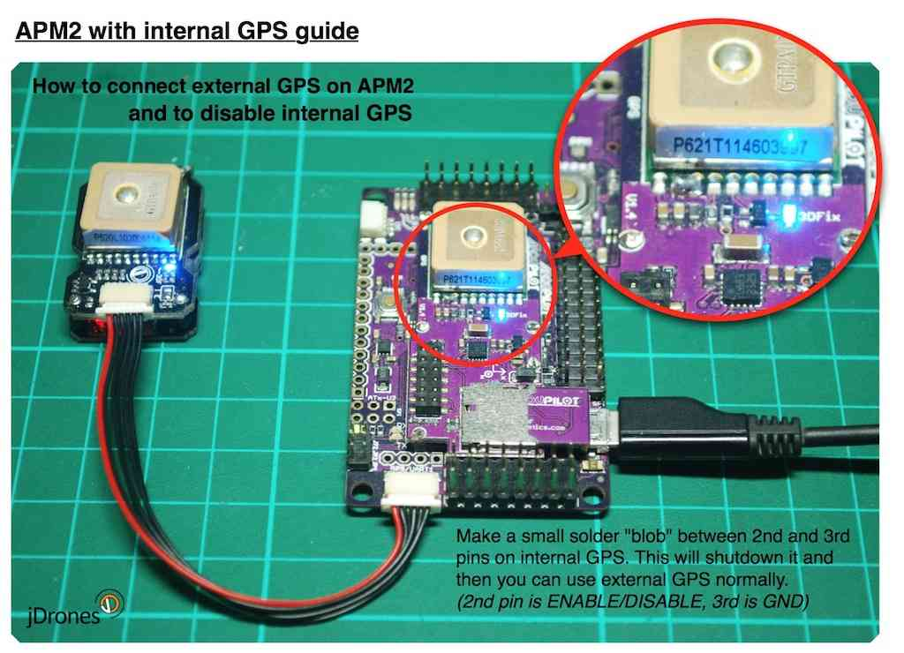

.. _common-disabling-the-built-in-gps-on-apm2-to-use-an-external-gps-instead:

===========================================================================
Archived: Disabling the Built In GPS on APM2 to use an External GPS instead
===========================================================================

.. warning::

   **ARCHIVED ARTICLE**

   APM2 with built-in GPS no longer produced.

If you have an APM 2 with the built-in Mediatek GPS and would like to
use an external and/or different GPS module, you can do so with some
simple modifications:

Just solder a blob over these two pins, to short them out:

Testing
=======

#. With no external GPS, connect to APM via the Mission Planner. The HUD
   should report "No GPS". That's good -- it means it can't detect a GPS
   module. Now disconnect and remove the power from your board/remove
   the USB cable
#. Connect your external GPS to the GPS port
#. Connect the USB cable and connect via the Mission Planner again
#. Once it connects, it should report "No Fix" (if you're indoors or
   don't have a fix yet) or "3D Fix" (if you've got GPS fix). Either are
   great -- it means your new GPS was detected!
