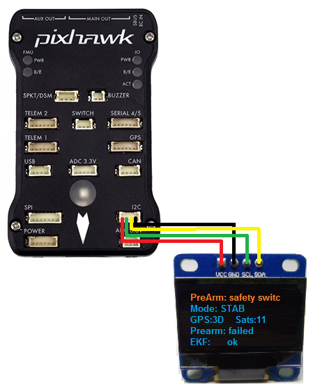

.. _common-display-onboard:

===============
Onboard Display
===============

This article explains how to connect a small onboard display to a autopilot which can be useful for displaying a small amount of vehicle information before takeoff.

This information includes:

- arming failure messages
- flight mode
- battery voltage
- GPS Lock and satellite count
- Pre-arm passed/failed
- EKF status

.. note::

   Support for the onboard display is included in Copter-3.5 (and higher).

Where to Buy
============

These boards have been confirmed to work:

- `SSD1306 module from AliExpress <https://www.aliexpress.com/item/Wholesale-0-96-inch-4pin-White-OLED-Module-SSD1306-Drive-IC-128-64-I2C-IIC-Communication/32658908775.html>`__
- `SSD1306 module from SunFounder on Amazon Spain <https://www.amazon.es/gp/product/B014KUB1SA/ref=oh_aui_detailpage_o00_s00?ie=UTF8&psc=1>`__
- `CRIUS display from rctimer <http://rctimer.com/product-797.html>`__
- `Diymall 1.3 inch from Amazon <https://www.amazon.com/gp/product/B016HVG0MM/ref=od_aui_detailpages00?ie=UTF8&psc=1>`__

Connecting to a Autopilot
=================================

Connect the display to the autopilot's I2C port as shown in the image above

set :ref:`NTF_DISPLAY_TYPE <NTF_DISPLAY_TYPE>` to 1 if using an SSD1306, 2 if using the SH1106 and reboot the board.
