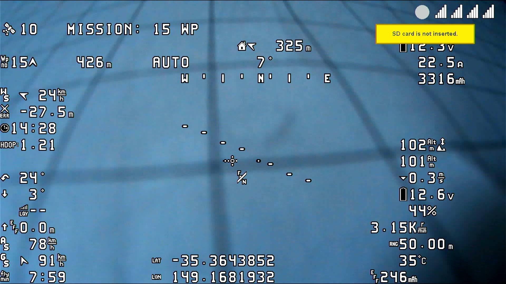
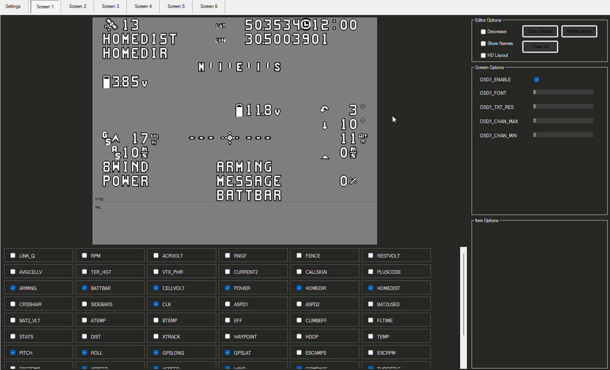

.. _common-displayport:

===============
DisplayPort OSD
===============
DisplayPort, is an MSP protocol extension that allows an autopilot to remotely draw text on compatible external OSDs. DisplayPort, is an MSP protocol extension that allows to remotely draw text characters/icons on compatible external OSDs and allows High Definition (HD) as well as Standard Definition (SD) displays.

HDZero, Walksnail, and DJI with WTF-OSD modifications are capable of DisplayPort operation.

Features
--------
DisplayPort OSDs can render all the panel items supported by the ArduPilot's onboard OSD.
Features such as multiple screen switching, multiple units and statistics are supported as well. Please refer to the :ref:`onboard OSD documentation <common-osd-overview>`  for more info.  DisplayPort based OSDs include:

- HDZero
- Walksnail
- DJI goggles using the `wtf-os <https://github.com/fpv-wtf/wtfos>`__ firmware and `msdp-osd module <https://github.com/fpv-wtf/msp-osd>`__, and 
- MWOSD's DisplayPort mode/firmware

Stick commands for accessing HDZero's VTX Menu and Camera Menu, or 0mW mode also work.

HDZero using ArduPilot custom fonts

Configuration
-------------
To enable MSP DisplayPort OSDs set the following parameters (using SERIAL port n as the port to attach to the Air unit using both TX and RX lines):

 - :ref:`OSD_TYPE<OSD_TYPE>` = 5 (MSP_DISPLAYPORT)
 - :ref:`SERIALn_PROTOCOL<SERIAL1_PROTOCOL>` = 42 (DisplayPort)
 - :ref:`SERIALn_BAUD<SERIAL1_BAUD>` = 115
 - :ref:`MSP_OPTIONS<MSP_OPTIONS>` set bit 0 = 0 (do NOT EnableTelemetryMode)
 - See :ref:`Display Resolution <display_resolution>` section below for resolution settings.

 .. note:: Serial port baud rate default is changed to 115.2Kbaud automatically when setting the above protocol type. However, if the user has previously changed or subsequently changes the baud, this default will not be used. 115.2Kbaud is required by most video goggle systems.

DJI Goggles with WTF-OSD firmware
---------------------------------
Depending on existing firmware revision, you can modify the firmware of the DJI goggles with a third party "rooting" and OS replacement that allows using MSP DisplayPort protocol and gives the same capabilities as that of the ArduPilot internal OSD in terms of panel items, screens, and placement.
Find out more about using the `wtf-os <https://github.com/fpv-wtf/wtfos>`__ firmware and `msdp-osd module <https://github.com/fpv-wtf/msp-osd>`__.

In addition, you can have either standard definition (SD) fonts, or high definition (HD) fonts, as well as colors for the fonts. The steps required to use this are:

- Use the `wtf-osd web based configurator <https://testing.fpv.wtf>`__ configuration buttons on your goggles and air units to:

#. ``Root`` the goggles and air unit
#. Install ``WTFOS``
#. Use the "Package Manager" to install the ``msp-osd`` module
#. Install the font package as instructed by the msp-osd readme in the root directory of the goggles SD card
#. Configure:

 - :ref:`OSD_TYPE<OSD_TYPE>` = 5 (MSP_DISPLAYPORT)
 - :ref:`SERIALn_PROTOCOL<SERIAL1_PROTOCOL>` = 42 (DisplayPort)
 - :ref:`SERIALn_BAUD<SERIAL1_BAUD>` = 115
 - :ref:`MSP_OPTIONS<MSP_OPTIONS>` set bit 0 = 0 (do NOT EnableTelemetryMode)
 - See :ref:`Display Resolution <display_resolution>` section below for resolution settings.

Sets of fonts converted from ArduPilot's standard font sets are provided on the ``msp-osd`` module site, but additional DJI-style SD/HD sets with color icons are available `here <https://github.com/ArduPilot/ardupilot/tree/master/libraries/AP_OSD/fonts/HDFonts>`__

.. note:: the font set above will need to be renamed and placed in the appropriate subdirectory on the goggle's SD card if using a version after ``mspd-osd`` ver 0.6.7. Follow the readme for whatever version you are using of ``msp-osd``.

OSD Panel Item Configuration
============================
Each OSD panel item uses a set of three variables to be set:

- ``OSDn_<ITEM>_EN`` - activates the respective panel item on screen "n" when set to 1.
- ``OSDn_<ITEM>_X`` and ``OSDn_<ITEM>_Y`` set the horizontal and vertical position of the item, starting with ``X = 0`` and ``Y = 0`` in the upper left corner of your screen.

.. note:: the positioning parameters are not used for MSP telemetry only OSDs that create the display only using the telemetry values.

.. note::    ArduPilot calculates a sensor-less airspeed estimate that is used if no sensor is present or fails. ARSPD_TYPE must be set to zero in order to display this value as the airspeed item, if no sensor is present.

.. _display_resolution:

Display Resolution and Fonts
============================
When using DisplayPort, you can select to display either the SD or HD fonts using ``OSDx_TXT_RES`` for each OSD screen enabled. 0 = SD (30x16), 1 = HD (50x18), 3 = HD (60x22).

For HDZero you should set ``OSDx_TXT_RES`` to 0 or 1 for each enabled OSD screen. If you set it to 2, the text displayed will be garbled.

The SD font's positions are set on a 30x16 X/Y position grid as normal, the HD uses a (1) 50x18 or (2) 60x22 grid. The 50x18 grid has margins at the top/bottom/left/right of the screen before the grid begins.

ArduPilot compatible fonts for WTFOS modified DJI goggles can be found `**HERE** <https://github.com/ArduPilot/ardupilot/tree/master/libraries/AP_OSD/fonts/HDFonts/WTFOS-DJI>`__ .

Walksnail/Avatar HD Goggles can select which font they use via a goggle menu. A set of different style fonts that are ArduPilot compatible can be found `**HERE** <https://github.com/ArduPilot/ardupilot/tree/master/libraries/AP_OSD/fonts/HDFonts/WalkSnail>`__ . The following image shows the font styles included.

Screens and screen switching
============================
For multiple screen layouts, each screen's "OSD" parameter label is trailed by a number, starting with "1". For example,  ``OSDn_<ITEM>_x`` is a parameter "x" associated with screen 1's "ITEM" panel.

.. note:: multiple screen layout switching is not avaialable on MSP telemetry only OSDs unless the OSD itself provides the capability themselves.

- Set ``OSDn_<ITEM>_EN`` =1 to enable screen "n" display of this item. This allows one to set individual items active on one screen but have them switched off on another screen. Up to 4 screens are optionally available, and can be individually enabled.
- Set parameters ``OSDn_CHAN_MIN`` and ``OSDn_CHAN_MAX`` to adjust RC channel pwm limits to use for switching to a respective screen. Be sure to have the ranges non-overlapping.

There are different switch-method options to meet individual RC systems switch layout requirements. These can be set by parameter: :ref:`OSD_SW_METHOD<OSD_SW_METHOD>`.
The options are:

- 0 = switches to next screen if the set RC channel's (:ref:`OSD_CHAN<OSD_CHAN>`) value is changed
- 1 = directly selects a screen based on the set pwm limits for each respective screen. RC channel value must change for new pwm value to be recognized.
- 2 = toggles screens on a low to high transition of set RC channel. keeps toggling to next screen every second while channel value is kept high

A limitation of telemetry based OSDs is that there's no way for ArduPilot to add new panel items at will, it's the vendor's responsibility to add new features by rolling out new firmware releases. 

Displaying statistics on a dedicated screen
===========================================
Displaying statistics on a dedicated screen requires enabling at least one extra screen by setting the respective ``OSDn_ENABLE`` to 1.
By default, ArduPilot has only one screen active so in a typical setup one would set (:ref:`OSD2_ENABLE<OSD2_ENABLE>`) = 1 and then enabling the OSD stats panel on screen 2 by setting (:ref:`OSD2_STATS_EN<OSD2_STATS_EN>`) = 1.

When the OSD switches to this screen it will check the value of the :ref:`OSD2_STATS_EN<OSD2_STATS_EN>` parameter and if enabled it will override the default behavior of the following OSD items:

 - OSDn_MESSAGE will display STATS followed by flight time
 - OSDn_ALTITUDE will display max altitude
 - OSDn_BAT_VOLT will display min voltage
 - OSDn_CURRENT will display max current
 - OSDn_GSPEED will display max ground speed (or airspeed if ``OSDn_ASPEED_EN`` is set to 1)
 - OSDn_HOMEDIST will alternates max distance from home and total traveled distance every 2 seconds
 - OSDn_RSSI will display min rssi

Using Mission Planner to Configure the Layout
=============================================
Mission Planner(MP) has a tab in its CONFIG menu to configure the on-board OSD many autopilots integrate, as well as setup layouts for Displayport OSDs. This same configuration tab can be used to configure the OSD panels. 

.. note:: Mission Planners' OSD setup screen now supports HD OSD configuration. To enable it check "HD Layout" in Editor Options at the top right of the OSD screen you want to change.

You can change the MSP OSD display configuration by connecting Mission Planner to SITL while the MSP OSD emulation window is active. By doing this, you can adjust and tweak your OSD configuration using SITL without having to worry about overheating your VTX. Once you are done you can take the OSD parameters you have settled on and move them to your vehicle.

Mission Planner can be connected running on the same computer, or networked computer, to MAVProxy, using this command in MAVProxy:

::

    output add <ip address of box running Mission Planner>:14550

.. note:: if MP is running on the same PC, the ip address would be 127.0.0.1 (local host address)

For more information about using Mission Planner with SITL Please refer to the `onboard OSD with SITL documentation <common-osd-overview.html#testing-osd-with-sitl>`_

Video
=====

.. youtube:: gT4R3E_7Z_0
