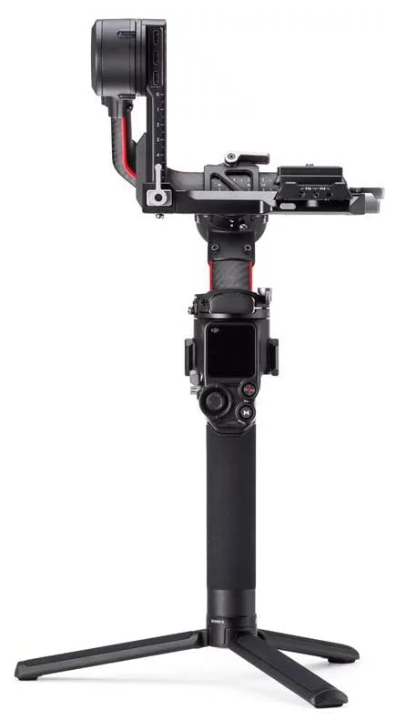
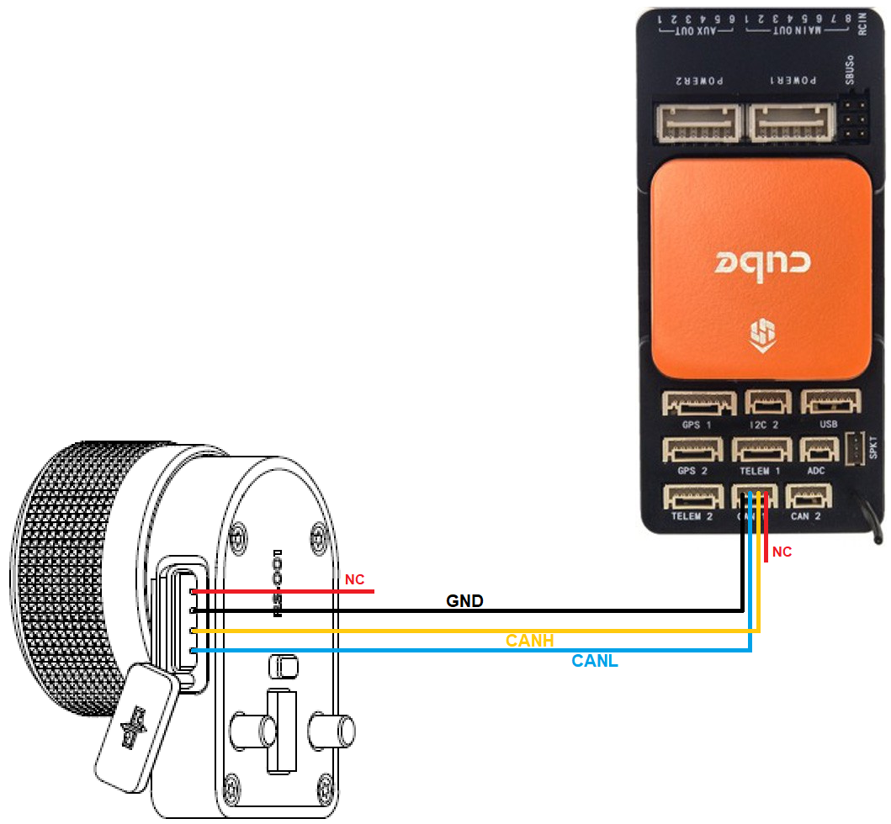
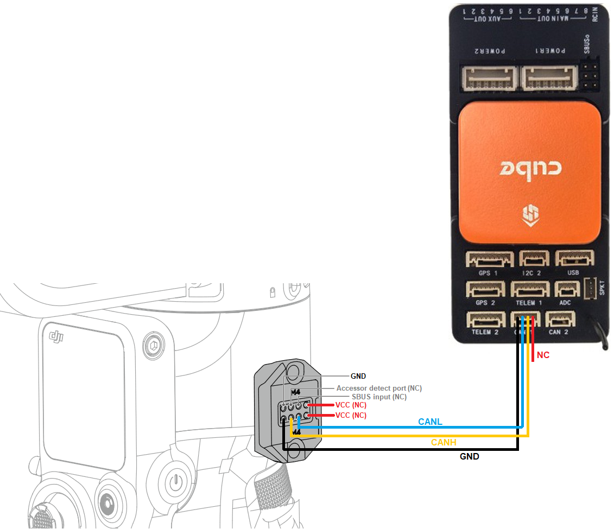

.. _common-djirs2-gimbal:

[copywiki destination="copter,plane,rover"]

===========================
DJI RS2 and RS3-Pro Gimbals
===========================

ArduPilot 4.4 (and higher) support the `DJI RS2 <https://www.dji.com/rs-2>`__ and `DJI RS3-Pro <https://www.dji.com/jp/rs-3-pro>`__ handheld gimbals using a :ref:`Lua script <common-lua-scripts>`.  The driver relies on the gimbal supporting the "DJI R SDK" protocol which is only these two gimbals as far as we know.  Other gimbals including the very similar RSC2 and RS3 are not supported.

Some images on this page are from the DJI SDK Protocol and User Interface instructions.

What to Buy
===========

- `DJI RS2 <https://www.dji.com/rs-2>`__ or `DJI RS3-Pro <https://www.dji.com/jp/rs-3-pro>`__ gimbal
- `DJI R Focus Wheel <https://store.dji.com/product/ronin-s-focus-wheel>`__ to allow connecting to the autopilot

Connection and Configuration
============================

Connect the autopilot's CAN1 or CAN2 port to the Focus wheel as shown below

Alternatively the connection can be accomplished without a Focus wheel.  Note the image below shows the ports on the right side of the gimbal.  The right-side port may be used but the pin positions are rotated 180 deg.

Connect to the autopilot with a ground station and do the following

- If using CAN1, set :ref:`CAN_D1_PROTOCOL <CAN_D1_PROTOCOL>` = 10 (Scripting), :ref:`CAN_P1_DRIVER <CAN_P1_DRIVER>` = 1 (First driver)
- If using CAN2, set :ref:`CAN_D2_PROTOCOL <CAN_D2_PROTOCOL>` = 10 (Scripting), :ref:`CAN_P2_DRIVER <CAN_P2_DRIVER>` = 2 (Second driver)
- Set :ref:`SCR_ENABLE <SCR_ENABLE>` = 1 to enable scripting
- Set :ref:`SCR_HEAP_SIZE <SCR_HEAP_SIZE>` = 120000 (or higher)
- Set :ref:`MNT1_TYPE <MNT1_TYPE>` = 9 (Scripting) to enable the mount/gimbal scripting driver
- Reboot the autopilot
- Download mount-djirs2-driver.lua (`from here <https://github.com/ArduPilot/ardupilot/tree/master/libraries/AP_Scripting/drivers>`__) and copy it to the autopilot's SD card in the APM/scripts directory and reboot the autopilot
- Optionally set DJIR_DEBUG to 1 to display parsing and errors stats at 5sec.  Set to 2 to display gimbal angles

See the "Control with an RC transmitter" section of :ref:`this page <common-mount-targeting>` for details on parameter changes required to control the gimbal through an RC Transmitter (aka "RC Targeting")

Control and Testing
===================

See :ref:`Gimbal / Mount Controls <common-mount-targeting>` for details on how to control the gimbal using RC, GCS or Auto mode mission commands

Videos
======

..  youtube:: Le1lWbucnF4
    :width: 100%