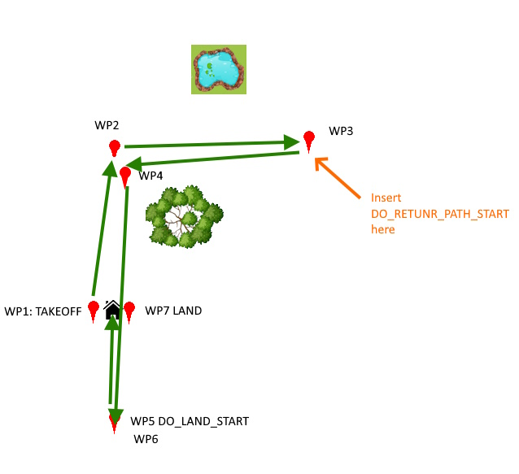

.. _common-do-return-path-start:
[copywiki destination="plane,copter,planner"]
==========================================
Using DO_RETURN_PATH_START Mission Command
==========================================

While the :ref:`DO_LAND_START <common-do-land-start>` mission command provides a means of defining a "landing sequence" that can be directly jumped to for autolandings or failsafe actions, in some cases this direct path might result in breaching fences or flying into obstacles.

The DO_RETURN_PATH_START mission command can be used to mark a place or places in the mission sequence, before the :ref:`DO_LAND_START <common-do-land-start>`, that the vehicle should directly rejoin the mission path at the closet point on the mission leading toward the :ref:`DO_LAND_START <common-do-land-start>` sequence, rather than directly to the :ref:`DO_LAND_START <common-do-land-start>`. As shown below:

Imagine above that the vehicle takes off, flies to WP2 and 3, and if one were to fly up and look at the lake but then have a failsafe, the vehicle would fly directly back to the DO_LAND_START tag, crashing thru the tree, exclusion fence, etc. But if a DO_RETURN_PATH_START mission item is inserted after WP 3, then the vehicle would return to the mission path, proceed to the waypoint after the DO_LAND_START tag and LAND safely.

Multiple DO_RETURN_PATH_START items can be placed in the mission sequence to tailor the return. It is not necessary that the sequence include a :ref:`DO_LAND_START <common-do-land-start>`, but if it does, the return to the mission will occur after the DO_RETURN_PATH_START mission command but before the :ref:`DO_LAND_START <common-do-land-start>`.

[site wiki="plane"]
In Plane, set :ref:`RTL_AUTOLAND<RTL_AUTOLAND>` to 4 to use this.
[/site]
[site wiki="copter"]
In Copter, set any failsafe action to DO_LAND_START, whether or not one exists in the mission.

.. note:: if a DO_LAND_START or DO_RETURN_PATH_START does not exist in the mission, RTL will occur.
[/site]
