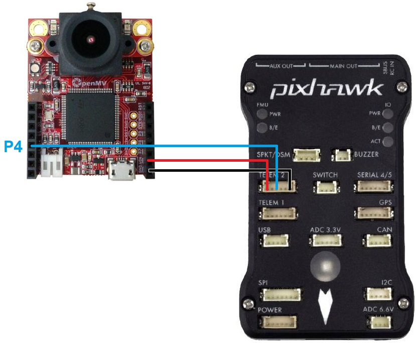

.. _common-dock-mode:

=========
Dock Mode
=========

The DOCK mode maneuvers a vehicle towards a stationary docking target automatically.
Currently, we support docking with the help of a camera attached to a companion computer.
The companion computer estimates the pose of the marker (`ArucoMarker/AprilTag <https://april.eecs.umich.edu/software/apriltag>`__) placed at the docking station and sends
`LANDING_TARGET <https://mavlink.io/en/messages/common.html#LANDING_TARGET>`__ mavlink messages to the vehicle which are then processed by the precision landing library
(`AC_PrecLand <https://github.com/ArduPilot/ardupilot/tree/master/libraries/AC_PrecLand>`__) to estimate the position of the docking target.

Successful tests have been conducted using the OpenMV camera as a companion computer to perform auto-docking.
However, any companion computer equipped with an RGB camera (like OpenMV camera, Raspberry Pi, Jetson Nano etc.) which can estimate pose
of marker placed at docking target and generate the  `LANDING_TARGET <https://mavlink.io/en/messages/common.html#LANDING_TARGET>`__ mavlink messages to the vehicle's autopilot can be used.

The OpenMV Camera
=================

OpenMV camera is a pocket sized camera board which is capable of performing various computer vision tasks.
It can transmit the required mavlink messages over its UART interface and hence it can be used as a companion computer to perform auto-docking.
The camera can be purchased directly from `openmv.io <https://openmv.io/collections/cams>`__

Connection to Autopilot
=======================

The companion computer needs to be connected a serial port on the autopilot via its UART interface.

- Connect the camera’s P4, VIN and GND pins to one of the autopilot’s serial ports as shown above. In the image above the OpenMV cam is connected to a Pixhawk’s Telem2 port.
  The connection scheme would be similar for the other companion computers too. The user just needs to make a connection between
  TX pin on the companion computer to RX pin of the telemetry port on the autopilot and power up the companion computer.
- Set :ref:`SERIAL2_PROTOCOL <SERIAL2_PROTOCOL>` = 1 (MAVLink) if using Serial2/Telem2, if connected to another serial port use the corresponding SERIALx_PROTOCOL parameter
- Set :ref:`SERIAL2_BAUD <SERIAL2_BAUD>` = 115

Generating AprilTag Markers
===========================

.. image:: ../../../images/openmv-apriltag-generator.png
   :target: ../_images/openmv-apriltag-generator.png
   :width: 600px

The OpenMV camera has capability to detect the AprilTags. The OpenMV IDE comes with built-in AprilTag generator. The steps to generate an AprilTag using the same are:

- Go to Tools -> Machine Vision -> AprilTag generator -> TAG36H11 Family (587 Tags - Recommended). This will open a small dialog box.
- Set the range of tags you want to generate. For eg. if you want to generate tag number 1, set Min and Max to 1. You can also generate a range of tags at once by setting the Min and Max values accordingly.
- Click ok and save the tags to the desired directory.

After successfully generating the tag, the user can print it out and place it vertically at the docking target.
The default printing size of tag as per the `example script <https://github.com/openmv/openmv/blob/master/scripts/examples/07-Interface-Library/02-MAVLink/mavlink_apriltags_landing_target.py>`__ in following section is 165 mm.
A tag of this size is obtained by simply printing the generated tag image on an A4 size sheet.

.. tip::

    The maximum range of marker detection while using the `example script <https://github.com/openmv/openmv/blob/master/scripts/examples/07-Interface-Library/02-MAVLink/mavlink_apriltags_landing_target.py>`__
    mentioned in next section and a 165 mm marker is around 1.5 - 2 m. This range can be increased by using a marker of bigger size. The maximum range of around 4 m has been successfully
    obtained by using a 380 mm marker during the tests. Instructions about modifying the script for using bigger markers are discussed in next section.

Uploading Code to the Camera
============================

The OpenMV camera can be programmed using the OpenMV IDE. Detailed instructions to do so can be found `here <http://docs.openmv.io/openmvcam/tutorial/index.html>`__.

- Connect the OpenMV camera to your PC using  a micro USB cable.
- Open the OpenMV IDE and click the connect button at the bottom left corner of the IDE window.
- Go to file menu, create new file and copy `this <https://github.com/openmv/openmv/blob/master/scripts/examples/07-Interface-Library/02-MAVLink/mavlink_apriltags_landing_target.py>`__
  script to the editor window.
- Set the tag number and the size of the marker `here <https://github.com/openmv/openmv/blob/8587f8d7c6d2c23b75e86154c73ae45bc8935bc0/scripts/examples/07-Interface-Library/02-MAVLink/mavlink_apriltags_landing_target.py#L29>`__.
  The size must be measured from edge to edge (including the black border) in mm.
- To upload the code to the camera go to Tools menu and click on `Save open script to OpenMV Cam (as main.py)`.
- Done! Now you can remove the micro USB cable and power up the camera using an external power source.
  If the script is successfully running, you should see a RED or GREEN LED blinking on the camera. The led flashes GREEN when the marker is in sight of the camera whereas it flashes RED when the camera can't see the marker.

Mounting to the vehicle
=======================

The camera should be mounted at the front of the vehicle. The camera board should be mounted such that the camera edge with
the lens is upwards (i.e., away from the ground). This is the default setup configuration that we think would be used
in most of the cases. However, support for mounting the camera at the back and in different mounting orientations is also provided.
If you want to mount the camera in any other configuration, please don't forget to set the related `PLND_XXX` parameters accordingly.

.. note::
    The precision landing library also relies on the vehicle's compass to construct the target vector.
    Any kind of `magnetic interference <https://ardupilot.org/rover/docs/common-magnetic-interference.html>`__ in the vehicle's compass may lead to the vehicle behaving inappropriately during the docking process.

Setup through GCS
=================

The following parameters are needed to be set to enable the precision landing using a companion computer on the rover.

-  :ref:`PLND_ENABLED <PLND_ENABLED>` = 1
-  :ref:`PLND_TYPE <PLND_TYPE>` = 1

You would need to reboot the vehicle once you set up the above mentioned parameters.

If you are mounting the camera in any configuration other than the default configuration mentioned in the previous section, please set the following parameters appropriately.

-  :ref:`PLND_CAM_POS_X <PLND_CAM_POS_X>`, :ref:`PLND_CAM_POS_Y <PLND_CAM_POS_Y>`, :ref:`PLND_CAM_POS_Z <PLND_CAM_POS_Z>`: Position of camera in body frame (in m)
-  :ref:`PLND_ORIENT <PLND_ORIENT>`: Orientation of camera on vehicles body. The camera can be mounted at the front or at the back of the vehicle's body
-  :ref:`PLND_YAW_ALIGN <PLND_YAW_ALIGN>`: Angle of rotation of camera from default configuration to mounted configuration around the axis pointing out from it's lens (in centi degrees)

The docking process can be fine tuned using the following parameters.

- :ref:`DOCK_SPEED <DOCK_SPEED>`: The maximum speed limit at the which the vehicle can maneuver in the dock mode.
- :ref:`DOCK_HDG_CORR_EN <DOCK_HDG_CORR_EN>`: To enable the heading correction while docking. This would enable the vehicle to dock head-on onto the docking station even if the dock mode is switched while the vehicle is not exactly in front of the dock. Note that this feature works only if :ref:`DOCK_DIR <DOCK_DIR>` parameter is correctly set.
- :ref:`DOCK_DIR <DOCK_DIR>`: This is the compass direction in which the vehicle is desired to head while docking. This direction is opposite to the direction in which the docking station is facing. For eg., if the docking station is facing North, the vehicle is desired to dock from the south and hence the parameter should be set with the value 180 degrees.
- :ref:`DOCK_HDG_CORR_WT <DOCK_HDG_CORR_WT>`: This parameter defines how aggressively the vehicle tries to corrects its heading.
- :ref:`DOCK_STOP_DIST <DOCK_STOP_DIST>`: The distance from the docking station at which the vehicle should stop (in meter).

.. tip::

   Be prepared to retake control if there are sudden unexpected
   movements (Change mode to Hold or manual).