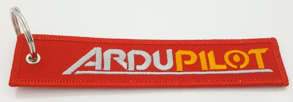

.. _common-donation:

=============================
Donating to ArduPilot project
=============================

Donating to our operation is made easy. If you are using ArduPilot system and want to donate for the good
cause, there are several ways of doing that:

- Direct `PayPal Donation <https://www.paypal.com/cgi-bin/webscr?cmd=_s-xclick&hosted_button_id=BBF28AFAD58B2>`__
- By Credit Card using `ClickAndPledge <https://co.clickandpledge.com/advanced/default.aspx?wid=34115>`__.  Be sure to enter the amount in the ArduPilot section, other sections are for other `SPI projects <http://www.spi-inc.org/>`__.  Other methods can be found on the `SPI donations page <http://www.spi-inc.org/donations/>`__.
- Buying supporting merchandise from :ref:`official stores <stores>`
- Buying ArduPilot SWAG products directly from the official `SWAG Shop <https://shop.ardupilot.org/>`__
- :ref:`Partner Donations <common-partners>` (for Companies)
 
PayPal Donations 
================

Direct PayPal donations should be made by using DONATE button on our ArduPilot.org pages or by using following PayPal link
 
- `PayPal Donation form <https://www.paypal.com/cgi-bin/webscr?cmd=_s-xclick&hosted_button_id=BBF28AFAD58B2>`__
 
Support Merchandise
===================  

.. note::

   To make sure that donations from all merchandise are distributed correctly, please use official suppliers listed here.

Our developers are currently creating various merchandise products for ArduPilot users. There will be keyrings, t-shirts, coffee mugs, windsocks and many other items coming. Many thanks to Jani from jDrones who is currently working on ArduPilot merchandise product lines and running the official ArduPilot `SWAG Shop <https://shop.ardupilot.org/>`__.

You can follow merchandise development on our discussion forums. New ideas are always welcome.

- ArduPilot discussion forum: `merchandise thread <http://discuss.ardupilot.org/t/ardupilot-t-shirts-keychains-and-other-merchandise/9750/33>`__ 
- ArduPilot discussion forum: `marketing category <https://discuss.ardupilot.org/c/marketing>`__ 

All profits from merchandise items will be used directly at ArduPilot organization. Funds will be used: Developing new hardware, feature development, developer meetings, running ArduPilot internet services and so on.

Here is a list of currently available merchandise products (at end of Jun 2016). 

- ArduPilot keyring: "Remove Pilot.." `buy here <https://shop.ardupilot.org/index.php?route=product/product&path=59&product_id=58>`__

- ArduPilot `SWAG Shop <https://shop.ardupilot.org/>`__

From the `SWAG Shop <https://shop.ardupilot.org/>`__ you also find:

- ArduPilot T-shirts,...
- ArduPilot mugs,...
- ArduPilot windsocks,...
- ArduPilot checklists,...
- ArduPilot tools,...

We are constantly adding more products to shop.

If you have a great idea, please join discussions on our `marketing category <https://discuss.ardupilot.org/c/marketing>`__ and present your idea. Then we can look if it can be made real and available for every ArduPilot users around the world. 

[copywiki destination="copter,plane,rover,planner,planner2,dev,antennatracker"]
