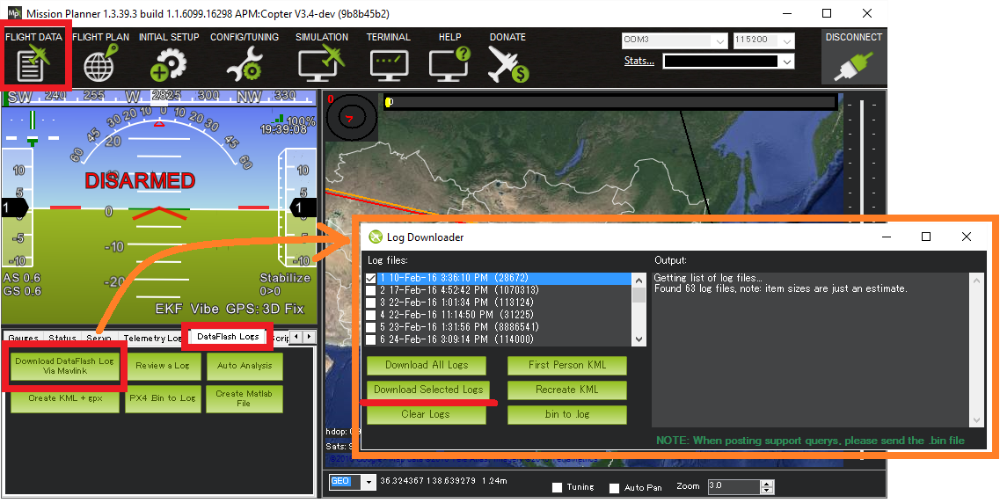
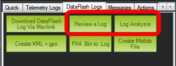
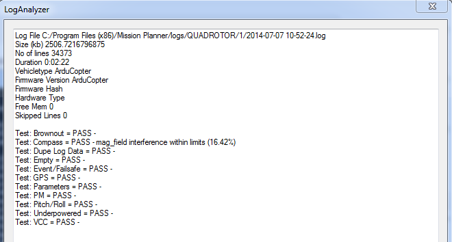
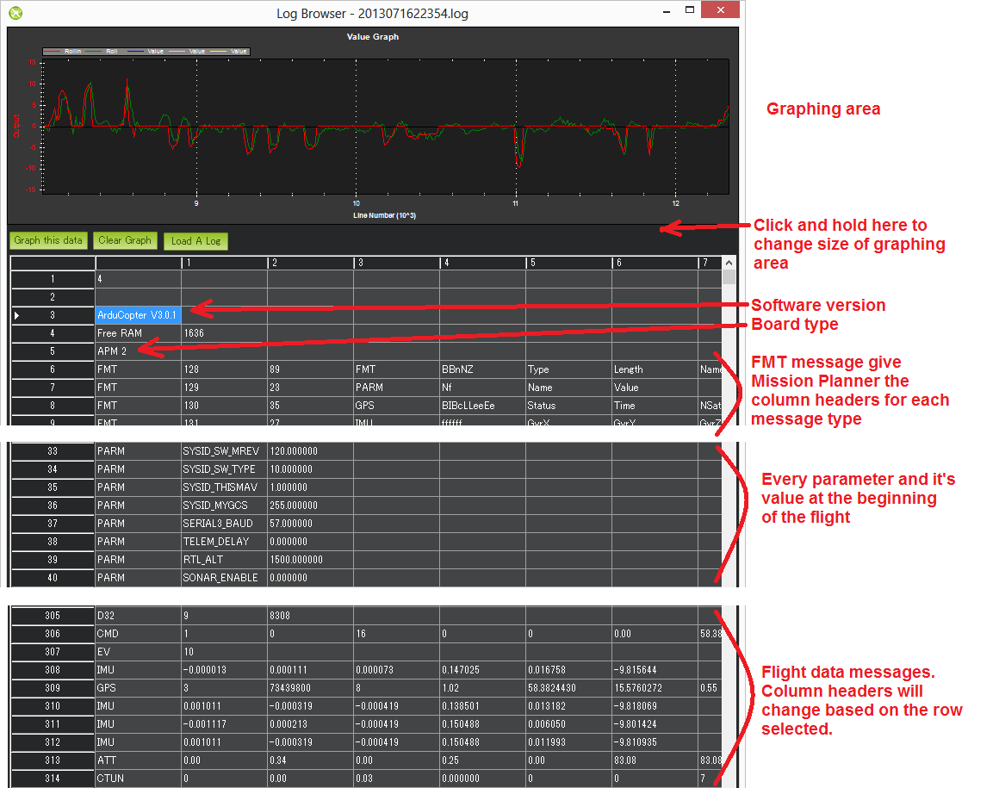
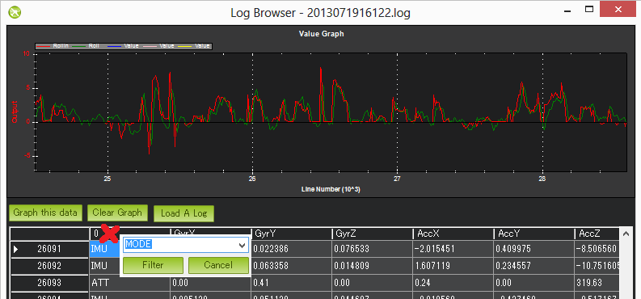
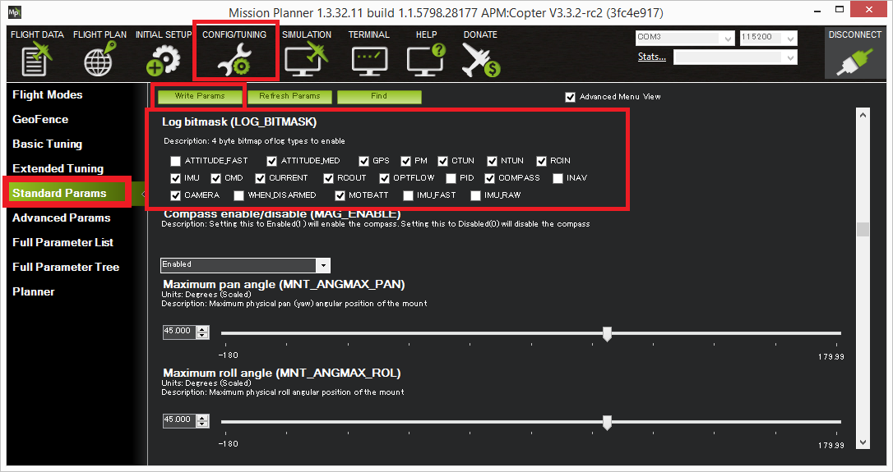

.. _common-downloading-and-analyzing-data-logs-in-mission-planner:

======================================================
Downloading and Analyzing Data Logs in Mission Planner
======================================================

Dataflash logs are stored on the flight controller's onboard dataflash memory
and can be download after a flight. On Plane and Rover dataflash logs are
created soon after start-up. On Copter they are created after you first
arm the copter. This topic explains how to configure and access
Dataflash logs.

[copywiki destination="copter,plane,rover,planner"]

.. note::

   :ref:`Telemetry logs <common-mission-planner-telemetry-logs>` (also
   known as "tlogs") collect similar information to dataflash logs (see
   :ref:`Diagnosing problems using Logs <common-diagnosing-problems-using-logs>` for more information).

.. note::

   If your vehicle is having trouble producing dataflash logs - including the infamous "No IO heartbeat" diagnostic message - try a different SD card.  You may also choose to test the card using a dedicated tool, such as ``H2testw``.  Low board voltates are also known to cause logging issues.

.. _common-downloading-and-analyzing-data-logs-in-mission-planner_downloading_logs_via_mavlink:

Downloading logs via MAVLink
============================

This method is available in AC3.2 (or higher).

-  Connect your vehicle to the mission planner using the micro USB cable
-  Open the Mission Planner's Flight Data screen
-  On the bottom left, select the "DataFlash Logs" tab and push the
   "Download DataFlash Log Via Mavlink" button

Then, select the log you want to download. This will save that log to
your MissionPlanner/logs directory, in a folder named after the vehicle
type, such as QUADCOPTER.

Automatic Analysis of logs
==========================

   Mission Planner: Start LogAnalysis

The simplest analysis is to generate a basic automated report that will
highlight common problem areas. For that, click on "Log Analysis"
and select a log that you've already saved to the MissionPlanner/logs
directory.  They will be in folders named after the vehicle type, such
as QUADCOPTER or ROVER. Once you pick the log you want, it will generate
a report that looks like this:

Manually review a log
=====================

For more detailed analysis, click on "Review a Log" and select a log
that you've already saved to the MissionPlanner/logs directory.  Once
again, they will be in folders named after the vehicle type, such as
QUADCOPTER or ROVER. Once you pick the log you want, you will get charts
such as the below. The basic format of the dataflash is:

-  Line numbers appear on the very left side of the viewer
-  Software version and board type appear at the top
-  FMT messages are next which tell the mission planner the column
   headers for each message type
-  PARM rows which show each parameter (in the order in which they
   appear in the eeprom) along with their value at the beginning of the
   flight
-  Flight data messages including GPS, IMU, etc.

Graph any flight data by first clicking on the appropriate row, you
should see the column headers update appropriately. Next find the column
you wish to graph, click on it and then push the "Graph this data"
button. In the example above the ATT's Roll-In and Roll data have been
graphed. The mouse's scroll wheel can be used to zoom in or out. You may
also select an area of the graph to zoom in on it. Zoom out by
right-mouse-button clicking and selecting "Set Scale to Default".
`Here's <http://www.diydrones.com/profiles/blog/show?id=705844%3ABlogPost%3A801607>`__
a mini tutorial on using this feature. You may also filter on just the
first column (the flight data message type) by clicking on the first
column and selecting the message type from the drop-down. This is very
useful especially for viewing the different flight modes (called "MODE"
messages) used during the mission. Click the first column again but
press "Cancel" to clear the filter.

Setting what data you want recorded
===================================

The LOG_BITMASK parameter controls what message types are recorded in
the dataflash.  Recent versions of the mission planner and ardupilot
allow individual messages to be enabled/disabled from the MP's
Config/Tuning, Standard Params screen.

Earlier versions of MP/ardupilot allow selecting the message using a
drop-down as shown below. 

.. image:: ../../../images/mp_log_bitmask.png
    :target: ../_images/mp_log_bitmask.png

.. _common-downloading-and-analyzing-data-logs-in-mission-planner_message_details_copter_specific:

Message Details (Copter specific)
=================================

**ATT (attitude information):**

+-----------+--------------------------------------------------------------------------------------------------------+
| DesRoll   | The pilot's desired roll angle in degrees (roll left is negative, right is positive)                   |
+-----------+--------------------------------------------------------------------------------------------------------+
| Roll      | The vehicle's actual roll in degrees (roll left is negative, right is positive)                        |
+-----------+--------------------------------------------------------------------------------------------------------+
| DesPitch  | The pilot's desired pitch angle in degrees (pitch forward is negative, pitch back is positive)         |
+-----------+--------------------------------------------------------------------------------------------------------+
| Pitch     | The vehicle's actual pitch angle in degrees (pitch forward is negative, pitch back is positive)        |
+-----------+--------------------------------------------------------------------------------------------------------+
| DesYaw    | The pilot's desired heading in degrees with 0 = north                                                  |
+-----------+--------------------------------------------------------------------------------------------------------+
| Yaw       | The vehicle's actual heading in degrees with 0 = north                                                 |
+-----------+--------------------------------------------------------------------------------------------------------+
| ErrRP     | The average size of the roll/pitch error estimate (values between 0 and 1)                             |
+-----------+--------------------------------------------------------------------------------------------------------+
| ErrYaw    | The average size of the yaw error estimate (values between 0 and 1)                                    |
+-----------+--------------------------------------------------------------------------------------------------------+

**ATUN (auto tune overview):**

+--------------------------------------+--------------------------------------+
|                                      | Axis: 0 = Roll, 1 = Pitch            |
+--------------------------------------+--------------------------------------+
| TuneStep                             | 0 = Returning towards Level (before  |
|                                      | or after a test), 1 = Testing (i.e.  |
|                                      | performing a twitch to test          |
|                                      | response), 2 = Updating gains        |
|                                      | (twitch completed and gains          |
|                                      | adjusted)                            |
+--------------------------------------+--------------------------------------+
| RateMin                              | Minimum recorded rate during this    |
|                                      | test                                 |
+--------------------------------------+--------------------------------------+
| RateMax                              | Maximum recorded rate during this    |
|                                      | test                                 |
+--------------------------------------+--------------------------------------+
| RPGain                               | Rate P gain value being tested       |
+--------------------------------------+--------------------------------------+
| RDGain                               | Rate D gain value being tested       |
+--------------------------------------+--------------------------------------+
| SPGain                               | Stabilize P gain being tested        |
+--------------------------------------+--------------------------------------+

**ATDE (auto tune step details):**

+---------+-------------------------------------------------------------------+
| Angle   | Angle of the copter in centi-degrees for the axis being testedx   |
+---------+-------------------------------------------------------------------+
| Rate    | Rate of rotation of the copter for the axis being tested          |
+---------+-------------------------------------------------------------------+

**CAM (time and position when camera shutter was activated):**

+-----------+-----------------------------------------------------------------------+
| GPSTime   | The GPS reported time since epoch in milliseconds                     |
+-----------+-----------------------------------------------------------------------+
| Lat       | The accelerometer + GPS latitude estimate                             |
+-----------+-----------------------------------------------------------------------+
| Lng       | The accelerometer + GPS longitude estimate                            |
+-----------+-----------------------------------------------------------------------+
| Alt       | The accelerometer + barometer estimated altitude in cm above ground   |
+-----------+-----------------------------------------------------------------------+
| Roll      | The vehicle roll angle in centi-degrees                               |
+-----------+-----------------------------------------------------------------------+
| Pitch     | The vehicle pitch angle in centi-degrees                              |
+-----------+-----------------------------------------------------------------------+
| Yaw       | The vehicle's heading in centi-degrees                                |
+-----------+-----------------------------------------------------------------------+

**CMD (commands received from the ground station or executed as part of
a mission):**

+--------+----------------------------------------------------------------------------------------+
| CTot   | The total number of commands in the mission                                            |
+--------+----------------------------------------------------------------------------------------+
| CNum   | This command's number in the mission (0 is always home, 1 is the first command, etc)   |
+--------+----------------------------------------------------------------------------------------+
| CId    | The `mavlink message id <https://pixhawk.ethz.ch/mavlink/>`__                          |
+--------+----------------------------------------------------------------------------------------+
| Copt   | The option parameter (used for many different purposes)                                |
+--------+----------------------------------------------------------------------------------------+
| Prm1   | The command's parameter (used for many different purposes)                             |
+--------+----------------------------------------------------------------------------------------+
| Alt    | The command's altitude in meters                                                       |
+--------+----------------------------------------------------------------------------------------+
| Lat    | The command's latitude position                                                        |
+--------+----------------------------------------------------------------------------------------+
| Lng    | The command's longitude position                                                       |
+--------+----------------------------------------------------------------------------------------+

**COMPASS (raw compass, offset and compassmot compensation values):**

+---------------------+----------------------------------------------------------------------------------------+
| Field               | Description                                                                            |
+---------------------+----------------------------------------------------------------------------------------+
| MagX, MagY. MagZ    | Raw magnetic field values for x, y and z axis                                          |
+---------------------+----------------------------------------------------------------------------------------+
| OfsX, OfsY, OfsZ    | Raw magnetic offsets (will only change if COMPASS_LEARN parameter is 1)                |
+---------------------+----------------------------------------------------------------------------------------+
| MOfsX, MOfsY, MOfsZ | Compassmot compensation for throttle or current                                        |
+---------------------+----------------------------------------------------------------------------------------+

**CURRENT (battery voltage, current and board voltage information):**

+---------------------+----------------------------------------------------------------------------------------+
| FIELD               | DESCRIPTION                                                                            |
+---------------------+----------------------------------------------------------------------------------------+
| Thr                 | Pilot input throttle from 0 ~ 1000                                                     |
+---------------------+----------------------------------------------------------------------------------------+
| ThrInt              | Integrated throttle (i.e. sum of total throttle output for this flight)                |
+---------------------+----------------------------------------------------------------------------------------+
| Volt                | Battery voltage in volts \* 100                                                        |
+---------------------+----------------------------------------------------------------------------------------+
| Curr                | Current drawn from the battery in amps \* 100                                          |
+---------------------+----------------------------------------------------------------------------------------+
| Vcc                 | Board voltage                                                                          |
+---------------------+----------------------------------------------------------------------------------------+
| CurrTot             | Total current drawn from battery                                                       |
+---------------------+----------------------------------------------------------------------------------------+

**CTUN (throttle and altitude information):**

+---------+----------------------------------------------------------------------------------------------------+
| FIELD   | DESCRIPTION                                                                                        |
+---------+----------------------------------------------------------------------------------------------------+
| ThrIn   | The pilot's throttle in as a number from 0 to 1000                                                 |
+---------+----------------------------------------------------------------------------------------------------+
| SonAlt  | The altitude above ground according to the sonar                                                   |
+---------+----------------------------------------------------------------------------------------------------+
| BarAlt  | The altitude above ground according to the barometer                                               |
+---------+----------------------------------------------------------------------------------------------------+
| WPAlt   | The desired altitude while in AltHold, Loiter, RTL or Auto flight modes                            |
+---------+----------------------------------------------------------------------------------------------------+
| NavThr  | Not used                                                                                           |
+---------+----------------------------------------------------------------------------------------------------+
| AngBst  | Throttle increase (from 0 ~ 1000) as a result of the copter leaning over (automatically            |
|         | added to all pilot and autopilot throttle to reduce altitude loss while  leaning)                  |
+---------+----------------------------------------------------------------------------------------------------+
| CRate   | Accelerometer + baro climb rate estimate in cm/s                                                   |
+---------+----------------------------------------------------------------------------------------------------+
| ThrOut  | Final throttle output sent to the motors (from 0 ~ 1000). Normally equal to ThrIn+AngBst while     |
|         | in stabilize mode.                                                                                 |
+---------+----------------------------------------------------------------------------------------------------+
| DCRate  | Pilot desired climb rate in cm/s                                                                   |
+---------+----------------------------------------------------------------------------------------------------+

**D32, DU32 (single data values which are either signed 32bit integers
or unsigned 32bit integers):**

+---------+-------------------------------------------------------------------------------------------------------+
| FIELD   | DESCRIPTION                                                                                           |
+---------+-------------------------------------------------------------------------------------------------------+
| id      | Identification number for the variable. There are only two possible values:                           |
|         |                                                                                                       |
|         | *   7 = bit mask of internal state.  ( The meaning of individual bits can be found in the def'n       |
|         |     of the ap structure <https://github.com/ardupilot/ardupilot/blob/master/ArduCopter/Copter.h#L251> |
|         |                                                                                                       |
|         | *   9 = simple mode's initial heading in centi-degrees                                                |
+---------+-------------------------------------------------------------------------------------------------------+

**EKF (Extended Kalman Filter**):

:ref:`Log information here <dev:extended-kalman-filter_interpreting_log_data>`
(Dev Wiki). Overview :ref:`here <common-apm-navigation-extended-kalman-filter-overview>`.

**ERR (an error message):**

SubSystem and Error codes listed below

+------------+----------------------------------------------------------------------------------------------------+
| Error      | DESCRIPTION                                                                                        |
+------------+----------------------------------------------------------------------------------------------------+
| 1:Main     | (never used)                                                                                       |
+------------+----------------------------------------------------------------------------------------------------+
| 2:Radio    | ECode 1: “Late Frame” which means the APM’s onboard ppm encoder did not provide an                 |
|            | update for at least 2 seconds                                                                      |
+------------+----------------------------------------------------------------------------------------------------+
| 3:Compass  | ECode 1: the compass failed to initialise (likely a hardware issue)                                |
|            | ECode 2: failure while trying to read a single value from the compass (probably a hardware issue)  |
|            | ECode 0: above errors resolve                                                                      |
+------------+----------------------------------------------------------------------------------------------------+
| 4:Optical  | Ecode 1: failed to initialise (likely a hardware issue)                                            |
| flow       |                                                                                                    |
+------------+----------------------------------------------------------------------------------------------------+
| 5:Throttle | ECode 1: throttle dropped below FS_THR_VALUE meaning likely loss of contact between RX/TX          |
| failsafe   | ECode 0: above error resolve meaning RX/TX contact likely restored                                 |
+------------+----------------------------------------------------------------------------------------------------+
| 6:Battery  | ECode 1: battery voltage dropped below LOW_VOLT or total capacity used exceeded BATT_CAPACITY      |
| failsafe   |                                                                                                    |
+------------+----------------------------------------------------------------------------------------------------+
| 7: GPS     | ECode 1: GPS lock lost for at least 5 seconds                                                      |
| failsafe   | ECode 0: GPS lock restored                                                                         |
+------------+----------------------------------------------------------------------------------------------------+
| 8: GCS     | ECode 1: updates from ground station joystick lost for at least 5 seconds                          |
| failsafe   | ECode 0: updates from ground station restored                                                      |
+------------+----------------------------------------------------------------------------------------------------+
| 9: Fence   | ECode 1: altitude fence breached                                                                   |
|            | ECode 2: circular fence breached                                                                   |
|            | ECode 3: both altitude and circular fences breached                                                |
|            | ECode 0: vehicle is back within the fences                                                         |
+------------+----------------------------------------------------------------------------------------------------+
| 10: Flight | ECode 0 ~ 17: the vehicle was unable to enter the desired flight mode:                             |
| Mode       | 0=Stabilize, 1=Acro, 2=AltHold, 3=Auto, 4=Guided, 5=Loiter, 6=RTL, 7=Circle, 8=Position, 9=Land,   |
|            | 10=OF_Loiter, 11=Drift, 13=Sport, 14=Flip, 15=AutoTune, 16=PosHold, 17=Brake                       |
+------------+----------------------------------------------------------------------------------------------------+
| 11: GPS    | ECode 2: GPS Glitch                                                                                |
|            | ECode 0: GPS Glitch cleared                                                                        |
+------------+----------------------------------------------------------------------------------------------------+
| 12: Crash  | ECode 1: Crash detected                                                                            |
| Check      |                                                                                                    |
+------------+----------------------------------------------------------------------------------------------------+

**EV: (an event number)**. The full list of possible events can be found
in `defines.h <https://github.com/ArduPilot/ardupilot/blob/master/ArduCopter/defines.h#L291>`__
but the most common are:

+------------+----------------------------------------------------------------------------------------------------+
| Event No   | DESCRIPTION                                                                                        |
+------------+----------------------------------------------------------------------------------------------------+
| 10         | Armed                                                                                              |
+------------+----------------------------------------------------------------------------------------------------+
| 11         | Disarmed                                                                                           |
+------------+----------------------------------------------------------------------------------------------------+
| 15         | Auto Armed (pilot has raised throttle above zero and autopilot is free to take control of throttle)|
+------------+----------------------------------------------------------------------------------------------------+
| 16         | TakeOff                                                                                            |
+------------+----------------------------------------------------------------------------------------------------+
| 18         | Land Complete                                                                                      |
+------------+----------------------------------------------------------------------------------------------------+
| 25         | Set Home (home location coordinates have been capture)                                             |
+------------+----------------------------------------------------------------------------------------------------+

**GPA: (Global Position Accuracy)**

+------------+----------------------------------------------------------------------------------------------------+
| FIELD      | DESCRIPTION                                                                                        |
+------------+----------------------------------------------------------------------------------------------------+
| VDop       | Vertical dilution of precision, a unitless measure of precision                                    |
|            | https://en.wikipedia.org/wiki/dilution_of_precision                                                |
+------------+----------------------------------------------------------------------------------------------------+
| HAcc       | Horizontal Accuracy as reported by the GPS module, in meters                                       |
+------------+----------------------------------------------------------------------------------------------------+
| VAcc       | Vertical Accuracy as reported by the GPS module, in meters                                         |
+------------+----------------------------------------------------------------------------------------------------+
| SAcc       | Speed accuracy as reported by the GPS, in m/s/s                                                    |
+------------+----------------------------------------------------------------------------------------------------+
| VV         | Flag to indicate if the GPS is reporting vertical velocity                                         |
|            |   0 No vertical velocity data                                                                      |
|            |   1 GPS has vertical velocity data                                                                 |
+------------+----------------------------------------------------------------------------------------------------+
| SMS        | The autopilot time in milliseconds that the accuracy/GPS position data is associated with.         |
+------------+----------------------------------------------------------------------------------------------------+
| Delta      | The time between when the previous GPS message and the current GPS message was parsed by the       |
|            | autopilot, in milliseconds                                                                         |
+------------+----------------------------------------------------------------------------------------------------+

**GPS:**

+------------+----------------------------------------------------------------------------------------------------+
| FIELD      | DESCRIPTION                                                                                        |
+------------+----------------------------------------------------------------------------------------------------+
| Status     | 0 = no GPS, 1 = GPS but no fix, 2 = GPS with 2D fix, 3 = GPS with 3D fix                           |
+------------+----------------------------------------------------------------------------------------------------+
| Time       | The GPS reported time since epoch in milliseconds                                                  |
+------------+----------------------------------------------------------------------------------------------------+
| NSats      | The number of satellites current being used                                                        |
+------------+----------------------------------------------------------------------------------------------------+
| HDop       | A measure of gps precision (1.5 is good, >2.0 is not so good)                                      |
|            | https://en.wikipedia.org/wiki/dilution_of_precision                                                |
+------------+----------------------------------------------------------------------------------------------------+
| Lat        | Lattitude according to the GPS                                                                     |
+------------+----------------------------------------------------------------------------------------------------+
| Lng        | Longitude according to the GPS                                                                     |
+------------+----------------------------------------------------------------------------------------------------+
| RelAlt     | Accelerometer + Baro altitude in meters                                                            |
+------------+----------------------------------------------------------------------------------------------------+
| Alt        | GPS reported altitude (not used by the flight controller)                                          |
+------------+----------------------------------------------------------------------------------------------------+
| SPD        | Horizontal ground speed in m/s                                                                     |
+------------+----------------------------------------------------------------------------------------------------+
| GCrs       | Ground course in degrees (0 = north)                                                               |
+------------+----------------------------------------------------------------------------------------------------+

**IMU (accelerometer and gyro information):**

+------------------+----------------------------------------------------------------------------------------------+
| FIELD            | DESCRIPTION                                                                                  |
+------------------+----------------------------------------------------------------------------------------------+
| GyrX, GyrY, GyrZ | The raw gyro rotation rates in degrees/second                                                |
+------------------+----------------------------------------------------------------------------------------------+
| AccX, AccY, AccZ | The raw accelerometer values in m/s/s                                                        |
+------------------+----------------------------------------------------------------------------------------------+

**Mode (flight mode):**

+------------+----------------------------------------------------------------------------------------------------+
| FIELD      | DESCRIPTION                                                                                        |
+------------+----------------------------------------------------------------------------------------------------+
| Mode       | The flight mode displayed as a string (i.e. STABILIZE, LOITER, etc)                                |
+------------+----------------------------------------------------------------------------------------------------+
| ThrCrs     | Throttle cruise (from 0 ~ 1000) which is the autopilot's best guess as to what throttle            |
|            | is required to maintain a stable hover                                                             |
+------------+----------------------------------------------------------------------------------------------------+

**NTUN (navigation information):**

+------------+----------------------------------------------------------------------------------------------------+
| FIELD      | DESCRIPTION                                                                                        |
+------------+----------------------------------------------------------------------------------------------------+
| WPDst      | Distance to the next waypoint (or loiter target) in cm. Only updated while in Loiter, RTL, Auto.   |
+------------+----------------------------------------------------------------------------------------------------+
| WPBrg      | Bearing to the next waypoint in degrees                                                            |
+------------+----------------------------------------------------------------------------------------------------+
| PErX       | Distance to intermediate target between copter and the next waypoint in the latitude direction     |
+------------+----------------------------------------------------------------------------------------------------+
| PErY       | Distance to intermediate target between copter and the next waypoint in the longitude direction    |
+------------+----------------------------------------------------------------------------------------------------+
| DVelX      | Desired velocity in cm/s in the latitude direction                                                 |
+------------+----------------------------------------------------------------------------------------------------+
| DVelY      | Desired velocity in cm/s in the longitude direction                                                |
+------------+----------------------------------------------------------------------------------------------------+
| VelX       | Actual accelerometer + gps velocity estimate in the latitude direction                             |
+------------+----------------------------------------------------------------------------------------------------+
| VelY       | Actual accelerometer + gps velocity estimate in the longitude direction                            |
+------------+----------------------------------------------------------------------------------------------------+
| DAcX       | Desired acceleration in cm/s/s in the latitude direction                                           |
+------------+----------------------------------------------------------------------------------------------------+
| DAcY       | Desired acceleration in cm/s/s in the longitude direction                                          |
+------------+----------------------------------------------------------------------------------------------------+
| DRol       | Desired roll angle in centi-degrees                                                                |
+------------+----------------------------------------------------------------------------------------------------+
| DPit       | Desired pitch angle in centi-degrees                                                               |
+------------+----------------------------------------------------------------------------------------------------+

**PM (performance monitoring):**

+------------+----------------------------------------------------------------------------------------------------+
| FIELD      | DESCRIPTION                                                                                        |
+------------+----------------------------------------------------------------------------------------------------+
| RenCnt     | DCM renormalization count - a high number may indicate problems in DCM (extremely rare)            |
+------------+----------------------------------------------------------------------------------------------------+
| RenBlw     | DCM renormalization blow-up count - how many times DCM had to completely rebuild the DCM matrix    |
|            | since the last PM. Normally innocuous but a number that constantly grows may be an indication      |
|            | that DCM is having troubles calculating the attitude (extremely rare)                              |
+------------+----------------------------------------------------------------------------------------------------+
| FixCnt     | The number of GPS fixes received since the last PM message was received                            |
|            | (it's hard to imagine how this would be useful)                                                    |
+------------+----------------------------------------------------------------------------------------------------+
| NLon       | Number of long running main loops                                                                  |
|            | (i.e. loops that take more than 5% longer than the 10ms they should)                               |
+------------+----------------------------------------------------------------------------------------------------+
| NLoop      | The total number of loops since the last PM message was displayed. This allows you to calculate    |
|            | the percentage of slow running loops (which should never be higher than 15%). Note that the        |
|            | value will depend on the autopilot clock speed.                                                    |
+------------+----------------------------------------------------------------------------------------------------+
| MaxT       | The maximum time that any loop took since the last PM message. This should be close to 10,000 but  |
|            | will be up to 6,000,000 during the interval where the motors are armed                             |
+------------+----------------------------------------------------------------------------------------------------+
| PMT        | A number that increments each time a heart beat is received from the ground station                |
+------------+----------------------------------------------------------------------------------------------------+
| I2CErr     | The number of I2C errors since the last PM message. Any I2C errors may indicate a problem on the   |
|            | I2C bus which may in turn slow down the main loop and cause performance problems.                  |
+------------+----------------------------------------------------------------------------------------------------+

**RCOUT (pwm output to individual RC outputs):**

RC1, RC2, etc : pwm command sent from flight controller to the
esc/motor/RC output

Viewing KMZ FILES
=================

When you download the dataflash log files from the APM/PX4 it will
automatically create a KMZ file (file with extension .kmz). This file
can be opened with Google Earth (just double click the file) to view
your flight in Google Earth. Please see the instructions on the
:ref:`Telemetry Logs Page <common-mission-planner-telemetry-logs_creating_3d_images_of_the_flight_path>`
for additional details.

Video tutorials
===============

..  youtube:: 62TmGiwFiDU
    :width: 100%

..  youtube:: IcVlJCR8N2g
    :width: 100%

