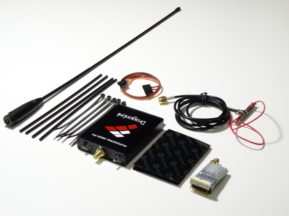

.. _common-dragonlink-rc:

=====================
DragonLink RC Systems
=====================

`DragonLink home page <http://www.dragonlinkrc.com/>`__

Dragonlink is a long range 433Mhz RC system with telemetry. Capable of operation at ranges exceeding 50km with full Mavlink telemetry passthrough. The system consists of an add-on transmitter module to your normal transmitter which includes a WIFI or Bluetooth connectivity module to a ground station (phone or PC) for full Mavlink telemetry, and mating receivers. Receivers down to the nano-size range are available.

