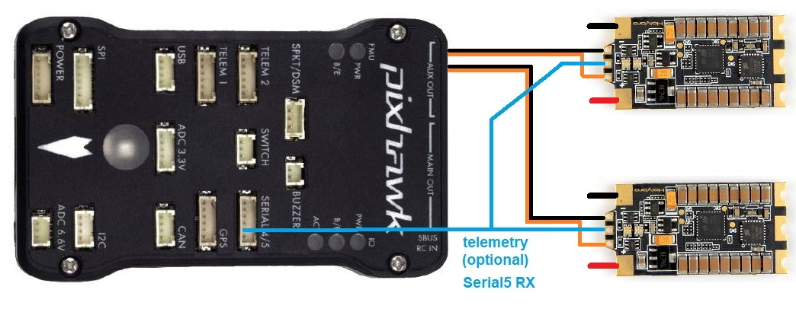

.. _common-dshot-blheli32-telemetry:

BLHeli_32 ESC Telemetry
=======================

If the ESC has this capability, it allows monitoring and logging of performance data that previously required additional sensors (like power modules and RPM sensors). The detailed data provided by every ESC allows real-time decisions and individual ESC or motor performance tuning and failure analysis. 

.. note:: ArduPilot does not currently support bi-directional Dshot reporting of telemetry via the ESC signal wire, nor does it support the polling of the ESCs for telemetry data via throttle idle messages over the signal line in non DShot protocols.

Connecting your ESCs for use with Dshot protocol and BLHeli_32 features
=======================================================================

Connect all ESC's telemetry wires to a single serial port's RX pin on the autopilot (above diagram uses Serial5 as an example). ESC telemetry is currently only supported with BLHeli_32 ESCs. A pin or wire for ESC telemetry is pre-soldered on most BLHeli_32 ESCs. If the wire isn't pre-soldered you will need to solder it yourself. Pinouts for serial ports on The Cube can be found `here <https://ardupilot.org/copter/docs/common-pixhawk-serial-names.html>`__.

Set the following parameters to enable BLHeli_32 telemetry feedback to a autopilot's serial port:

- :ref:`SERVO_BLH_AUTO <SERVO_BLH_AUTO>` = 1 to enable automatic mapping of multirotor motors for BLHeli_32 pass-through and telemetry support. for most multirotor and quadplane users this will do the right thing. If using BLHeli_32 ESCs on non-multirotor motors with the respective SERVOn_FUNCTION set to 70 (=throttle), 73 (=throttle left) or 74 (=throttle right), you will need to further specify the used outputs as follows:

#. :ref:`SERVO_BLH_MASK <SERVO_BLH_MASK>` : a bitmap used to enable BLHeli_32 pass-through and telemetry support on non-multirotor motors and / or exactly specify which servo outputs you want to enable pass-through and telemetry on (if available in ESC).

#. :ref:`SERVO_BLH_OTYPE<SERVO_BLH_OTYPE>` : This needs to be set to the protocol being used for the DShot protocol being used on those additional outputs if not the same as the normal copter style motor outputs.

- :ref:`SERIAL5_PROTOCOL <SERIAL5_PROTOCOL>` 16 (= ESC telemetry). This assumes serial port 5 is used. Adjust the serial port's protocol parameter to 16 , for the serial port whose RX input is connected to the ESC(s) telemetry pad. The correlation between serial port numbering and UART physical ports for you autopilot should be documented in its description page linked :ref:`here <common-autopilots>`.

- :ref:`SERVO_BLH_TRATE <SERVO_BLH_TRATE>` defaults to 10. this enables telemetry at a 10hz update rate from the ESC.

- :ref:`SERVO_BLH_POLES <SERVO_BLH_POLES>` defaults to 14 which applies to the majority of brushless motors. Adjust as required if you're using motors with a pole count other than 14 to calculate true motor shaft RPM from ESC's e-field RPM.

Logging and Reporting
---------------------

The autopilot requests status information from one ESC at a time, cycling between them. This information is logged to the onboard log's ESCn messages and can be viewed in any :ref:`ArduPilot compatible log viewer <common-logs>`.

- RPM
- Voltage
- Current
- Temperature
- Total Current

The RCOU messages are also written to the onboard logs which hold the requested output level sent to the ESCs expressed as a number from 1000 (meaning stopped) to 2000 (meaning full output).

This data can also be viewed in real-time using a ground station.  If using the Mission Planner go to the Flight Data screen's status tab and look for esc1_rpm.

.. image:: ../../../images/dshot-realtime-esc-telem-in-mp.jpg
    :target: ../_images/dshot-realtime-esc-telem-in-mp.jpg
    :width: 450px

.. note::

   Sending BLHeli_32 telemetry data to the GCS requires the telemetry connection use MAVLink2.  ArduPilot uses MAVLink2 by default on the USB port but if another port is used it may be necessary to set the SERIALx_PROTOCOL parameter to 2 (where "x" is the serial port number used for the telemetry connection).

In addition, some telemetry values can be displayed on the integrated :ref:`on-board OSD <common-osd-overview>`, if your autopilot has one.

Use as Battery Monitor
======================

By setting a battery monitor instance to BLHeli32 ESC  type (for example :ref:`BATT2_MONITOR<BATT2_MONITOR>` = 9), all connected BLHeli32 ESCs with connected telemetry wiring to the configured autopilot serial port, will be aggregated as a single source. The voltages reported will be averaged, the currents totaled, and the consumed current accumulated.

