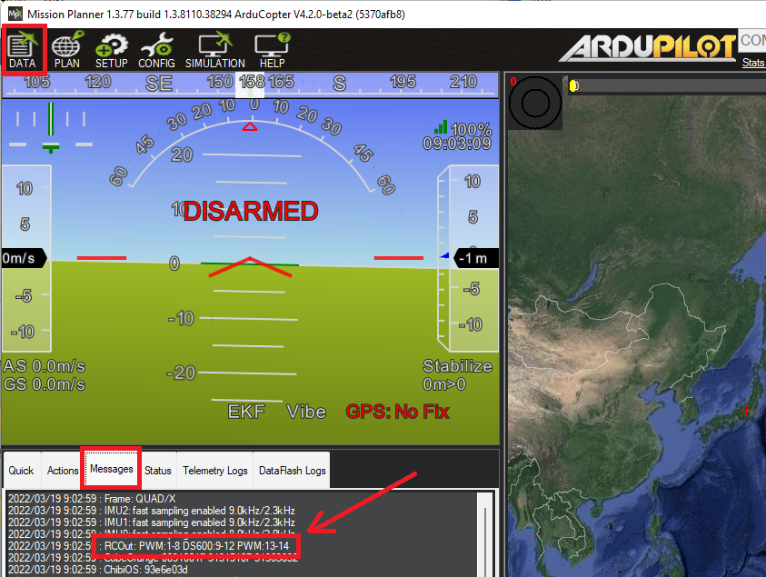

.. _common-dshot-escs:

==========
DShot ESCs
==========

.. image:: ../../../images/hobbywing-esc.jpg

DShot is a digital ESC protocol which allows fast, high resolution digital communication which may improve vehicle control which is especially useful in multirotor and quadplane applications.  Other advantages include

- Values sent to the ESC are checksum-protected
- Clock differences between the ESC and autopilot don't affect flight performance
- ESC calibration is not required

DShot is the underlying ESC control protocol used by :ref:`BLHeli <common-blheli32-passthru>` ESCs.  Many BLHeli ESC versions offer even more features such as ESC configuration, :ref:`ESC telemetry <blheli32-esc-telemetry>`, LED control and/or :ref:`Bi-directional dshot <bidir-dshot>`.  If choosing a DShot enabled ESC we recommend using one that also supports BLHeli32 or BLHeli_S.

.. note::
   Only try DShot on ESCs that are known to support it or you will get unpredictable results.

.. note::
   Recently there is a growing number of proprietary and non-proprietary 16 / 32 bit ESCs with firmware that support DShot and other digital ESC protocols, but not BLHeli32 specific features like passthrough and telemetry. See your ESC's manual for further detail on supported features.

.. note:: most DShot ESCs normally will also operate as normal :ref:`PWM ESCs <common-brushless-escs>`.

Connecting the ESCs
===================

For autopilots with an IOMCU (e.g. Pixhawk, CubeOrange) the Bi-Directional DShot ESCs should be connected to the AUX outputs. 
On CubeOrange Normal DShot works on all channels.  AUX1 cannot be used for Bi-Directional DShot meaning only AUX2 to AUX6 can be used for Bi_directional.  (`see issue <https://github.com/ArduPilot/ardupilot/issues/20362>`__).

For :ref:`Pixracer <common-pixracer-overview>` and :ref:`other boards <common-autopilots>` without a separate IOMCU coprocessor, any servo/motor outputs can be used.

Please see the :ref:`Mixing ESC Protocols <dshot-mixing-escs>` section below for more details on limitations

Select the DShot baud rate
==========================

[site wiki="copter, rover"]
Set :ref:`MOT_PWM_TYPE <MOT_PWM_TYPE>` for the desired baud rate and reboot the autopilot
[/site]
[site wiki="plane"]
Set :ref:`Q_M_PWM_TYPE <Q_M_PWM_TYPE>` for the desired baud rate to use for VTOL motors and reboot the autopilot
[/site]

- DShot150 at 150kbaud (recommended for larger aircraft with long signal lead runs)
- DShot300 at 300kbaud
- DShot600 at 600kbaud (recommended for most vehicles)
- DShot1200 at 1200kbaud

For larger aircraft with longer cable runs using DShot ESC protocol, we recommend using the lowest baud rate, DShot150, as it is the most reliable protocol (lower baudrates are less susceptible to noise on cables).

For smaller craft, DShot600 is by far the most widely used and can therefore be a more suitable choice simply because of the amount of testing that it has had, rather than the newer DShot1200 protocol.

Higher rates (e.g. DShot600 and DShot1200) are more susceptible to noise but have the advantage that they tie up the allocated DMA channel for less time which can be beneficial on autopilots with a lot of DMA sharing.

If :ref:`Bi-directional DShot <bidir-dshot>` will be used, DShot300 and DShot600 are preferred, because this feature requires a longer pulse width as it has to wait for the response from the ESC before it can send another pulse.  Bi-directional DShot does not share DMA channels and so there is no impact on other peripherals.  Bi-directional DShot is only supported on BLHeli32 ESCs

Configure the Servo Functions
=============================

As mentioned above, if using an autopilot with an IOMCU (e.g. Pixhawk, CubeOrange) the ESCs should be connected to the AUX outputs instead of the default MAIN outputs.  This in turn means that the corresponding :ref:`SERVOx_FUNCTION <SERVO9_FUNCTION>` parameters must be updated so the autopilot knows which output is connected to the ESCs/motors.   This can be most easily done using Mission Planner's "Servo Output" page

.. image:: ../../../images/dshot-setup-mp-servooutput.png

.. note:: When an output is configured for DShot, the ``SERVOx_MIN/MAX/TRIM`` parameters for that output will always be ignored since DShot does not use these parameters. The trim  value used will be  1500 if it's a reversible output, or 1000 if normal output setup in DShot, and the output range always be 1000-2000. No ESC calibration step is required.

[site wiki="plane"]
On Plane, all other motors use Normal (PWM) protocol. However, in Plane, any motor, like the traditional fixed wing's main motor or Dual Motor Tailsitters (SERVOx_FUNCTION = 70 throttle, 73 throttle left and / or 74 throttle right), can be changed to a protocol other than PWM using the :ref:`SERVO_BLH_MASK<SERVO_BLH_MASK>` parameter to specify the output number of the motor together with the :ref:`SERVO_BLH_OTYPE<SERVO_BLH_OTYPE>` parameter to select the protocol of these motors independently of that selected for the copter function motors.
[/site]

.. note:: All mask-based configuration can only be changed at a PWM group level, please consult the documentation for your autopilot to ascertain which outputs are on different groups. See :ref:`Mixing ESC Protocols <dshot-mixing-escs>` section below.

.. warning:: Be sure your ESC can support the configuration you select for it. Damage can occur otherwise. This includes frame rates discussed below. Also be careful when switching between digital and analogue output types without re-calibrating ESCs as this can lead to uncommanded motor output.

Check the RC Banner
===================

Reboot the autopilot and check the "RC banner" to confirm the output channels are setup as expected (this banner appears whenever parameters are downloaded)

Additional Configuration
========================

DShot Update Rates
------------------

The frequency at which DShot pulses are sent can be configured through :ref:`SERVO_DSHOT_RATE<SERVO_DSHOT_RATE>`. By default ArduPilot will output a DShot data pulse every time a new IMU sample is ready *and* at a fixed 1Khz interval. On a copter with the standard 400Hz scheduler loop rate this works out at about 1.4Khz. However, the output is quite irregular - in order to get more regular output :ref:`SERVO_DSHOT_RATE<SERVO_DSHOT_RATE>` can be configured to send pulses at multiples of the scheduler loop rate. Thus if set to 2 the pulses will be sent at 800Hz, set to 3 at 1.2Khz and so on. The difference being very, very even output which can benefit copters needing tighter motor control (for instance smaller racers). It is not recommended to send pulses at less than 1Khz due to reports of BLHeli32 occasionally missing frames on some autopilots, similarly sending at higher rates can result in increased reliability and faster recovery from missed pulses where needed at the cost of some CPU. Very high rates can only be used for faster DShot speeds since otherwise pulses might overlap - for instance the fastest rate that DShot150 can theoretically support is 4Khz.

.. _dshot-commands:

DShot Commands
--------------

On certain ESCs DShot commands are supported. These allow functions such as ESC LEDs, beeps and motor direction to be manipulated by the autopilot. In order to use DShot commands:

- set :ref:`SERVO_DSHOT_ESC<SERVO_DSHOT_ESC>` = 1 (BLHeli32/BLHeli_S/Kiss)
- set :ref:`NTF_LED_TYPES<NTF_LED_TYPES>`'s "DShot" checkbox to enable controlling the ESCs LEDs
- set :ref:`NTF_BUZZ_TYPES<NTF_BUZZ_TYPES>`'s "DShot" checkbox to enable usingthe motors as buzzers

The current commands supported are:

-    DShot LEDs on/off
-    DShot Buzzer on/off
-    Reverse motor direction (see :ref:`SERVO_BLH_RVMASK <SERVO_BLH_RVMASK>` parameter)
-    Reversible DShot (aka 3D mode) (see :ref:`Reversible DShot ESCs <blheli32-reversible-dshot>`)

.. warning:: Currently, ArduPilot supports the command set (:ref:`SERVO_DSHOT_ESC<SERVO_DSHOT_ESC>` =1) that is commonly used, however, others are appearing and may not be compatible, resulting in undefined operation. Use caution (remove blades!) until correct operation using type=1 is verified for your ESC

.. _dshot-mixing-escs:

Mixing ESC Protocols
====================

While all the servo/motor outputs of an ArduPilot autopilot are capable of Normal PWM operation at 50Hz and higher frame rates, not all are capable of other ESC protocol configurations. And, usually, these configurations must apply to pre-designated groups of outputs, even if they are not all driving an ESC. So the following cautions apply:

#. The 8 "MAIN" outputs of autopilots using an IOMCU (like PixHawk and Cube), cannot be used for DShot. On these autopilots, only the additional "AUX" outputs support DShot. If you attempt to set a "MAIN" output to DShot, then normal PWM output will occur, even though it has been set to a DShot protocol.

#. For :ref:`Pixracer <common-pixracer-overview>` and :ref:`other boards <common-autopilots>` without a separate IOMCU coprocessor, all servo/motor outputs can be used.

#. Groups of outputs sharing a common timer, MUST have the same advanced configuration. Usually, these are specified in the autopilot's hardware description linked from the :ref:`common-autopilots` page. For example, if an output is configured for DShot in a group, then you cannot use another output in that group for Normal PWM ESC **or** normal PWM servo operation.

.. note:: Everytime the autopilot initializes, it sends a message to the ground control station, showing which outputs are PWM/Oneshot/or DShot. The remaining higher numbered outputs are assigned as GPIOs.

.. image:: ../../../images/RCOutbanner.jpg
