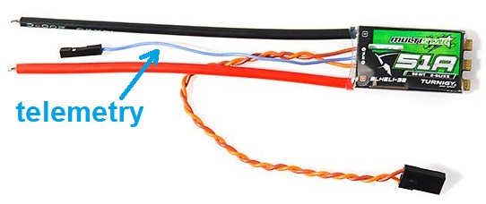
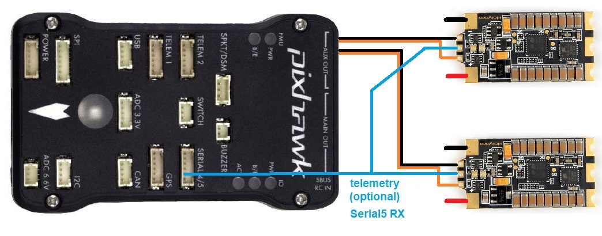
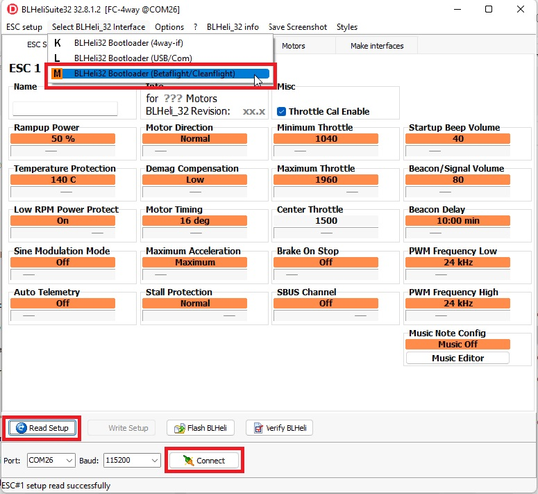

.. _common-dshot:

============================
DShot and BLHeli ESC Support
============================

[copywiki destination="copter,plane"]

..  youtube:: np7xXY_e5sA
    :width: 100%

This articles describes how to setup and use three features supported
by recent BLHeli ESC firmwares.

- DShot ESC protocol support (for sending digital signals to the ESC)
- ESC telemetry support (for receiving performance data from the ESC)
- BLHeli pass-thru configuration and ESC flashing (for configuring the ESC)

Detailed descriptions of these features are lower down on this page. 
Dshot and telemetry ESC's provide an advantage over traditional ESC's for a number of reasons. 

The primary advantage of Dshot is that it provides fast, high resolution digital communication. This opens the door for more precise vehicle control and removes the need to calibrate ESC's for different PWM ranges. 

Telemetry ESC's also provide monitoring of performance data that previously required additional sensors (like power modules and RPM sensors). Because of the detailed data provided by every ESC, real-time decisions can be made and logs can be analyzed for indidvidual ESC or motor failure.

.. warning::

   As of April 2018 these features are currently only available with Copter-3.6, Plane-3.9, Rover-3.3 (or higher) using the ChibiOS firmware for STM32 based flight boards, and not yet in a stable release.
   Please join the http://gitter.im/ArduPilot/ChibiOS gitter channel for up to date information on these builds.
   Only try DShot on ESCs that are known to support it or you will get unpredictable results. 
   Reverse thrust and virtual batteries are not yet supported.

Where to buy
============

`blheli32.com provides this list of BLHeli compatible ESCs <http://www.blheli32.com/list-of-blheli_32-escs/>`__.
We recommend choosing one that has the telemetry wire pre-soldered (see blue wire below).

*image courtesy of hobbyking.com*

Connecting and Configuring
==========================

For :ref:`Pixhawk <common-pixhawk-overview>`, :ref:`The Cube <common-thecube-overview>` and related boards with IO co-processors, the ESC's ground and signal wire should be connected to the AUX OUT ports.
For :ref:`Pixracer <common-pixracer-overview>` and :ref:`other boards <common-autopilots>` with all PWM outputs coming from the main processor, the normal outputs can be used.

To enable DShot (output):

- :ref:`MOT_PWM_TYPE <MOT_PWM_TYPE>`, :ref:`SERVO_BLH_OTYPE <SERVO_BLH_OTYPE>`, or :ref:`Q_M_PWM_TYPE <Q_M_PWM_TYPE>` on quadplanes to **4** meaning "DShot150"
- on Pixhawk and Cube boards:

  - do not use channels 1-8 for DShot ESC's. Turn off :ref:`SERVO1_FUNCTION <SERVO1_FUNCTION>` to :ref:`SERVO8_FUNCTION <SERVO8_FUNCTION>` OR set them to something other than motor or throttle functions.
  - set the auxillary channels to their appropriate functions (:ref:`SERVO9_FUNCTION <SERVO9_FUNCTION>` to :ref:`SERVO14_FUNCTION <SERVO14_FUNCTION>`). For quadcopters quadplanes, these parameters will be 33, 34, 35, and 36 for channels 9-12 (Aux 1-4).
  - When using more than the first 4 Aux ports for DShot ESC's, set :ref:`BRD_PWM_COUNT <BRD_PWM_COUNT>` to 6.

To enable ESC telemetry (feedback):

Connect all ESC's telemetry wires to a single Telemetry RX pin on the flight board (above diagram uses Serial5).
ESC telemetry is currently only available with BLHeli_32 ESCs, and a wire for the telemetry is only 
pre-soldered for some ESCs. If the wire isn't pre-soldered you will need to solder it yourself. Pinouts for
serial ports on The Cube can be found `here <http://ardupilot.org/copter/docs/common-pixhawk2-overview.html>`__.
Support for KISS ESC Telemetry is planned.

- :ref:`SERIAL5_PROTOCOL <SERIAL5_PROTOCOL>` = 16 (if telemetry is connected to Serial5).
- :ref:`SERVO_BLH_TRATE <SERVO_BLH_TRATE>` to 10 to enable 10hz updates and logging from the ESC.
- :ref:`SERVO_BLH_MASK <SERVO_BLH_MASK>` to the corresponding sum for the channels you want to monitor. (channel 1 = 1, channel 9 = 256, channel 10 = 512)

The flight board requests telemetry from only one ESC at a time, cycling between them. 
The following data is logged in the ESCn log messages in your dataflash
log. This can be viewed in any ArduPilot dataflash log viewer.

- RPM
- Voltage
- current
- temperature
- total-current

To configure and flash ESC's using BLHeli, see the Pass-Through Support section bleow.

DShot Protocol
==============

The DShot ESC protocol is a digital protocol for communication between
a flight board and an ESC. The key advantages are:

- all values sent to the ESC are protected with a 4 bit CRC
- clock differences between the ESC and flight controller don't affect
  flight
- no need to do any ESC throttle range calibration
- very high protocol frame frames are supported

The DShot protocol can run at several different speeds. ArduPilot
supports four speeds:

- DShot150 at 150kbaud (recommended)
- DShot300 at 300kbaud
- DShot600 at 600kbaud (may be needed for BLHeli_S ESC's)
- DShot1200 at 1200kbaud

We recommend using the lowest baud rate, DShot150,
as it is the most reliable protocol (lower baudrates are less
susceptible to noise on cables).  Higher values will be beneficial
once ArduPilot's main loop rate is capable of speeds above 1kHz.

The protocol ArduPilot uses is controlled by setting the 
:ref:`MOT_PWM_TYPE <MOT_PWM_TYPE>` (or :ref:`Q_M_PWM_TYPE <Q_M_PWM_TYPE>` on quadplanes) to a value from 4 to 7.
The value of 4 corresponds to DShot150.

DShot sends 16 bits per frame, with bits allocated as follows:

- 11 bits for the throttle level
- 1 bit for telemetry request
- 4 bits for CRC (simple XOR)

This gives a good throttle resolution, with support for asking the ESC
to provide telemetry feedback. See below for more information on ESC
telemetry.

We do not currently support DShot output on other vehicle types.

.. note::

   DShot output is currently only supported on the "FMU" outputs of
   your flight controller. If you have a board with an IO
   microcontroller, with separate "main" and "auxillary" outputs, such
   as a Pixhawk or Cube, then you can only use DShot on the
   "auxillary" outputs. You will need to use the SERVOn_FUNCTION
   parameters to remap your motors to the auxillary outputs.

BLHeli Pass-Through Support
===========================

BLHeli pass-through support is a feature that allows you to configure
and upgrade the firmware on your ESCs without having to disconnect
them from your vehicle. You can plug a USB cable into your flight
controller and run the BLHeliSuite software for Windows to configure
your ESCs.

Note that you do not have to be using DShot to take advantage of
BLHeli pass-through support, although it is recommended that you do.

To enable BLHeli pass-through support you need to set one of two
variables:

- :ref:`SERVO_BLH_AUTO <SERVO_BLH_AUTO>` = 1 to enable automatic mapping of motors to
  BLHeliSuite ESC numbers.  for most users this will do the right thing.
- :ref:`SERVO_BLH_MASK <SERVO_BLH_MASK>` if you want to instead specify a specific set of
  servo outputs to enable.  For more complex setups where you want to choose exactly which servo outputs you want to configure

Once you have enabled BLHeli support with one of the above two
parameters you should reboot your flight board.

Now connect a USB cable to your flight board and use BLHeliSuite on
Windows to connect. You will need to use BLHeliSuite32 for BLHeli_32
ESCs, and BLHeliSuite16 for BLHeli/BLHeli_S ESCs.

You need to select "BLHeli32 Bootloader (Betaflight/Cleanflight)" from
the interfaces menu

