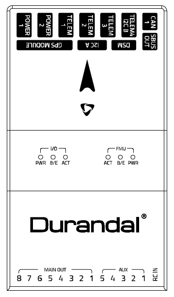
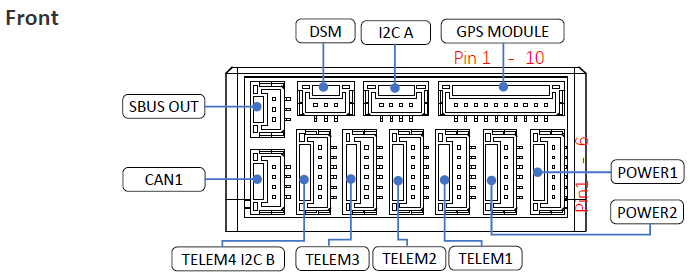
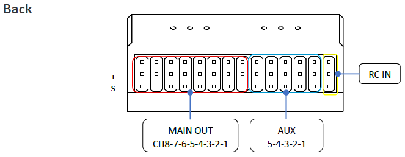
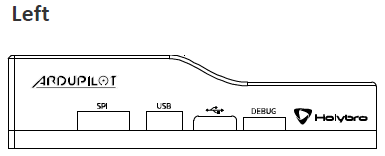
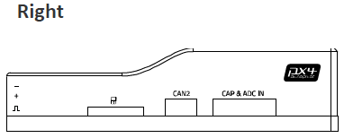

================
Holybro Durandal
================

.. image:: ../../../images/holybro_durandal/durandal_iso.png
    :target: ../_images/durandal_iso.png
    :width: 360px

Durandal is the latest update to the successful family of Holybro autopilots.
It was designed and developed by Holybro, optimized to run the latest ArduPilot firmware.
It features the STM32H743 microprocessor, the latest advanced processor technology from STMicroelectronics®,
plus sensor technology from Bosch® and InvenSense®, and a ChibiOS real-time operating system, delivering incredible
performance, flexibility, and reliability for controlling any autonomous vehicle.
Durandal’s microcontroller now has 2 MB of Flash memory and 1 MB of RAM.

Specifications
==============

-  **Processor**

   -  32-bit STM32H743 main processor
   -  400Mhz / 1MB RAM / 2MB Flash
   -  32-bit co-processor

-  **Sensors**

   -  InvenSense ICM20689 accelerometer / gyroscope
   -  Bosch BMI088 accelerometer / gyroscope
   -  MS5611 barometer
   -  IST8310 magnetometer

-  **Power**

   -  Operating power: 4.9~5.5V (6v max input)
   -  USB Input: 4.75~5.25V
   -  High-power servo rail, up to 36V
      (servo rail does not power the autopilot)
   -  Dual voltage and current monitor inputs

-  **Interfaces**

   -  USB-C and JST_GH USB ports
   -  16 PWM outputs, 8 of which can be used as GPIO pins
   -  Dual power module inputs
   -  S.Bus servo output
   -  R/C inputs for CPPM and S.Bus
   -  DSM input port
   -  Analogue / PWM RSSI input
   -  5x general purpose serial ports plus debug port
   -  3x I2C ports
   -  4x SPI buses enabled
   -  2x CAN Bus ports
   -  2x additional analog inputs
   -  Safety Switch/LED 

-  **Other**

  -  Weight: 64g
  -  Builtin IMU heater for temperature stability
  -  Dimensions: 80mm x 45mm x 20.5mm
  -  Operating temperature: -40 ~ 85°c（claimed）

Pinout
======

UART Mapping
============

 - SERIAL0 -> USB
 - SERIAL1 -> UART2 (Telem1)
 - SERIAL2 -> UART3 (Telem2)
 - SERIAL3 -> UART1 (GPS)
 - SERIAL4 -> UART4 (GPS2, Telem4/I2C)
 - SERIAL5 -> UART6 (Telem3)
 - SERIAL6 -> UART7 (debug port)
 - SERIAL7 -> USB2

The Telem1, Telem2 and Telem3 ports have RTS/CTS pins, the other UARTs do not
have RTS/CTS.

Connectors
==========

Unless noted otherwise all connectors are JST GH

TELEM1, TELEM2, TELEM3 ports
----------------------------

.. raw:: html

   <table border="1" class="docutils">
   <tbody>
   <tr>
   <th>Pin </th>
   <th>Signal </th>
   <th>Volt </th>
   </tr>
   <tr>
   <td>1 (red)</td>
   <td>VCC</td>
   <td>+5V</td>
   </tr>
   <tr>
   <td>2 (blk)</td>
   <td>TX (OUT)</td>
   <td>+3.3V</td>
   </tr>
   <tr>
   <td>3 (blk)</td>
   <td>RX (IN)</td>
   <td>+3.3V</td>
   </tr>
   <tr>
   <td>4 (blk)</td>
   <td>CTS</td>
   <td>+3.3V</td>
   </tr>
   <tr>
   <td>5 (blk)</td>
   <td>RTS</td>
   <td>+3.3V</td>
   </tr>
   <tr>
   <td>6 (blk)</td>
   <td>GND</td>
   <td>GND</td>
   </tr>
   </tbody>
   </table>

GPS1 port
---------

.. raw:: html

   <table border="1" class="docutils">
   <tbody>
   <tr>
   <th>Pin</th>
   <th>Signal</th>
   <th>Volt</th>
   </tr>
   <tr>
   <td>1 (red)</td>
   <td>VCC</td>
   <td>+5V</td>
   </tr>
   <tr>
   <td>2 (blk)</td>
   <td>TX (OUT)</td>
   <td>+3.3V</td>
   </tr>
   <tr>
   <td>3 (blk)</td>
   <td>RX (IN)</td>
   <td>+3.3V</td>
   </tr>
   <tr>
   <td>4 (blk)</td>
   <td>SCL I2C1</td>
   <td>+3.3V</td>
   </tr>
   <tr>
   <td>5 (blk)</td>
   <td>SDA I2C1</td>
   <td>+3.3V</td>
   </tr>
   <tr>
   <td>6 (blk)</td>
   <td>Button</td>
   <td>GND</td>
   </tr>
   <tr>
   <td>7 (blk)</td>
   <td>button LED</td>
   <td>GND</td>
   </tr>
   <tr>
   <td>8 (blk)</td>
   <td>3.3V</td>
   <td>3.3</td>
   </tr>
   <tr>
   <td>9 (blk)</td>
   <td>buzzer</td>
   <td>GND</td>
   </tr>
   <tr>
   <td> (blk)</td>
   <td>GND</td>
   <td>GND</td>
   </tr>
   </tbody>
   </table>

GPS2, Telem4/I2C port
---------------------

.. raw:: html

   <table border="1" class="docutils">
   <tbody>
   <tr>
   <th>Pin</th>
   <th>Signal</th>
   <th>Volt</th>
   </tr>
   <tr>
   <td>1 (red)</td>
   <td>VCC</td>
   <td>+5V</td>
   </tr>
   <tr>
   <td>2 (blk)</td>
   <td>TX (OUT)</td>
   <td>+3.3V</td>
   </tr>
   <tr>
   <td>3 (blk)</td>
   <td>RX (IN)</td>
   <td>+3.3V</td>
   </tr>
   <tr>
   <td>4 (blk)</td>
   <td>SCL I2C2</td>
   <td>+3.3V</td>
   </tr>
   <tr>
   <td>5 (blk)</td>
   <td>SDA I2C2</td>
   <td>+3.3V</td>
   </tr>
   <tr>
   <td>6 (blk)</td>
   <td>GND</td>
   <td>GND</td>
   </tr>
   </tbody>
   </table>

SBUS Out port
-------------

The SBUS out port is a port attached to the IO processor which can be
used to output all servo channels via SBUS. It is enabled by setting
the :ref:`BRD_SBUS_OUT<BRD_SBUS_OUT>` parameter.

When SBUS output is disabled (by setting :ref:`BRD_SBUS_OUT<BRD_SBUS_OUT>` to 0, you can
use the pin for analog RSSI input from receivers. To enable for RSSI
input you need to set:

 - BRD_SBUS_OUT 0
 - RSSI_TYPE 1
 - RSSI_PIN 103

You cannot have both SBUS output and analog RSSI input at the same time.

.. raw:: html

   <table border="1" class="docutils">
   <tbody>
   <tr>
   <th>Pin</th>
   <th>Signal</th>
   <th>Volt</th>
   </tr>
   <tr>
   <td>1</td>
   <td>GND</td>
   <td>GND</td>
   </tr>
   <tr>
   <td>2</td>
   <td>5v(Vservo)</td>
   <td>+5.0V</td>
   </tr>
   <tr>
   <td>3</td>
   <td>TX (OUT)</td>
   <td>+3.3V</td>
   </tr>
   </tbody>
   </table>

DSM/SPKT port
-------------

The SPKT port provides a connector for Spektrum satellite
receivers. It is needed to allow for software controlled binding of
satellite receivers.

.. raw:: html

   <table border="1" class="docutils">
   <tbody>
   <tr>
   <th>Pin</th>
   <th>Signal</th>
   <th>Volt</th>
   </tr>
   <tr>
   <td>1</td>
   <td>RX (IN)</td>
   <td>+3.3V</td>
   </tr>
   <tr>
   <td>2</td>
   <td>GND</td>
   <td>GND</td>
   </tr>
   <tr>
   <td>3</td>
   <td>3.3v</td>
   <td>+3.3V</td>
   </tr>
   </tbody>
   </table>

ADC / CAPTURE
-------------

.. raw:: html

   <table border="1" class="docutils">
   <tbody>
   <tr>
   <th>Pin</th>
   <th>Signal</th>
   <th>Volt</th>
   </tr>

   <tr>
   <td>1 (red)</td>
   <td>VCC</td>
   <td>+5V</td>
   </tr>

   <tr>
   <td>2 (blk)</td>
   <td>FMU_CAP6, AUX6, GPIO 55</td>
   <td></td>
   </tr>

   <tr>
   <td>3 (blk)</td>
   <td>FMU_CAP5, AUX7, GPIO 56</td>
   <td></td>
   </tr>

   <tr>
   <td>4 (blk)</td>
   <td>FMU_CAP4, AUX8, GPIO 57</td>
   <td></td>
   </tr>

   <tr>
   <td>5 (blk)</td>
   <td>FMU_CAP3, GPIO 60</td>
   <td></td>
   </tr>

   <tr>
   <td>6 (blk)</td>
   <td>FMU_CAP2, GPIO 59</td>
   <td></td>
   </tr>

   <tr>
   <td>7 (blk)</td>
   <td>FMU_CAP1, GPIO 58</td>
   <td></td>
   </tr>

   <tr>
   <td>8 (blk)</td>
   <td>ADC1_3V3 (ADC pin 4)</td>
   <td></td>
   </tr>

   <tr>
   <td>9 (blk)</td>
   <td>ADC1_6V6 (ADC pin 18)</td>
   <td></td>
   </tr>

   <tr>
   <td>10 (blk)</td>
   <td>GND</td>
   <td>GND</td>
   </tr>

   </tbody>
   </table>

I2C
---

.. raw:: html

   <table border="1" class="docutils">
   <tbody>
   <tr>
   <th>Pin</th>
   <th>Signal</th>
   <th>Volt</th>
   </tr>
   <tr>
   <td>1 (red)</td>
   <td>VCC</td>
   <td>+5V</td>
   </tr>
   <tr>
   <td>2 (blk)</td>
   <td>SCL</td>
   <td>+3.3 (pullups)</td>
   </tr>
   <tr>
   <td>3 (blk)</td>
   <td>SDA</td>
   <td>+3.3 (pullups)</td>
   </tr>
   <tr>
   <td>4 (blk)</td>
   <td>GND</td>
   <td>GND</td>
   </tr>
   </tbody>
   </table>

CAN1&2
------

.. raw:: html

   <table border="1" class="docutils">
   <tbody>
   <tr>
   <th>Pin</th>
   <th>Signal</th>
   <th>Volt</th>
   </tr>
   <tr>
   <td>1 (red)</td>
   <td>VCC</td>
   <td>+5V</td>
   </tr>
   <tr>
   <td>2 (blk)</td>
   <td>CAN_H</td>
   <td>+12V</td>
   </tr>
   <tr>
   <td>3 (blk)</td>
   <td>CAN_L</td>
   <td>+12V</td>
   </tr>
   <tr>
   <td>4 (blk)</td>
   <td>GND</td>
   <td>GND</td>
   </tr>
   </tbody>
   </table>

POWER1&2
--------

.. raw:: html

   <table border="1" class="docutils">
   <tbody>
   <tr>
   <th>Pin</th>
   <th>Signal</th>
   <th>Volt</th>
   </tr>
   <tr>
   <td>1 (red)</td>
   <td>VCC</td>
   <td>+5V</td>
   </tr>
   <tr>
   <td>2 (red)</td>
   <td>VCC</td>
   <td>+5V</td>
   </tr>
   <tr>
   <td>3 (blk)</td>
   <td>CURRENT</td>
   <td>up to +3.3V</td>
   </tr>
   <tr>
   <td>4 (blk)</td>
   <td>VOLTAGE</td>
   <td>up to +3.3V</td>
   </tr>
   <td>5 (blk)</td>
   <td>GND</td>
   <td>GND</td>
   </tr>
   <td>6 (blk)</td>
   <td>GND</td>
   <td>GND</td>
   </tr>
   </tbody>
   </table>

USB
---

.. raw:: html

   <table border="1" class="docutils">
   <tbody>
   <tr>
   <th>Pin </th>
   <th>Signal </th>
   <th>Volt </th>
   </tr>
   <tr>
   <td>1 (red)</td>
   <td>VCC</td>
   <td>+5V</td>
   </tr>
   <tr>
   <td>2 (blk)</td>
   <td>D_minus</td>
   <td>+3.3V</td>
   </tr>
   <tr>
   <td>3 (blk)</td>
   <td>D_plus</td>
   <td>+3.3V</td>
   </tr>
   <tr>
   <td>4 (blk)</td>
   <td>GND</td>
   <td>GND</td>
   </tr>
   </tbody>
   </table>

RC Input
========

RC input is configured on the RCIN pin, at one end of the servo rail,
marked RCIN in the above diagram. This pin supports all RC
protocols. In addition there is a dedicated Spektrum satellite port
which supports software power control, allowing for binding of
Spektrum satellite receivers.

PWM Output
==========

The Durandal supports up to 16 PWM outputs. First first 8 outputs (labelled
"MAIN") are controlled by a dedicated STM32F100 IO controller. These 8
outputs support all PWM output formats, but not DShot.

The remaining 8 outputs (labelled AUX1 to AUX8) are the "auxiliary"
outputs. These are directly attached to the STM32H743 and support all
PWM protocols as well as DShot.

All 13 back-side PWM outputs have GND on the top row, 5V on the middle row and
signal on the bottom row.

The 8 main PWM outputs are in 3 groups:

 - PWM 1 and 2 in group1
 - PWM 3 and 4 in group2
 - PWM 5, 6, 7 and 8 in group3

The 8 auxiliary PWM outputs are in 2 groups:

 - PWM 1, 2, 3 and 4 in group4
 - PWM 5 and 6 in group5
 - PWM 7 and 8 in group6 (no DMA, no DShot)

Channels within the same group need to use the same output rate. If
any channel in a group uses DShot then all channels in the group need
to use DShot.

Battery Monitoring
==================

The board has two dedicated power monitor ports on 6 pin
connectors. The correct battery setting parameters are dependent on
the type of power brick which is connected.

Compass
=======

The Durandal has one builtin IST8310 compass.

GPIOs
=====

The 8 AUX PWM ports can be used as GPIOs (relays, buttons, RPM etc). To
use them you need to limit the number of these pins that is used for
PWM by setting the ``BRD_PWM_COUNT`` to a number less than 8. For example
if you set it to 6 then PWM7 and PWM8 will be available for
use as GPIOs.

.. note:: in firmware versions 4.2 and later, the method for setting a PWM/SERVO/MOTOR output to be a GPIO function is changed. Instead of ``BRD_PWM_COUNT`` being used, the individual ``SERVOx_FUNCTION`` parameter is merely set to "-1". If set to "0", it remains a PWM output, unassigned to a function, and outputs that output's trim value when board safety is not active. If the servo function is being "mirrored" to a remote device, as in the case of a DroneCAN or KDECAN ESC, then in order to change the autopilot board's corresponding output pin to be a GPIO, but allow the ``SERVOx_FUNCTION`` to still be assigned to the remote device, the :ref:`SERVO_GPIO_MASK<SERVO_GPIO_MASK>` parameter can be used to assign the board pin to be a GPIO without affecting the ``SERVOx_FUNCTION`` assignment for the remote device.

The numbering of the GPIOs for PIN variables in ArduPilot is:

 - PWM1 50
 - PWM2 51
 - PWM3 52
 - PWM4 53
 - PWM5 54
 - PWM6 55
 - PWM7 56
 - PWM8 57

Analog inputs
=============

The Durandal has 7 analog inputs

 - ADC Pin16 -> Battery Voltage
 - ADC Pin17 -> Battery Current Sensor
 - ADC Pin14 -> Battery2 Voltage
 - ADC Pin15 -> Battery2 Current Sensor
 - ADC Pin4 -> ADC port pin 8 (3.3V limit)
 - ADC Pin18 -> ADC port pin 9 (6.6V limit)
 - ADC Pin9 -> RSSI in
 - ADC Pin10 -> 5V Sense
 - ADC Pin11 -> 3.3V Sense

IMU Heater
==========

The IMU heater in the Durandal can be controlled with the
:ref:`BRD_HEAT_TARG<BRD_HEAT_TARG>` parameter, which is in degrees C.

Loading Firmware
================

The board comes pre-installed with an ArduPilot compatible bootloader,
allowing the loading of \*.apj firmware files with any ArduPilot
compatible ground station.

Where to Buy
============

 - Order from `Holybro <https://shop.holybro.com/durandalbeta_p1189.html>`__.
 - Holybro distributors are listed `here <https://shop.holybro.com/art/distributors_a0050.html>`__.

Quick Start
===========

Use the :ref:`Pixhawk Wiring QuickStart <common-pixhawk-wiring-and-quick-start>` as a general guide.

Acknowledgments
===============

Thanks to [Holybro](http://www.holybro.com) for images

[copywiki destination="plane,copter,rover,blimp"]