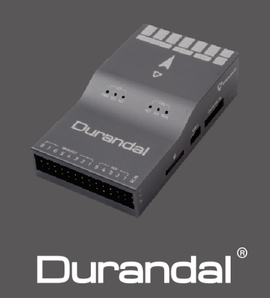
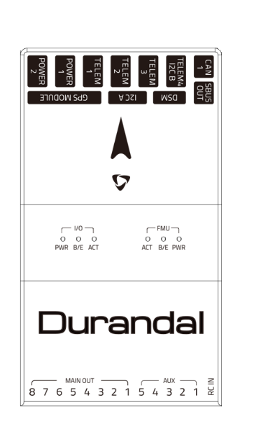

================
Holybro Durandal
================

Durandal is the latest update to the successful family of Holybro autopilots.
It was designed and developed by Holybro, optimized to run the latest ArduPilot firmware.
It features the STM32H743 microprocessor, the latest advanced processor technology from STMicroelectronics®,
plus sensor technology from Bosch® and InvenSense®, and a ChibiOS real-time operating system, delivering incredible
performance, flexibility, and reliability for controlling any autonomous vehicle.
Durandal’s microcontroller now has 2 MB of Flash memory and 1 MB of RAM.

Specifications
==============

-  **Processor**

   -  32-bit STM32H743 main processor
   -  400Mhz / 1MB RAM / 2MB Flash
   -  32-bit co-processor

-  **Sensors**

   -  InvenSense ICM20689 accelerometer / gyroscope
   -  Bosch BMI088 accelerometer / gyroscope
   -  MS5611 barometer
   -  IST8310 magnetometer

-  **Power**

   -  Operating power: 4.9~5.5V (6v max input)
   -  USB Input: 4.75~5.25V
   -  High-power servo rail, up to 36V
      (servo rail does not power the autopilot)
   -  Dual voltage and current monitor inputs

-  **Interfaces**

   -  USB-C
   -  8 IOMCU PWM servo outputs
   -  5 FMU PWM outputs (D-Shot capable)
   -  6 dedicated PWM/Capture inputs on FMU
   -  S.Bus servo output
   -  R/C inputs for CPPM and S.Bus
   -  Analogue / PWM RSSI input
   -  5x general purpose serial ports
   -  3x I2C ports
   -  4x SPI buses enabled
   -  2x CAN Bus ports
   -  2x additional analog inputs

-  **Other**

  -  Weight: 64g
  -  Builtin IMU heater for temperature stability
  -  Dimensions: 80mm x 45mm x 20.5mm
  -  Operating temperature: -40 ~ 85°c（claimed）

Where to Buy
============

 - Order from `Holybro <https://shop.holybro.com/durandalbeta_p1189.html>`__.
 - Holybro distributors are listed `here <https://shop.holybro.com/art/distributors_a0050.html>`__.

Quick Start
===========

Use the :ref:`Pixhawk Wiring QuickStart <common-pixhawk-wiring-and-quick-start>` as a general guide.

Durandal is a cutting edge autopilot: this documentation will be updated in due course.

More Images
===========

